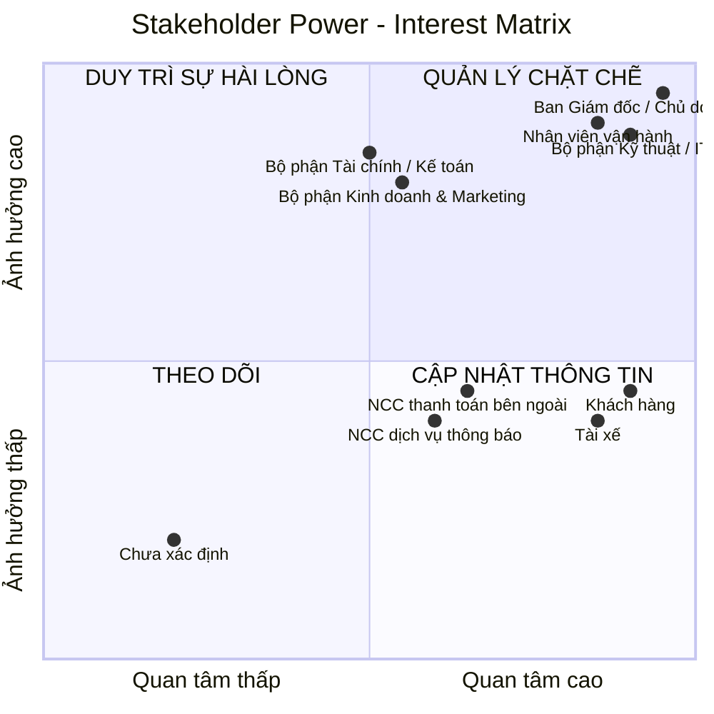

# 23641051_TranTrongDuythuc_cabsystem

## 1/ Stakeholder
### BẢNG PHÂN TÍCH VÀ XÁC ĐỊNH STAKEHOLDERS (CAB SYSTEM)
| STT | Nhóm Stakeholder | Vai trò chi tiết | Vai trò & Kỳ vọng chính đối với hệ thống CAB |
|---:|---|---|---|
| 1 | **Ban giám đốc / Chủ doanh nghiệp** | Định hướng hoạt động kinh doanh, quyết định mục tiêu và phạm vi hệ thống | Muốn hệ thống vận hành ổn định, phục vụ số lượng lớn khách hàng và tài xế, kiểm soát doanh thu, hiệu quả hoạt động và có khả năng mở rộng |
| 2 | **Khách hàng** | Người sử dụng dịch vụ để đặt và sử dụng chuyến xe | Đăng ký/đăng nhập, đặt xe nhanh, theo dõi trạng thái chuyến, biết thông tin tài xế, thanh toán, xem lịch sử và đánh giá tài xế |
| 3 | **Tài xế** | Người nhận và trực tiếp thực hiện chuyến xe | Quản lý hồ sơ và phương tiện, cập nhật trạng thái sẵn sàng, nhận thông báo chuyến, chấp nhận/từ chối chuyến, cập nhật trạng thái và hoàn thành chuyến |
| 4 | **Nhân viên vận hành** | Theo dõi và điều phối hoạt động đặt xe hằng ngày | Theo dõi chuyến đang diễn ra, trạng thái tài xế, hỗ trợ xử lý chuyến lỗi, quản lý thông tin khách hàng, tài xế, phương tiện và tra cứu lịch sử |
| 5 | **Bộ phận Tài chính / Kế toán** | Theo dõi các khoản thanh toán, giao dịch và doanh thu từ chuyến xe | Tra cứu giao dịch, theo dõi số tiền phải thu, trạng thái thanh toán và doanh thu; đảm bảo dữ liệu tài chính chính xác |
| 6 | **Nhà cung cấp thanh toán bên ngoài** | Cung cấp dịch vụ xử lý thanh toán điện tử | Tiếp nhận yêu cầu thanh toán, xử lý giao dịch và trả kết quả cho CAB; không yêu cầu CAB lưu thông tin nhạy cảm của thẻ/tài khoản |
| 7 | **Nhà cung cấp dịch vụ thông báo** | Cung cấp các kênh gửi thông báo đến khách hàng và tài xế | Gửi thông báo về đặt xe, tài xế, chuyến đi và thanh toán; hỗ trợ khả năng bổ sung hoặc thay đổi kênh thông báo trong tương lai |
| 8 | **Bộ phận Kinh doanh & Marketing** | Phụ trách hoạt động kinh doanh, thu hút khách hàng và phát triển dịch vụ | Cần dữ liệu về số lượng chuyến, khách hàng và doanh thu để đánh giá hoạt động kinh doanh; kỳ vọng hệ thống hỗ trợ mở rộng dịch vụ và phát triển khách hàng |
| 9 | **Bộ phận Kỹ thuật / IT** | Quản lý hạ tầng kỹ thuật, vận hành và hỗ trợ hệ thống | Hệ thống ổn định, bảo mật, dễ bảo trì; các thành phần có thể mở rộng độc lập và có thể triển khai tính năng mới từng phần mà hạn chế ảnh hưởng hệ thống đang hoạt động |

## 2/ Stakeholder Power–Interest Matrix
### 2.1/ Phân loại Stakeholder theo Power – Interest
| Nhóm | Tên nhóm | Stakeholder | Power | Interest | Chiến lược quản lý |
|---|---|---|---|---|---|
| **1** | **Quản lý chặt chẽ** | **Ban giám đốc / Chủ doanh nghiệp** | Cao | Cao | Tham gia thường xuyên, xác nhận phạm vi, yêu cầu và các quyết định quan trọng |
| | | **Nhân viên vận hành** | Cao | Cao | Làm việc trực tiếp, thu thập yêu cầu và lấy phản hồi thường xuyên |
| | | **Bộ phận Kỹ thuật / IT** | Cao | Cao | Phối hợp chặt chẽ về kỹ thuật, bảo mật, hiệu năng và khả năng mở rộng |
| **2** | **Duy trì sự hài lòng** | **Bộ phận Tài chính / Kế toán** | Cao | Trung bình | Đảm bảo các yêu cầu về thanh toán, giao dịch và doanh thu |
| | | **Bộ phận Kinh doanh & Marketing** | Cao | Trung bình | Đảm bảo có dữ liệu cần thiết để theo dõi hoạt động kinh doanh |
| **3** | **Cập nhật thông tin** | **Khách hàng** | Thấp – Trung bình | Cao | Thu thập nhu cầu, phản hồi và ưu tiên trải nghiệm người dùng |
| | | **Tài xế** | Thấp – Trung bình | Cao | Khảo sát quy trình thực tế và thu thập phản hồi |
| | | **Nhà cung cấp thanh toán bên ngoài** | Trung bình | Trung bình – Cao | Trao đổi yêu cầu tích hợp, trạng thái giao dịch và xử lý lỗi |
| | | **Nhà cung cấp dịch vụ thông báo** | Trung bình | Trung bình – Cao | Đảm bảo yêu cầu tích hợp và khả năng mở rộng kênh thông báo |
| **4** | **Theo dõi** | **Chưa xác định** | Thấp | Thấp | Chỉ cần theo dõi, không cần tham gia thường xuyên |

### 2.2/ Ma trận 2 chiều phân loại Stakeholder theo:
- **Trục X:** Mức độ quan tâm (Interest)
- **Trục Y:** Mức độ ảnh hưởng (Power)

## 3/ Business goals
### BẢNG XÁC ĐỊNH MỤC TIÊU KINH DOANH (BUSINESS GOALS)
| STT | Business Goal | Mô tả | Kỳ vọng / Kết quả cần đạt |
|---:|---|---|---|
| 1 | **Nâng cao hiệu quả đặt xe** | Thay thế quy trình đặt xe và phân công tài xế thủ công bằng hệ thống CAB | Khách hàng có thể đặt xe nhanh, hệ thống tự động tiếp nhận và xử lý yêu cầu |
| 2 | **Tự động hóa việc tìm và phân công tài xế** | Tự động tìm tài xế phù hợp dựa trên vị trí, trạng thái sẵn sàng và tiêu chí vận hành | Giảm thời gian điều phối, hạn chế phụ thuộc vào nhân viên vận hành |
| 3 | **Cải thiện trải nghiệm khách hàng** | Cung cấp thông tin rõ ràng trong toàn bộ quá trình sử dụng dịch vụ | Khách hàng biết trạng thái chuyến, tài xế, thời gian dự kiến đến, chi phí và kết quả thanh toán |
| 4 | **Nâng cao hiệu quả hoạt động của tài xế** | Hỗ trợ tài xế nhận và xử lý chuyến thông qua hệ thống | Tài xế dễ dàng nhận chuyến, cập nhật trạng thái và hoàn thành chuyến |
| 5 | **Quản lý tập trung dữ liệu vận hành** | Tập trung thông tin khách hàng, tài xế, phương tiện, chuyến đi và giao dịch | Nhân viên có thể tra cứu và quản lý dữ liệu từ một hệ thống thống nhất |
| 6 | **Quản lý thanh toán và doanh thu hiệu quả** | Tích hợp thanh toán điện tử và quản lý kết quả thanh toán | Theo dõi được số tiền phải trả, trạng thái giao dịch và doanh thu; không lưu thông tin thanh toán nhạy cảm |
| 7 | **Giảm tỷ lệ chuyến không được phân công** | Xây dựng cơ chế tiếp tục tìm tài xế khi tài xế được đề xuất không phản hồi hoặc từ chối | Tăng khả năng tìm được tài xế mà khách hàng không phải tạo lại yêu cầu |
| 8 | **Tăng khả năng kiểm soát hoạt động vận hành** | Cung cấp giao diện để nhân viên theo dõi chuyến và trạng thái tài xế | Nhân viên có thể phát hiện và xử lý nhanh các trường hợp bất thường |
| 9 | **Cung cấp dữ liệu phục vụ quản lý và ra quyết định** | Tổng hợp các chỉ số hoạt động chính | Ban lãnh đạo có thể theo dõi số chuyến, doanh thu, tỷ lệ hoàn thành, tỷ lệ hủy và hiệu quả tài xế |
| 10 | **Đảm bảo an toàn và bảo mật dữ liệu** | Bảo vệ thông tin cá nhân, phương tiện, vị trí và giao dịch | Chỉ người có quyền mới được truy cập dữ liệu/chức năng phù hợp; các thao tác quan trọng được lưu vết |
| 11 | **Đảm bảo hệ thống hoạt động ổn định khi nhu cầu tăng cao** | Thiết kế hệ thống có khả năng mở rộng khi số lượng khách hàng và tài xế tăng | Hạn chế tình trạng hệ thống bị gián đoạn hoặc giảm hiệu năng trong giờ cao điểm |
| 12 | **Tạo nền tảng có khả năng mở rộng trong tương lai** | Xây dựng CAB không chỉ phục vụ MVP mà còn hỗ trợ phát triển thêm dịch vụ và tích hợp | Có thể bổ sung loại dịch vụ, phương thức thanh toán, kênh thông báo và thay đổi thành phần kỹ thuật mà không phải xây dựng lại toàn bộ hệ thống |

## 4/ Scope
### BẢNG PHẠM VI CÔNG VIỆC THEO MODULE 
| STT | Module | Phạm vi công việc chính |
|---:|---|---|
| 1 | **Quản lý tài khoản & hồ sơ** | Đăng ký, đăng nhập, đăng xuất; cập nhật thông tin khách hàng và tài xế; quản lý trạng thái tài xế |
| 2 | **Đặt xe (Booking)** | Nhập điểm đón, điểm đến; lựa chọn loại xe; tạo và xác nhận yêu cầu đặt xe |
| 3 | **Tìm & phân công tài xế (Dispatch)** | Xác định tài xế phù hợp dựa trên vị trí và trạng thái sẵn sàng; gửi yêu cầu chuyến; tài xế chấp nhận hoặc từ chối; tiếp tục tìm tài xế khác khi không có phản hồi hoặc bị từ chối |
| 4 | **Quản lý & theo dõi chuyến đi** | Quản lý trạng thái chuyến từ khi tạo yêu cầu đến khi hoàn thành hoặc hủy; theo dõi thông tin tài xế, vị trí và thời gian dự kiến đến |
| 5 | **Quản lý tài xế & phương tiện** | Quản lý hồ sơ tài xế; thông tin phương tiện; trạng thái hoạt động; thông tin vị trí tài xế |
| 6 | **Tính cước & thanh toán** | Xác định số tiền phải trả; hỗ trợ thanh toán tiền mặt và điện tử; tích hợp nhà cung cấp thanh toán; xử lý và lưu trạng thái giao dịch |
| 7 | **Thông báo** | Gửi thông báo cho khách hàng và tài xế về đặt xe, nhận chuyến, tài xế đến, trạng thái chuyến và kết quả thanh toán |
| 8 | **Quản trị & vận hành** | Quản lý khách hàng, tài xế, phương tiện và chuyến đi; theo dõi chuyến đang diễn ra; xử lý chuyến lỗi; tra cứu giao dịch; phân quyền |
| 9 | **Báo cáo & giám sát** | Cung cấp báo cáo về số lượng chuyến, doanh thu, tỷ lệ hoàn thành, tỷ lệ hủy và hiệu quả hoạt động của tài xế |

## 5/ Business Requirements
### **BẢNG YÊU CẦU NGHIỆP VỤ (BUSINESS REQUIREMENTS)**
| ID | Business Requirement | Mô tả |
|---|---|---|
| **BR-01** | Quản lý dịch vụ đặt xe | Hệ thống phải hỗ trợ doanh nghiệp cung cấp dịch vụ đặt xe trực tuyến từ khi khách hàng tạo yêu cầu đến khi chuyến đi hoàn thành. |
| **BR-02** | Quản lý khách hàng | Hệ thống phải cho phép doanh nghiệp quản lý thông tin tài khoản và hồ sơ của khách hàng sử dụng dịch vụ. |
| **BR-03** | Quản lý tài xế | Hệ thống phải hỗ trợ doanh nghiệp quản lý tài khoản, hồ sơ, trạng thái hoạt động và thông tin liên quan của tài xế. |
| **BR-04** | Quản lý phương tiện | Hệ thống phải cho phép quản lý thông tin phương tiện được sử dụng để cung cấp dịch vụ vận chuyển. |
| **BR-05** | Tự động tìm và phân công tài xế | Hệ thống phải hỗ trợ tự động tìm tài xế phù hợp dựa trên vị trí, trạng thái sẵn sàng và các tiêu chí vận hành được doanh nghiệp xác định. |
| **BR-06** | Xử lý trường hợp tài xế không nhận chuyến | Hệ thống phải tiếp tục tìm tài xế khác khi tài xế được đề xuất không phản hồi hoặc từ chối chuyến, không yêu cầu khách hàng tạo lại yêu cầu. |
| **BR-07** | Quản lý quá trình thực hiện chuyến | Hệ thống phải hỗ trợ doanh nghiệp và các bên liên quan theo dõi chuyến đi từ lúc đặt xe đến khi hoàn thành hoặc bị hủy. |
| **BR-08** | Theo dõi vị trí và thời gian dự kiến | Hệ thống phải sử dụng thông tin vị trí của tài xế để hỗ trợ tìm tài xế gần khách hàng và cung cấp thời gian dự kiến tài xế đến. |
| **BR-09** | Tính cước chuyến đi | Hệ thống phải xác định số tiền khách hàng phải trả dựa trên loại dịch vụ và thông tin của chuyến đi. |
| **BR-10** | Hỗ trợ thanh toán | Hệ thống phải hỗ trợ thanh toán bằng tiền mặt và thanh toán điện tử thông qua nhà cung cấp thanh toán bên ngoài. |
| **BR-11** | Quản lý kết quả thanh toán | Hệ thống phải ghi nhận trạng thái giao dịch và thông báo cho khách hàng khi thanh toán thành công hoặc thất bại; cho phép xử lý lại giao dịch thất bại theo chính sách doanh nghiệp. |
| **BR-12** | Quản lý thông báo | Hệ thống phải cung cấp thông báo kịp thời cho khách hàng và tài xế về các sự kiện quan trọng trong quá trình đặt và thực hiện chuyến. |
| **BR-13** | Hỗ trợ vận hành | Hệ thống phải cung cấp giao diện để nhân viên vận hành theo dõi chuyến, trạng thái tài xế và xử lý các trường hợp chuyến bị lỗi. |
| **BR-14** | Quản lý và tra cứu dữ liệu | Hệ thống phải tập trung dữ liệu khách hàng, tài xế, phương tiện, chuyến đi và giao dịch để hỗ trợ quản lý và tra cứu. |
| **BR-15** | Báo cáo hoạt động kinh doanh | Hệ thống phải cung cấp các báo cáo cơ bản về số lượng chuyến, doanh thu, tỷ lệ hoàn thành, tỷ lệ hủy và hiệu quả hoạt động của tài xế. |
| **BR-16** | Đánh giá chất lượng dịch vụ | Hệ thống phải cho phép khách hàng đánh giá tài xế sau khi chuyến đi hoàn thành để doanh nghiệp theo dõi chất lượng dịch vụ. |
| **BR-17** | Kiểm soát quyền truy cập | Hệ thống phải đảm bảo các chức năng và dữ liệu quản trị chỉ được truy cập bởi nhân viên có quyền phù hợp. |
| **BR-18** | Bảo vệ dữ liệu | Hệ thống phải bảo vệ thông tin cá nhân, thông tin phương tiện, dữ liệu vị trí và dữ liệu giao dịch của người dùng. |
| **BR-19** | Lưu vết hoạt động | Hệ thống phải lưu lại các thao tác quan trọng để phục vụ kiểm tra và xử lý sự cố khi cần thiết. |
| **BR-20** | Đảm bảo tính ổn định của dịch vụ | Hệ thống phải hạn chế việc một thành phần gặp lỗi, như thanh toán hoặc thông báo, làm gián đoạn toàn bộ hoạt động đặt xe. |
| **BR-21** | Hỗ trợ mở rộng hệ thống | Hệ thống phải có khả năng mở rộng để phục vụ số lượng lớn khách hàng, tài xế và chuyến đi khi hoạt động kinh doanh phát triển. |

## 6/ Functional Requirements
### BẢNG PHÂN RÃ YÊU CẦU CHỨC NĂNG (FUNCTIONAL REQUIREMENTS)
| ID | Business Requirement | Functional Requirement |
|---|---|---|
| **FR-01.01** | **BR-01 Quản lý dịch vụ đặt xe** | Hệ thống cho phép khách hàng tạo yêu cầu đặt xe. |
| **FR-01.02** | | Hệ thống tiếp nhận và ghi nhận yêu cầu đặt xe. |
| **FR-01.03** | | Hệ thống cập nhật trạng thái xử lý của yêu cầu đặt xe. |
| **FR-01.04** | | Hệ thống cho phép hủy yêu cầu/chuyến đi theo chính sách được xác định. |
| **FR-02.01** | **BR-02 Quản lý khách hàng** | Hệ thống cho phép khách hàng đăng ký tài khoản. |
| **FR-02.02** | | Hệ thống cho phép khách hàng đăng nhập và đăng xuất. |
| **FR-02.03** | | Hệ thống cho phép khách hàng cập nhật thông tin cá nhân. |
| **FR-02.04** | | Hệ thống lưu trữ và quản lý thông tin tài khoản khách hàng. |
| **FR-03.01** | **BR-03 Quản lý tài xế** | Hệ thống cho phép tạo tài khoản tài xế. |
| **FR-03.02** | | Hệ thống cho phép tài xế cập nhật thông tin hồ sơ. |
| **FR-03.03** | | Hệ thống cho phép tài xế chuyển đổi trạng thái sẵn sàng/không sẵn sàng nhận chuyến. |
| **FR-03.04** | | Hệ thống ghi nhận trạng thái hoạt động hiện tại của tài xế. |
| **FR-04.01** | **BR-04 Quản lý phương tiện** | Hệ thống cho phép nhân viên vận hành tạo thông tin phương tiện. |
| **FR-04.02** | | Hệ thống cho phép cập nhật thông tin phương tiện. |
| **FR-04.03** | | Hệ thống cho phép liên kết phương tiện với tài xế. |
| **FR-04.04** | | Hệ thống lưu trữ thông tin phương tiện để phục vụ quản lý chuyến đi. |
| **FR-05.01** | **BR-05 Tìm & phân công tài xế** | Hệ thống xác định các tài xế đang sẵn sàng nhận chuyến. |
| **FR-05.02** | | Hệ thống xác định vị trí hiện tại của các tài xế phù hợp. |
| **FR-05.03** | | Hệ thống lọc tài xế theo các tiêu chí vận hành được cấu hình. |
| **FR-05.04** | | Hệ thống ưu tiên tài xế phù hợp và gần điểm đón. |
| **FR-05.05** | | Hệ thống gửi yêu cầu nhận chuyến đến tài xế được lựa chọn. |
| **FR-05.06** | | Hệ thống ghi nhận tài xế đã nhận chuyến. |
| **FR-06.01** | **BR-06 Xử lý tài xế không nhận chuyến** | Hệ thống ghi nhận trường hợp tài xế từ chối chuyến. |
| **FR-06.02** | | Hệ thống xác định trường hợp tài xế không phản hồi trong thời gian quy định. |
| **FR-06.03** | | Hệ thống tự động chuyển yêu cầu sang tài xế phù hợp tiếp theo. |
| **FR-06.04** | | Hệ thống tiếp tục tìm tài xế khác cho đến khi tìm được tài xế hoặc hết tài xế phù hợp. |
| **FR-06.05** | | Hệ thống thông báo cho khách hàng khi không tìm được tài xế. |
| **FR-07.01** | **BR-07 Quản lý chuyến đi** | Hệ thống tạo chuyến đi sau khi tài xế nhận yêu cầu. |
| **FR-07.02** | | Hệ thống cho phép tài xế cập nhật trạng thái **đã đến điểm đón**. |
| **FR-07.03** | | Hệ thống cho phép tài xế cập nhật trạng thái **đã đón khách**. |
| **FR-07.04** | | Hệ thống cho phép tài xế cập nhật trạng thái **đang di chuyển**. |
| **FR-07.05** | | Hệ thống cho phép tài xế cập nhật trạng thái **hoàn thành chuyến**. |
| **FR-07.06** | | Hệ thống cho phép xử lý trạng thái **hủy chuyến**. |
| **FR-07.07** | | Hệ thống lưu lại lịch sử và trạng thái của chuyến đi. |
| **FR-08.01** | **BR-08 Theo dõi vị trí & ETA** | Hệ thống ghi nhận vị trí hiện tại của tài xế. |
| **FR-08.02** | | Hệ thống cập nhật vị trí tài xế trong quá trình thực hiện chuyến. |
| **FR-08.03** | | Hệ thống sử dụng vị trí tài xế để hỗ trợ tìm tài xế phù hợp. |
| **FR-08.04** | | Hệ thống cung cấp thời gian dự kiến tài xế đến cho khách hàng. |
| **FR-08.05** | | Hệ thống hiển thị thông tin vị trí/trạng thái chuyến cho khách hàng. |
| **FR-09.01** | **BR-09 Tính cước** | Hệ thống xác định loại dịch vụ của chuyến đi. |
| **FR-09.02** | | Hệ thống thu thập thông tin cần thiết để tính cước. |
| **FR-09.03** | | Hệ thống tính số tiền khách hàng phải trả theo quy tắc tính cước. |
| **FR-09.04** | | Hệ thống lưu số tiền phải trả của chuyến đi. |
| **FR-10.01** | **BR-10 Thanh toán** | Hệ thống cho phép khách hàng lựa chọn thanh toán bằng tiền mặt. |
| **FR-10.02** | | Hệ thống cho phép khách hàng lựa chọn thanh toán điện tử. |
| **FR-10.03** | | Hệ thống gửi yêu cầu thanh toán điện tử đến nhà cung cấp thanh toán. |
| **FR-10.04** | | Hệ thống nhận kết quả giao dịch từ nhà cung cấp thanh toán. |
| **FR-10.05** | | Hệ thống không lưu trực tiếp thông tin nhạy cảm của thẻ/tài khoản thanh toán. |
| **FR-11.01** | **BR-11 Quản lý kết quả thanh toán** | Hệ thống ghi nhận trạng thái giao dịch thanh toán. |
| **FR-11.02** | | Hệ thống thông báo cho khách hàng khi thanh toán thành công. |
| **FR-11.03** | | Hệ thống thông báo cho khách hàng khi thanh toán thất bại. |
| **FR-11.04** | | Hệ thống cho phép thực hiện lại thanh toán khi giao dịch thất bại theo chính sách doanh nghiệp. |
| **FR-12.01** | **BR-12 Thông báo** | Hệ thống thông báo cho khách hàng khi yêu cầu đặt xe được tiếp nhận. |
| **FR-12.02** | | Hệ thống thông báo cho khách hàng khi tài xế nhận chuyến. |
| **FR-12.03** | | Hệ thống thông báo khi tài xế đến điểm đón. |
| **FR-12.04** | | Hệ thống thông báo khi chuyến đi hoàn thành. |
| **FR-12.05** | | Hệ thống thông báo kết quả thanh toán. |
| **FR-12.06** | | Hệ thống thông báo cho tài xế khi có chuyến mới. |
| **FR-12.07** | | Hệ thống thông báo cho tài xế khi có thay đổi liên quan đến chuyến đang thực hiện. |
| **FR-13.01** | **BR-13 Hỗ trợ vận hành** | Hệ thống cung cấp giao diện quản trị cho nhân viên vận hành. |
| **FR-13.02** | | Nhân viên vận hành có thể xem danh sách chuyến đang diễn ra. |
| **FR-13.03** | | Nhân viên vận hành có thể kiểm tra trạng thái tài xế. |
| **FR-13.04** | | Nhân viên vận hành có thể tra cứu thông tin khách hàng, tài xế và phương tiện. |
| **FR-13.05** | | Nhân viên vận hành có thể tra cứu lịch sử chuyến đi. |
| **FR-13.06** | | Nhân viên vận hành có thể tra cứu lịch sử giao dịch. |
| **FR-13.07** | | Nhân viên vận hành có thể hỗ trợ xử lý các trường hợp chuyến bị lỗi. |
| **FR-14.01** | **BR-14 Quản lý & tra cứu dữ liệu** | Hệ thống lưu trữ tập trung thông tin khách hàng. |
| **FR-14.02** | | Hệ thống lưu trữ tập trung thông tin tài xế và phương tiện. |
| **FR-14.03** | | Hệ thống lưu trữ thông tin chuyến đi. |
| **FR-14.04** | | Hệ thống lưu trữ thông tin giao dịch. |
| **FR-14.05** | | Người dùng có quyền có thể tìm kiếm và tra cứu dữ liệu. |
| **FR-15.01** | **BR-15 Báo cáo** | Hệ thống cung cấp báo cáo số lượng chuyến. |
| **FR-15.02** | | Hệ thống cung cấp báo cáo doanh thu. |
| **FR-15.03** | | Hệ thống cung cấp tỷ lệ chuyến hoàn thành. |
| **FR-15.04** | | Hệ thống cung cấp tỷ lệ chuyến hủy. |
| **FR-15.05** | | Hệ thống cung cấp thông tin hiệu quả hoạt động của tài xế. |
| **FR-16.01** | **BR-16 Đánh giá tài xế** | Hệ thống cho phép khách hàng đánh giá tài xế sau khi hoàn thành chuyến. |
| **FR-16.02** | | Hệ thống lưu kết quả đánh giá của khách hàng. |
| **FR-16.03** | | Hệ thống cho phép doanh nghiệp tra cứu kết quả đánh giá. |
| **FR-17.01** | **BR-17 Kiểm soát quyền truy cập** | Hệ thống xác thực khách hàng và tài xế trước khi sử dụng chức năng yêu cầu tài khoản. |
| **FR-17.02** | | Hệ thống xác thực nhân viên trước khi truy cập giao diện quản trị. |
| **FR-17.03** | | Hệ thống phân quyền chức năng theo vai trò người dùng. |
| **FR-17.04** | | Hệ thống ngăn người dùng thực hiện chức năng ngoài quyền được cấp. |
| **FR-18.01** | **BR-18 Bảo vệ dữ liệu** | Hệ thống kiểm soát quyền truy cập thông tin cá nhân. |
| **FR-18.02** | | Hệ thống bảo vệ thông tin phương tiện và dữ liệu vị trí. |
| **FR-18.03** | | Hệ thống bảo vệ dữ liệu giao dịch và thanh toán. |
| **FR-19.01** | **BR-19 Lưu vết hoạt động** | Hệ thống ghi nhận các thao tác quản trị quan trọng. |
| **FR-19.02** | | Hệ thống ghi nhận người thực hiện, thời gian và thao tác đã thực hiện. |
| **FR-19.03** | | Người có quyền có thể tra cứu log phục vụ kiểm tra và xử lý sự cố. |
| **FR-20.01** | **BR-20 Ổn định dịch vụ** | Hệ thống phải xử lý lỗi của dịch vụ thanh toán mà không làm dừng chức năng đặt xe. |
| **FR-20.02** | | Hệ thống phải xử lý lỗi của dịch vụ thông báo mà không làm dừng chức năng đặt xe. |
| **FR-20.03** | | Hệ thống phải ghi nhận các lỗi xảy ra trong quá trình xử lý để phục vụ kiểm tra. |
| **FR-21.01** | **BR-21 Mở rộng hệ thống** | Hệ thống cho phép mở rộng khả năng phục vụ khi số lượng khách hàng và tài xế tăng. |
| **FR-21.02** | | Các thành phần xử lý chính có thể được mở rộng độc lập khi cần thiết. |
| **FR-21.03** | | Hệ thống hỗ trợ triển khai thêm chức năng mà hạn chế ảnh hưởng đến chức năng đang hoạt động. |

## 7/ Vẽ use case
## 7.1/ Xác định Actors
| STT | Actor | Vai trò |
|---:|---|---|
| 1 | **Khách hàng** | Người đặt và sử dụng dịch vụ xe |
| 2 | **Tài xế** | Người nhận và thực hiện chuyến xe |
| 3 | **Nhân viên vận hành** | Theo dõi, quản lý và xử lý các hoạt động vận hành |
| 4 | **Nhân viên tài chính / kế toán** | Theo dõi và tra cứu giao dịch, doanh thu |
| 5 | **Quản lý / Ban giám đốc** | Theo dõi báo cáo và hiệu quả hoạt động |
| 6 | **Nhà cung cấp thanh toán** | Xử lý các giao dịch thanh toán điện tử |
| 7 | **Nhà cung cấp thông báo** | Gửi thông báo đến khách hàng và tài xế |

## 7.2/ Sơ đồ use case

## 8/ Đặt tả use case
## 9/ Phân tích quy trình nghiệp vụ (Business Project)
## 10/ Phân tích quy tắc nghiệp vụ (Business Rules)
