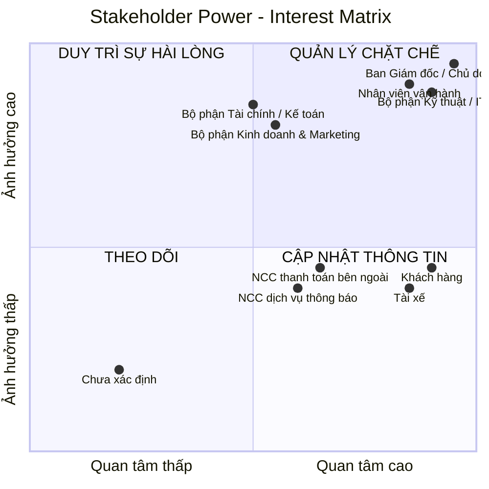
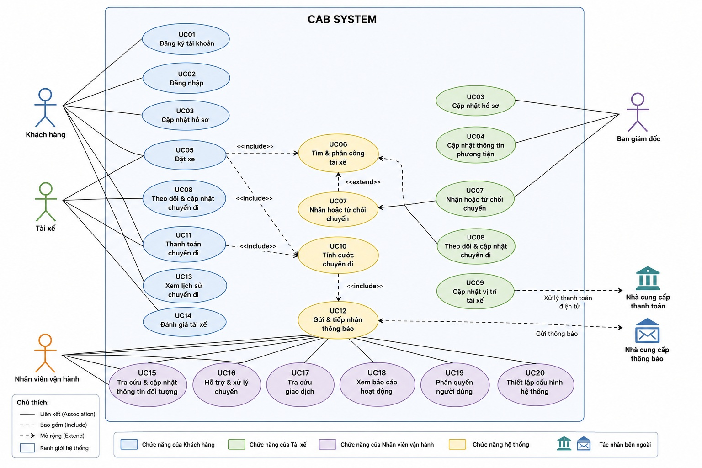
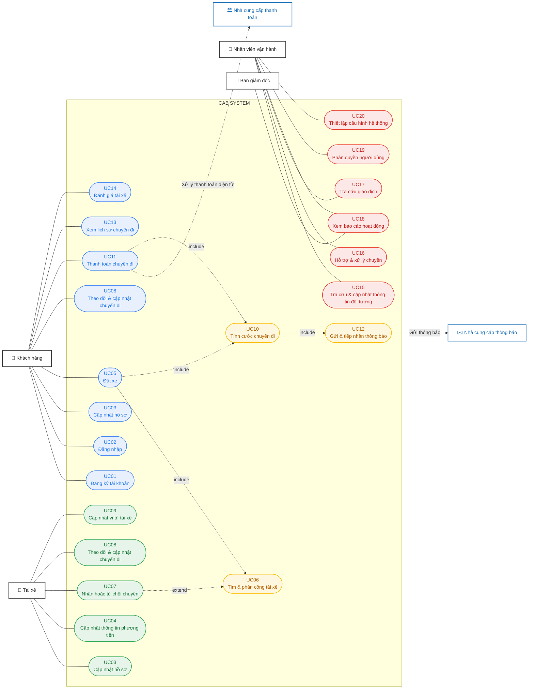

# 23641051_TranTrongDuythuc_cabsystem

## 1/ Stakeholder
### BẢNG PHÂN TÍCH VÀ XÁC ĐỊNH STAKEHOLDERS (CAB SYSTEM)
| STT | Nhóm Stakeholder | Vai trò chi tiết | Vai trò & Kỳ vọng chính đối với hệ thống CAB |
|---:|---|---|---|
| 1 | **Ban giám đốc / Chủ doanh nghiệp** | Định hướng hoạt động kinh doanh, quyết định mục tiêu và phạm vi hệ thống | Muốn hệ thống vận hành ổn định, phục vụ số lượng lớn khách hàng và tài xế, kiểm soát doanh thu, hiệu quả hoạt động và có khả năng mở rộng |
| 2 | **Khách hàng** | Người sử dụng dịch vụ để đặt và sử dụng chuyến xe | Đăng ký/đăng nhập, đặt xe nhanh, theo dõi trạng thái chuyến, biết thông tin tài xế, thanh toán, xem lịch sử và đánh giá tài xế |
| 3 | **Tài xế** | Người nhận và trực tiếp thực hiện chuyến xe | Quản lý hồ sơ và phương tiện, cập nhật trạng thái sẵn sàng, nhận thông báo chuyến, chấp nhận/từ chối chuyến, cập nhật trạng thái và hoàn thành chuyến |
| 4 | **Nhân viên vận hành** | Theo dõi và điều phối hoạt động đặt xe hằng ngày | Theo dõi chuyến đang diễn ra, trạng thái tài xế, hỗ trợ xử lý chuyến lỗi, quản lý thông tin khách hàng, tài xế, phương tiện và tra cứu lịch sử |
| 5 | **Bộ phận Tài chính / Kế toán** | Theo dõi các khoản thanh toán, giao dịch và doanh thu từ chuyến xe | Tra cứu giao dịch, theo dõi số tiền phải thu, trạng thái thanh toán và doanh thu; đảm bảo dữ liệu tài chính chính xác |
| 6 | **Nhà cung cấp thanh toán bên ngoài** | Cung cấp dịch vụ xử lý thanh toán điện tử | Tiếp nhận yêu cầu thanh toán, xử lý giao dịch và trả kết quả cho CAB; không yêu cầu CAB lưu thông tin nhạy cảm của thẻ/tài khoản |
| 7 | **Nhà cung cấp dịch vụ thông báo** | Cung cấp các kênh gửi thông báo đến khách hàng và tài xế | Gửi thông báo về đặt xe, tài xế, chuyến đi và thanh toán; hỗ trợ khả năng bổ sung hoặc thay đổi kênh thông báo trong tương lai |
| 8 | **Bộ phận Kinh doanh & Marketing** | Phụ trách hoạt động kinh doanh, thu hút khách hàng và phát triển dịch vụ | Cần dữ liệu về số lượng chuyến, khách hàng và doanh thu để đánh giá hoạt động kinh doanh; kỳ vọng hệ thống hỗ trợ mở rộng dịch vụ và phát triển khách hàng |
| 9 | **Bộ phận Kỹ thuật / IT** | Quản lý hạ tầng kỹ thuật, vận hành và hỗ trợ hệ thống | Hệ thống ổn định, bảo mật, dễ bảo trì; các thành phần có thể mở rộng độc lập và có thể triển khai tính năng mới từng phần mà hạn chế ảnh hưởng hệ thống đang hoạt động |

## 2/ Stakeholder Power–Interest Matrix
### 2.1/ Phân loại Stakeholder theo Power – Interest
| Nhóm | Tên nhóm | Stakeholder | Power | Interest | Chiến lược quản lý |
|---|---|---|---|---|---|
| **1** | **Quản lý chặt chẽ** | **Ban giám đốc / Chủ doanh nghiệp** | Cao | Cao | Tham gia thường xuyên, xác nhận phạm vi, yêu cầu và các quyết định quan trọng |
| | | **Nhân viên vận hành** | Cao | Cao | Làm việc trực tiếp, thu thập yêu cầu và lấy phản hồi thường xuyên |
| | | **Bộ phận Kỹ thuật / IT** | Cao | Cao | Phối hợp chặt chẽ về kỹ thuật, bảo mật, hiệu năng và khả năng mở rộng |
| **2** | **Duy trì sự hài lòng** | **Bộ phận Tài chính / Kế toán** | Cao | Trung bình | Đảm bảo các yêu cầu về thanh toán, giao dịch và doanh thu |
| | | **Bộ phận Kinh doanh & Marketing** | Cao | Trung bình | Đảm bảo có dữ liệu cần thiết để theo dõi hoạt động kinh doanh |
| **3** | **Cập nhật thông tin** | **Khách hàng** | Thấp – Trung bình | Cao | Thu thập nhu cầu, phản hồi và ưu tiên trải nghiệm người dùng |
| | | **Tài xế** | Thấp – Trung bình | Cao | Khảo sát quy trình thực tế và thu thập phản hồi |
| | | **Nhà cung cấp thanh toán bên ngoài** | Trung bình | Trung bình – Cao | Trao đổi yêu cầu tích hợp, trạng thái giao dịch và xử lý lỗi |
| | | **Nhà cung cấp dịch vụ thông báo** | Trung bình | Trung bình – Cao | Đảm bảo yêu cầu tích hợp và khả năng mở rộng kênh thông báo |
| **4** | **Theo dõi** | **Chưa xác định** | Thấp | Thấp | Chỉ cần theo dõi, không cần tham gia thường xuyên |

### 2.2/ Ma trận 2 chiều phân loại Stakeholder theo:
- **Trục X:** Mức độ quan tâm (Interest)
- **Trục Y:** Mức độ ảnh hưởng (Power)

## 3/ Business goals
### BẢNG XÁC ĐỊNH MỤC TIÊU KINH DOANH (BUSINESS GOALS)
| STT | Business Goal | Mô tả | Kỳ vọng / Kết quả cần đạt |
|---:|---|---|---|
| 1 | **Nâng cao hiệu quả đặt xe** | Thay thế quy trình đặt xe và phân công tài xế thủ công bằng hệ thống CAB | Khách hàng có thể đặt xe nhanh, hệ thống tự động tiếp nhận và xử lý yêu cầu |
| 2 | **Tự động hóa việc tìm và phân công tài xế** | Tự động tìm tài xế phù hợp dựa trên vị trí, trạng thái sẵn sàng và tiêu chí vận hành | Giảm thời gian điều phối, hạn chế phụ thuộc vào nhân viên vận hành |
| 3 | **Cải thiện trải nghiệm khách hàng** | Cung cấp thông tin rõ ràng trong toàn bộ quá trình sử dụng dịch vụ | Khách hàng biết trạng thái chuyến, tài xế, thời gian dự kiến đến, chi phí và kết quả thanh toán |
| 4 | **Nâng cao hiệu quả hoạt động của tài xế** | Hỗ trợ tài xế nhận và xử lý chuyến thông qua hệ thống | Tài xế dễ dàng nhận chuyến, cập nhật trạng thái và hoàn thành chuyến |
| 5 | **Quản lý tập trung dữ liệu vận hành** | Tập trung thông tin khách hàng, tài xế, phương tiện, chuyến đi và giao dịch | Nhân viên có thể tra cứu và quản lý dữ liệu từ một hệ thống thống nhất |
| 6 | **Quản lý thanh toán và doanh thu hiệu quả** | Tích hợp thanh toán điện tử và quản lý kết quả thanh toán | Theo dõi được số tiền phải trả, trạng thái giao dịch và doanh thu; không lưu thông tin thanh toán nhạy cảm |
| 7 | **Giảm tỷ lệ chuyến không được phân công** | Xây dựng cơ chế tiếp tục tìm tài xế khi tài xế được đề xuất không phản hồi hoặc từ chối | Tăng khả năng tìm được tài xế mà khách hàng không phải tạo lại yêu cầu |
| 8 | **Tăng khả năng kiểm soát hoạt động vận hành** | Cung cấp giao diện để nhân viên theo dõi chuyến và trạng thái tài xế | Nhân viên có thể phát hiện và xử lý nhanh các trường hợp bất thường |
| 9 | **Cung cấp dữ liệu phục vụ quản lý và ra quyết định** | Tổng hợp các chỉ số hoạt động chính | Ban lãnh đạo có thể theo dõi số chuyến, doanh thu, tỷ lệ hoàn thành, tỷ lệ hủy và hiệu quả tài xế |
| 10 | **Đảm bảo an toàn và bảo mật dữ liệu** | Bảo vệ thông tin cá nhân, phương tiện, vị trí và giao dịch | Chỉ người có quyền mới được truy cập dữ liệu/chức năng phù hợp; các thao tác quan trọng được lưu vết |
| 11 | **Đảm bảo hệ thống hoạt động ổn định khi nhu cầu tăng cao** | Thiết kế hệ thống có khả năng mở rộng khi số lượng khách hàng và tài xế tăng | Hạn chế tình trạng hệ thống bị gián đoạn hoặc giảm hiệu năng trong giờ cao điểm |
| 12 | **Tạo nền tảng có khả năng mở rộng trong tương lai** | Xây dựng CAB không chỉ phục vụ MVP mà còn hỗ trợ phát triển thêm dịch vụ và tích hợp | Có thể bổ sung loại dịch vụ, phương thức thanh toán, kênh thông báo và thay đổi thành phần kỹ thuật mà không phải xây dựng lại toàn bộ hệ thống |

## 4/ Scope
### BẢNG PHẠM VI CÔNG VIỆC THEO MODULE 
| STT | Module | Phạm vi công việc chính |
|---:|---|---|
| 1 | **Quản lý tài khoản & hồ sơ** | Đăng ký, đăng nhập, đăng xuất; cập nhật thông tin khách hàng và tài xế; quản lý trạng thái tài xế |
| 2 | **Đặt xe (Booking)** | Nhập điểm đón, điểm đến; lựa chọn loại xe; tạo và xác nhận yêu cầu đặt xe |
| 3 | **Tìm & phân công tài xế (Dispatch)** | Xác định tài xế phù hợp dựa trên vị trí và trạng thái sẵn sàng; gửi yêu cầu chuyến; tài xế chấp nhận hoặc từ chối; tiếp tục tìm tài xế khác khi không có phản hồi hoặc bị từ chối |
| 4 | **Quản lý & theo dõi chuyến đi** | Quản lý trạng thái chuyến từ khi tạo yêu cầu đến khi hoàn thành hoặc hủy; theo dõi thông tin tài xế, vị trí và thời gian dự kiến đến |
| 5 | **Quản lý tài xế & phương tiện** | Quản lý hồ sơ tài xế; thông tin phương tiện; trạng thái hoạt động; thông tin vị trí tài xế |
| 6 | **Tính cước & thanh toán** | Xác định số tiền phải trả; hỗ trợ thanh toán tiền mặt và điện tử; tích hợp nhà cung cấp thanh toán; xử lý và lưu trạng thái giao dịch |
| 7 | **Thông báo** | Gửi thông báo cho khách hàng và tài xế về đặt xe, nhận chuyến, tài xế đến, trạng thái chuyến và kết quả thanh toán |
| 8 | **Quản trị & vận hành** | Quản lý khách hàng, tài xế, phương tiện và chuyến đi; theo dõi chuyến đang diễn ra; xử lý chuyến lỗi; tra cứu giao dịch; phân quyền |
| 9 | **Báo cáo & giám sát** | Cung cấp báo cáo về số lượng chuyến, doanh thu, tỷ lệ hoàn thành, tỷ lệ hủy và hiệu quả hoạt động của tài xế |

## 5/ Business Requirements
### **BẢNG YÊU CẦU NGHIỆP VỤ (BUSINESS REQUIREMENTS)**
| ID | Business Requirement | Mô tả |
|---|---|---|
| **BR-01** | Quản lý dịch vụ đặt xe | Hệ thống phải hỗ trợ doanh nghiệp cung cấp dịch vụ đặt xe trực tuyến từ khi khách hàng tạo yêu cầu đến khi chuyến đi hoàn thành. |
| **BR-02** | Quản lý khách hàng | Hệ thống phải cho phép doanh nghiệp quản lý thông tin tài khoản và hồ sơ của khách hàng sử dụng dịch vụ. |
| **BR-03** | Quản lý tài xế | Hệ thống phải hỗ trợ doanh nghiệp quản lý tài khoản, hồ sơ, trạng thái hoạt động và thông tin liên quan của tài xế. |
| **BR-04** | Quản lý phương tiện | Hệ thống phải cho phép quản lý thông tin phương tiện được sử dụng để cung cấp dịch vụ vận chuyển. |
| **BR-05** | Tự động tìm và phân công tài xế | Hệ thống phải hỗ trợ tự động tìm tài xế phù hợp dựa trên vị trí, trạng thái sẵn sàng và các tiêu chí vận hành được doanh nghiệp xác định. |
| **BR-06** | Xử lý trường hợp tài xế không nhận chuyến | Hệ thống phải tiếp tục tìm tài xế khác khi tài xế được đề xuất không phản hồi hoặc từ chối chuyến, không yêu cầu khách hàng tạo lại yêu cầu. |
| **BR-07** | Quản lý quá trình thực hiện chuyến | Hệ thống phải hỗ trợ doanh nghiệp và các bên liên quan theo dõi chuyến đi từ lúc đặt xe đến khi hoàn thành hoặc bị hủy. |
| **BR-08** | Theo dõi vị trí và thời gian dự kiến | Hệ thống phải sử dụng thông tin vị trí của tài xế để hỗ trợ tìm tài xế gần khách hàng và cung cấp thời gian dự kiến tài xế đến. |
| **BR-09** | Tính cước chuyến đi | Hệ thống phải xác định số tiền khách hàng phải trả dựa trên loại dịch vụ và thông tin của chuyến đi. |
| **BR-10** | Hỗ trợ thanh toán | Hệ thống phải hỗ trợ thanh toán bằng tiền mặt và thanh toán điện tử thông qua nhà cung cấp thanh toán bên ngoài. |
| **BR-11** | Quản lý kết quả thanh toán | Hệ thống phải ghi nhận trạng thái giao dịch và thông báo cho khách hàng khi thanh toán thành công hoặc thất bại; cho phép xử lý lại giao dịch thất bại theo chính sách doanh nghiệp. |
| **BR-12** | Quản lý thông báo | Hệ thống phải cung cấp thông báo kịp thời cho khách hàng và tài xế về các sự kiện quan trọng trong quá trình đặt và thực hiện chuyến. |
| **BR-13** | Hỗ trợ vận hành | Hệ thống phải cung cấp giao diện để nhân viên vận hành theo dõi chuyến, trạng thái tài xế và xử lý các trường hợp chuyến bị lỗi. |
| **BR-14** | Quản lý và tra cứu dữ liệu | Hệ thống phải tập trung dữ liệu khách hàng, tài xế, phương tiện, chuyến đi và giao dịch để hỗ trợ quản lý và tra cứu. |
| **BR-15** | Báo cáo hoạt động kinh doanh | Hệ thống phải cung cấp các báo cáo cơ bản về số lượng chuyến, doanh thu, tỷ lệ hoàn thành, tỷ lệ hủy và hiệu quả hoạt động của tài xế. |
| **BR-16** | Đánh giá chất lượng dịch vụ | Hệ thống phải cho phép khách hàng đánh giá tài xế sau khi chuyến đi hoàn thành để doanh nghiệp theo dõi chất lượng dịch vụ. |
| **BR-17** | Kiểm soát quyền truy cập | Hệ thống phải đảm bảo các chức năng và dữ liệu quản trị chỉ được truy cập bởi nhân viên có quyền phù hợp. |
| **BR-18** | Bảo vệ dữ liệu | Hệ thống phải bảo vệ thông tin cá nhân, thông tin phương tiện, dữ liệu vị trí và dữ liệu giao dịch của người dùng. |
| **BR-19** | Lưu vết hoạt động | Hệ thống phải lưu lại các thao tác quan trọng để phục vụ kiểm tra và xử lý sự cố khi cần thiết. |
| **BR-20** | Đảm bảo tính ổn định của dịch vụ | Hệ thống phải hạn chế việc một thành phần gặp lỗi, như thanh toán hoặc thông báo, làm gián đoạn toàn bộ hoạt động đặt xe. |
| **BR-21** | Hỗ trợ mở rộng hệ thống | Hệ thống phải có khả năng mở rộng để phục vụ số lượng lớn khách hàng, tài xế và chuyến đi khi hoạt động kinh doanh phát triển. |

## 6/ Functional Requirements
### BẢNG PHÂN RÃ YÊU CẦU CHỨC NĂNG (FUNCTIONAL REQUIREMENTS)
| ID | Business Requirement | Functional Requirement |
|---|---|---|
| **FR-01.01** | **BR-01 Quản lý dịch vụ đặt xe** | Hệ thống cho phép khách hàng tạo yêu cầu đặt xe. |
| **FR-01.02** | | Hệ thống tiếp nhận và ghi nhận yêu cầu đặt xe. |
| **FR-01.03** | | Hệ thống cập nhật trạng thái xử lý của yêu cầu đặt xe. |
| **FR-01.04** | | Hệ thống cho phép hủy yêu cầu/chuyến đi theo chính sách được xác định. |
| **FR-02.01** | **BR-02 Quản lý khách hàng** | Hệ thống cho phép khách hàng đăng ký tài khoản. |
| **FR-02.02** | | Hệ thống cho phép khách hàng đăng nhập và đăng xuất. |
| **FR-02.03** | | Hệ thống cho phép khách hàng cập nhật thông tin cá nhân. |
| **FR-02.04** | | Hệ thống lưu trữ và quản lý thông tin tài khoản khách hàng. |
| **FR-03.01** | **BR-03 Quản lý tài xế** | Hệ thống cho phép tạo tài khoản tài xế. |
| **FR-03.02** | | Hệ thống cho phép tài xế cập nhật thông tin hồ sơ. |
| **FR-03.03** | | Hệ thống cho phép tài xế chuyển đổi trạng thái sẵn sàng/không sẵn sàng nhận chuyến. |
| **FR-03.04** | | Hệ thống ghi nhận trạng thái hoạt động hiện tại của tài xế. |
| **FR-04.01** | **BR-04 Quản lý phương tiện** | Hệ thống cho phép nhân viên vận hành tạo thông tin phương tiện. |
| **FR-04.02** | | Hệ thống cho phép cập nhật thông tin phương tiện. |
| **FR-04.03** | | Hệ thống cho phép liên kết phương tiện với tài xế. |
| **FR-04.04** | | Hệ thống lưu trữ thông tin phương tiện để phục vụ quản lý chuyến đi. |
| **FR-05.01** | **BR-05 Tìm & phân công tài xế** | Hệ thống xác định các tài xế đang sẵn sàng nhận chuyến. |
| **FR-05.02** | | Hệ thống xác định vị trí hiện tại của các tài xế phù hợp. |
| **FR-05.03** | | Hệ thống lọc tài xế theo các tiêu chí vận hành được cấu hình. |
| **FR-05.04** | | Hệ thống ưu tiên tài xế phù hợp và gần điểm đón. |
| **FR-05.05** | | Hệ thống gửi yêu cầu nhận chuyến đến tài xế được lựa chọn. |
| **FR-05.06** | | Hệ thống ghi nhận tài xế đã nhận chuyến. |
| **FR-06.01** | **BR-06 Xử lý tài xế không nhận chuyến** | Hệ thống ghi nhận trường hợp tài xế từ chối chuyến. |
| **FR-06.02** | | Hệ thống xác định trường hợp tài xế không phản hồi trong thời gian quy định. |
| **FR-06.03** | | Hệ thống tự động chuyển yêu cầu sang tài xế phù hợp tiếp theo. |
| **FR-06.04** | | Hệ thống tiếp tục tìm tài xế khác cho đến khi tìm được tài xế hoặc hết tài xế phù hợp. |
| **FR-06.05** | | Hệ thống thông báo cho khách hàng khi không tìm được tài xế. |
| **FR-07.01** | **BR-07 Quản lý chuyến đi** | Hệ thống tạo chuyến đi sau khi tài xế nhận yêu cầu. |
| **FR-07.02** | | Hệ thống cho phép tài xế cập nhật trạng thái **đã đến điểm đón**. |
| **FR-07.03** | | Hệ thống cho phép tài xế cập nhật trạng thái **đã đón khách**. |
| **FR-07.04** | | Hệ thống cho phép tài xế cập nhật trạng thái **đang di chuyển**. |
| **FR-07.05** | | Hệ thống cho phép tài xế cập nhật trạng thái **hoàn thành chuyến**. |
| **FR-07.06** | | Hệ thống cho phép xử lý trạng thái **hủy chuyến**. |
| **FR-07.07** | | Hệ thống lưu lại lịch sử và trạng thái của chuyến đi. |
| **FR-08.01** | **BR-08 Theo dõi vị trí & ETA** | Hệ thống ghi nhận vị trí hiện tại của tài xế. |
| **FR-08.02** | | Hệ thống cập nhật vị trí tài xế trong quá trình thực hiện chuyến. |
| **FR-08.03** | | Hệ thống sử dụng vị trí tài xế để hỗ trợ tìm tài xế phù hợp. |
| **FR-08.04** | | Hệ thống cung cấp thời gian dự kiến tài xế đến cho khách hàng. |
| **FR-08.05** | | Hệ thống hiển thị thông tin vị trí/trạng thái chuyến cho khách hàng. |
| **FR-09.01** | **BR-09 Tính cước** | Hệ thống xác định loại dịch vụ của chuyến đi. |
| **FR-09.02** | | Hệ thống thu thập thông tin cần thiết để tính cước. |
| **FR-09.03** | | Hệ thống tính số tiền khách hàng phải trả theo quy tắc tính cước. |
| **FR-09.04** | | Hệ thống lưu số tiền phải trả của chuyến đi. |
| **FR-10.01** | **BR-10 Thanh toán** | Hệ thống cho phép khách hàng lựa chọn thanh toán bằng tiền mặt. |
| **FR-10.02** | | Hệ thống cho phép khách hàng lựa chọn thanh toán điện tử. |
| **FR-10.03** | | Hệ thống gửi yêu cầu thanh toán điện tử đến nhà cung cấp thanh toán. |
| **FR-10.04** | | Hệ thống nhận kết quả giao dịch từ nhà cung cấp thanh toán. |
| **FR-10.05** | | Hệ thống không lưu trực tiếp thông tin nhạy cảm của thẻ/tài khoản thanh toán. |
| **FR-11.01** | **BR-11 Quản lý kết quả thanh toán** | Hệ thống ghi nhận trạng thái giao dịch thanh toán. |
| **FR-11.02** | | Hệ thống thông báo cho khách hàng khi thanh toán thành công. |
| **FR-11.03** | | Hệ thống thông báo cho khách hàng khi thanh toán thất bại. |
| **FR-11.04** | | Hệ thống cho phép thực hiện lại thanh toán khi giao dịch thất bại theo chính sách doanh nghiệp. |
| **FR-12.01** | **BR-12 Thông báo** | Hệ thống thông báo cho khách hàng khi yêu cầu đặt xe được tiếp nhận. |
| **FR-12.02** | | Hệ thống thông báo cho khách hàng khi tài xế nhận chuyến. |
| **FR-12.03** | | Hệ thống thông báo khi tài xế đến điểm đón. |
| **FR-12.04** | | Hệ thống thông báo khi chuyến đi hoàn thành. |
| **FR-12.05** | | Hệ thống thông báo kết quả thanh toán. |
| **FR-12.06** | | Hệ thống thông báo cho tài xế khi có chuyến mới. |
| **FR-12.07** | | Hệ thống thông báo cho tài xế khi có thay đổi liên quan đến chuyến đang thực hiện. |
| **FR-13.01** | **BR-13 Hỗ trợ vận hành** | Hệ thống cung cấp giao diện quản trị cho nhân viên vận hành. |
| **FR-13.02** | | Nhân viên vận hành có thể xem danh sách chuyến đang diễn ra. |
| **FR-13.03** | | Nhân viên vận hành có thể kiểm tra trạng thái tài xế. |
| **FR-13.04** | | Nhân viên vận hành có thể tra cứu thông tin khách hàng, tài xế và phương tiện. |
| **FR-13.05** | | Nhân viên vận hành có thể tra cứu lịch sử chuyến đi. |
| **FR-13.06** | | Nhân viên vận hành có thể tra cứu lịch sử giao dịch. |
| **FR-13.07** | | Nhân viên vận hành có thể hỗ trợ xử lý các trường hợp chuyến bị lỗi. |
| **FR-14.01** | **BR-14 Quản lý & tra cứu dữ liệu** | Hệ thống lưu trữ tập trung thông tin khách hàng. |
| **FR-14.02** | | Hệ thống lưu trữ tập trung thông tin tài xế và phương tiện. |
| **FR-14.03** | | Hệ thống lưu trữ thông tin chuyến đi. |
| **FR-14.04** | | Hệ thống lưu trữ thông tin giao dịch. |
| **FR-14.05** | | Người dùng có quyền có thể tìm kiếm và tra cứu dữ liệu. |
| **FR-15.01** | **BR-15 Báo cáo** | Hệ thống cung cấp báo cáo số lượng chuyến. |
| **FR-15.02** | | Hệ thống cung cấp báo cáo doanh thu. |
| **FR-15.03** | | Hệ thống cung cấp tỷ lệ chuyến hoàn thành. |
| **FR-15.04** | | Hệ thống cung cấp tỷ lệ chuyến hủy. |
| **FR-15.05** | | Hệ thống cung cấp thông tin hiệu quả hoạt động của tài xế. |
| **FR-16.01** | **BR-16 Đánh giá tài xế** | Hệ thống cho phép khách hàng đánh giá tài xế sau khi hoàn thành chuyến. |
| **FR-16.02** | | Hệ thống lưu kết quả đánh giá của khách hàng. |
| **FR-16.03** | | Hệ thống cho phép doanh nghiệp tra cứu kết quả đánh giá. |
| **FR-17.01** | **BR-17 Kiểm soát quyền truy cập** | Hệ thống xác thực khách hàng và tài xế trước khi sử dụng chức năng yêu cầu tài khoản. |
| **FR-17.02** | | Hệ thống xác thực nhân viên trước khi truy cập giao diện quản trị. |
| **FR-17.03** | | Hệ thống phân quyền chức năng theo vai trò người dùng. |
| **FR-17.04** | | Hệ thống ngăn người dùng thực hiện chức năng ngoài quyền được cấp. |
| **FR-18.01** | **BR-18 Bảo vệ dữ liệu** | Hệ thống kiểm soát quyền truy cập thông tin cá nhân. |
| **FR-18.02** | | Hệ thống bảo vệ thông tin phương tiện và dữ liệu vị trí. |
| **FR-18.03** | | Hệ thống bảo vệ dữ liệu giao dịch và thanh toán. |
| **FR-19.01** | **BR-19 Lưu vết hoạt động** | Hệ thống ghi nhận các thao tác quản trị quan trọng. |
| **FR-19.02** | | Hệ thống ghi nhận người thực hiện, thời gian và thao tác đã thực hiện. |
| **FR-19.03** | | Người có quyền có thể tra cứu log phục vụ kiểm tra và xử lý sự cố. |
| **FR-20.01** | **BR-20 Ổn định dịch vụ** | Hệ thống phải xử lý lỗi của dịch vụ thanh toán mà không làm dừng chức năng đặt xe. |
| **FR-20.02** | | Hệ thống phải xử lý lỗi của dịch vụ thông báo mà không làm dừng chức năng đặt xe. |
| **FR-20.03** | | Hệ thống phải ghi nhận các lỗi xảy ra trong quá trình xử lý để phục vụ kiểm tra. |
| **FR-21.01** | **BR-21 Mở rộng hệ thống** | Hệ thống cho phép mở rộng khả năng phục vụ khi số lượng khách hàng và tài xế tăng. |
| **FR-21.02** | | Các thành phần xử lý chính có thể được mở rộng độc lập khi cần thiết. |
| **FR-21.03** | | Hệ thống hỗ trợ triển khai thêm chức năng mà hạn chế ảnh hưởng đến chức năng đang hoạt động. |

## 7/ Vẽ use case
## 7.1/ Xác định Actors
| STT | Actor | Vai trò |
| :---: | :--- | :--- |
| 1 | **Khách hàng** | Sử dụng dịch vụ đặt xe: đăng ký, đăng nhập, quản lý thông tin cá nhân, đặt xe, theo dõi chuyến, hủy chuyến, thanh toán, xem lịch sử và đánh giá tài xế. |
| 2 | **Tài xế** | Cung cấp dịch vụ vận chuyển: quản lý hồ sơ và phương tiện, cập nhật trạng thái hoạt động, nhận hoặc từ chối chuyến, cập nhật trạng thái chuyến và vị trí. |
| 3 | **Nhân viên vận hành** | Điều phối và giám sát hoạt động đặt xe; quản lý thông tin khách hàng, tài xế, phương tiện; theo dõi chuyến đi, hỗ trợ xử lý sự cố, tra cứu giao dịch và phân quyền theo chức năng được cấp. |
| 4 | **Ban giám đốc** | Theo dõi tình hình hoạt động và hiệu quả kinh doanh thông qua các báo cáo về số lượng chuyến, doanh thu, tỷ lệ hoàn thành, tỷ lệ hủy và hiệu quả tài xế. |
| 5 | **Nhà cung cấp thanh toán** | Tiếp nhận và xử lý các giao dịch thanh toán điện tử, sau đó trả kết quả giao dịch cho hệ thống CAB. |
| 6 | **Nhà cung cấp thông báo** | Cung cấp dịch vụ gửi thông báo đến khách hàng và tài xế về các sự kiện trong quá trình đặt và thực hiện chuyến. |

## 7.2/ Sơ đồ use case

## 8/ Đặc tả use case
### 8.1/ Đặc tả use case Đăng ký tài khoản
| Thành phần | Nội dung | |
| :--- | :--- | :--- |
| **Tên Use Case** | Đăng ký tài khoản | |
| **Tiền điều kiện** | Người dùng chưa có tài khoản trên hệ thống và hệ thống đang hoạt động bình thường. | |
| **Hậu điều kiện** | Tài khoản được tạo thành công và thông tin tài khoản được lưu vào CSDL. Người dùng có thể sử dụng tài khoản để đăng nhập. | |
| **Actor chính** | Khách hàng | |
| **Actor phụ** | Không | |
| **Basic flow** | **Actor (Khách hàng)** | **System (Hệ thống)** |
| | 1. Chọn chức năng “Đăng ký tài khoản” | 2. Hiển thị biểu mẫu đăng ký tài khoản |
| | 3. Nhập họ tên, số điện thoại, email và mật khẩu | 4. Kiểm tra tính hợp lệ của thông tin đăng ký |
| | | 5. Kiểm tra số điện thoại và email chưa được sử dụng |
| | 6. Chọn “Đăng ký” | 7. Hiển thị yêu cầu xác nhận đăng ký |
| | 8. Chọn “Xác nhận” | 9. Tạo tài khoản mới và lưu thông tin |
| | | 10. Hiển thị thông báo “Đăng ký tài khoản thành công” |
| | | 11. Kết thúc Use Case |
| **Alternative flow** | **6.1 Khách hàng hủy đăng ký:** Khách hàng chọn “Hủy” → Hệ thống không tạo tài khoản → Quay về màn hình trước đó. **8.1 Khách hàng hủy xác nhận:** Khách hàng chọn “Hủy” → Hệ thống không lưu thông tin đăng ký → Giữ nguyên biểu mẫu → Quay lại bước 6. | |
| **Exception** | **4.1 Thông tin đăng ký không hợp lệ:** Hệ thống phát hiện thông tin chưa đầy đủ hoặc sai định dạng → Thông báo lỗi → Khách hàng nhập lại thông tin → Quay lại bước 3. **5.1 Số điện thoại hoặc email đã tồn tại:** Hệ thống phát hiện thông tin đã được sử dụng → Thông báo lỗi → Khách hàng nhập thông tin khác → Quay lại bước 3. | |

### 8.2/ Đặc tả use case Đăng nhập
| Thành phần | Nội dung | |
| :--- | :--- | :--- |
| **Tên Use Case** | Đăng nhập | |
| **Tiền điều kiện** | Người dùng đã có tài khoản và tài khoản đang ở trạng thái được phép đăng nhập. | |
| **Hậu điều kiện** | Người dùng đăng nhập thành công, hệ thống xác định vai trò và quyền truy cập, sau đó hiển thị giao diện phù hợp. | |
| **Actor chính** | Khách hàng / Tài xế / Nhân viên vận hành / Ban giám đốc | |
| **Actor phụ** | Không | |
| **Basic flow** | **Actor** | **System (Hệ thống)** |
| | 1. Chọn chức năng “Đăng nhập” | 2. Hiển thị biểu mẫu đăng nhập |
| | 3. Nhập số điện thoại/email và mật khẩu | 4. Kiểm tra tính hợp lệ của thông tin đăng nhập |
| | 5. Chọn “Đăng nhập” | 6. Xác thực tài khoản |
| | | 7. Xác định vai trò và quyền truy cập |
| | | 8. Tạo phiên đăng nhập |
| | | 9. Hiển thị giao diện phù hợp với vai trò |
| | | 10. Kết thúc Use Case |
| **Alternative flow** | **5.1 Người dùng hủy đăng nhập:** Người dùng chọn “Hủy” → Hệ thống không thực hiện đăng nhập → Quay về màn hình trước đó. | |
| **Exception** | **6.1 Thông tin đăng nhập không chính xác:** Hệ thống phát hiện thông tin không chính xác → Hiển thị thông báo lỗi → Người dùng nhập lại thông tin → Quay lại bước 3. **6.2 Tài khoản bị khóa:** Hệ thống phát hiện tài khoản bị khóa → Thông báo tài khoản không được phép đăng nhập → Kết thúc Use Case. | |

### 8.3/ Đặc tả use case Cập nhật hồ sơ
| Thành phần | Nội dung | |
| :--- | :--- | :--- |
| **Tên Use Case** | Cập nhật hồ sơ | |
| **Tiền điều kiện** | Khách hàng hoặc tài xế đã đăng nhập thành công. | |
| **Hậu điều kiện** | Thông tin hồ sơ mới được lưu thành công vào CSDL và hiển thị thông tin mới trên hệ thống. | |
| **Actor chính** | Khách hàng / Tài xế | |
| **Actor phụ** | Không | |
| **Basic flow** | **Actor (Khách hàng / Tài xế)** | **System (Hệ thống)** |
| | 1. Chọn chức năng “Hồ sơ cá nhân” | 2. Hiển thị thông tin hồ sơ hiện tại |
| | 3. Chọn “Cập nhật hồ sơ” | 4. Hiển thị biểu mẫu cập nhật hồ sơ |
| | 5. Chỉnh sửa thông tin cần thay đổi | 6. Kiểm tra tính hợp lệ của thông tin |
| | 7. Chọn “Lưu” | 8. Hiển thị yêu cầu xác nhận cập nhật |
| | 9. Chọn “Xác nhận” | 10. Lưu thông tin hồ sơ mới |
| | | 11. Hiển thị thông báo “Cập nhật hồ sơ thành công” |
| | | 12. Kết thúc Use Case |
| **Alternative flow** | **9.1 Người dùng hủy cập nhật:** Người dùng chọn “Hủy” → Hệ thống không lưu thông tin mới → Giữ nguyên thông tin hồ sơ → Quay lại bước 2. | |
| **Exception** | **6.1 Thông tin hồ sơ không hợp lệ:** Hệ thống phát hiện thông tin không đúng định dạng hoặc chưa đầy đủ → Hiển thị thông báo lỗi → Người dùng nhập lại thông tin → Quay lại bước 5. | |

### 8.4/ Đặc tả use case Cập nhật thông tin phương tiện
| Thành phần | Nội dung | |
| :--- | :--- | :--- |
| **Tên Use Case** | Cập nhật thông tin phương tiện | |
| **Tiền điều kiện** | Tài xế hoặc nhân viên vận hành đã đăng nhập và có quyền cập nhật thông tin phương tiện. | |
| **Hậu điều kiện** | Thông tin phương tiện được cập nhật thành công và lưu vào CSDL. | |
| **Actor chính** | Tài xế | |
| **Actor phụ** | Nhân viên vận hành | |
| **Basic flow** | **Actor (Tài xế / Nhân viên vận hành)** | **System (Hệ thống)** |
| | 1. Chọn chức năng “Thông tin phương tiện” | 2. Hiển thị danh sách phương tiện |
| | 3. Chọn phương tiện cần cập nhật | 4. Hiển thị thông tin chi tiết phương tiện |
| | 5. Chọn “Cập nhật” | 6. Hiển thị biểu mẫu cập nhật |
| | 7. Nhập hoặc chỉnh sửa thông tin phương tiện | 8. Kiểm tra tính hợp lệ của thông tin |
| | 9. Chọn “Lưu” | 10. Hiển thị yêu cầu xác nhận |
| | 11. Chọn “Xác nhận” | 12. Lưu thông tin phương tiện |
| | | 13. Hiển thị thông báo “Cập nhật thông tin phương tiện thành công” |
| | | 14. Kết thúc Use Case |
| **Alternative flow** | **11.1 Actor hủy cập nhật:** Actor chọn “Hủy” → Hệ thống không lưu thông tin mới → Giữ nguyên thông tin phương tiện → Quay lại bước 4. | |
| **Exception** | **8.1 Thông tin phương tiện không hợp lệ:** Hệ thống phát hiện thông tin không đầy đủ hoặc sai định dạng → Thông báo lỗi → Actor nhập lại thông tin → Quay lại bước 7. **8.2 Biển số xe đã tồn tại:** Hệ thống phát hiện biển số đã được đăng ký cho phương tiện khác → Thông báo lỗi → Actor nhập lại biển số → Quay lại bước 7. | |

### 8.5/ Đặc tả use case Đặt xe
| Thành phần | Nội dung | |
| :--- | :--- | :--- |
| **Tên Use Case** | Đặt xe | |
| **Tiền điều kiện** | Khách hàng đã đăng nhập thành công và dịch vụ đặt xe đang hoạt động. | |
| **Hậu điều kiện** | Yêu cầu đặt xe được tạo thành công. Hệ thống bắt đầu tìm và phân công tài xế, đồng thời cập nhật trạng thái cho khách hàng. | |
| **Actor chính** | Khách hàng | |
| **Actor phụ** | Không | |
| **Basic flow** | **Actor (Khách hàng)** | **System (Hệ thống)** |
| | 1. Chọn chức năng “Đặt xe” | 2. Hiển thị giao diện đặt xe |
| | 3. Nhập điểm đón và điểm đến | 4. Kiểm tra thông tin địa điểm |
| | 5. Chọn loại dịch vụ/loại xe | 6. Hiển thị thông tin chuyến và cước dự kiến |
| | 7. Kiểm tra thông tin đặt xe | 8. Hiển thị yêu cầu xác nhận đặt xe |
| | 9. Chọn “Xác nhận đặt xe” | 10. Tạo yêu cầu đặt xe |
| | | 11. Thực hiện UC06 – Tìm và phân công tài xế |
| | | 12. Hiển thị trạng thái tìm tài xế |
| | | 13. Gửi thông báo cho khách hàng khi có kết quả phân công |
| | | 14. Kết thúc Use Case |
| **Alternative flow** | **7.1 Khách hàng thay đổi thông tin đặt xe:** Khách hàng chỉnh sửa điểm đón, điểm đến hoặc loại xe → Hệ thống kiểm tra thông tin mới → Tính lại cước dự kiến → Quay lại bước 7. **9.1 Khách hàng hủy đặt xe:** Khách hàng chọn “Hủy” → Hệ thống không tạo yêu cầu đặt xe → Quay về giao diện chính → Kết thúc Use Case. | |
| **Exception** | **4.1 Địa điểm không hợp lệ:** Hệ thống không xác định được điểm đón hoặc điểm đến → Hiển thị thông báo lỗi → Khách hàng nhập lại địa điểm → Quay lại bước 3. **10.1 Không thể tạo yêu cầu đặt xe:** Hệ thống phát hiện lỗi khi lưu yêu cầu → Thông báo lỗi → Khách hàng thực hiện lại thao tác → Quay lại bước 7. | |

### 8.6/ Đặc tả use case Tìm và phân công tài xế
| Thành phần | Nội dung | |
| :--- | :--- | :--- |
| **Tên Use Case** | Tìm và phân công tài xế | |
| **Tiền điều kiện** | Có yêu cầu đặt xe hợp lệ và hệ thống có thông tin tài xế đang hoạt động. | |
| **Hậu điều kiện** | Nếu tìm được tài xế: yêu cầu được gửi đến tài xế phù hợp và chuyến được phân công khi tài xế chấp nhận. Nếu không tìm được: khách hàng được thông báo không có tài xế phù hợp. | |
| **Actor chính** | Hệ thống | |
| **Actor phụ** | Tài xế | |
| **Basic flow** | **Actor (Tài xế)** | **System (Hệ thống)** |
| | | 1. Tiếp nhận yêu cầu tìm tài xế |
| | | 2. Xác định các tài xế đang sẵn sàng nhận chuyến |
| | | 3. Lọc các tài xế phù hợp theo vị trí, trạng thái và loại xe |
| | | 4. Xác định tài xế phù hợp theo tiêu chí phân công |
| | | 5. Gửi yêu cầu nhận chuyến cho tài xế |
| | | 6. Hiển thị yêu cầu chuyến cho tài xế |
| | 7. Nhận yêu cầu và xem thông tin chuyến | 8. Chờ phản hồi của tài xế |
| | 9. Chọn “Nhận chuyến” | 10. Kiểm tra chuyến còn khả dụng |
| | | 11. Gán chuyến cho tài xế |
| | | 12. Cập nhật trạng thái tài xế thành “Đang có chuyến” |
| | | 13. Thông báo kết quả phân công cho khách hàng |
| | | 14. Kết thúc Use Case |
| **Alternative flow** | **9.1 Tài xế chọn “Từ chối”:** Hệ thống ghi nhận tài xế từ chối → Tìm tài xế phù hợp tiếp theo → Gửi yêu cầu cho tài xế tiếp theo → Quay lại bước 6. **8.1 Tài xế không phản hồi:** Hệ thống xác định tài xế hết thời gian phản hồi → Ghi nhận trạng thái “Không phản hồi” → Tìm tài xế tiếp theo → Quay lại bước 5. | |
| **Exception** | **3.1 Không có tài xế phù hợp:** Hệ thống xác định không có tài xế đáp ứng điều kiện → Cập nhật trạng thái yêu cầu → Thông báo cho khách hàng → Kết thúc Use Case. **10.1 Chuyến đã được tài xế khác nhận:** Hệ thống phát hiện chuyến không còn khả dụng → Thông báo cho tài xế → Kết thúc yêu cầu phân công đối với tài xế này. | |

### 8.7/ Đặc tả use case Nhận hoặc từ chối chuyến
| Thành phần | Nội dung | |
| :--- | :--- | :--- |
| **Tên Use Case** | Nhận hoặc từ chối chuyến | |
| **Tiền điều kiện** | Tài xế đã đăng nhập, đang ở trạng thái sẵn sàng nhận chuyến và có yêu cầu chuyến được gửi đến. | |
| **Hậu điều kiện** | Nếu nhận chuyến: chuyến được gán cho tài xế. Nếu từ chối: hệ thống ghi nhận từ chối và tiếp tục tìm tài xế khác. | |
| **Actor chính** | Tài xế | |
| **Actor phụ** | Không | |
| **Basic flow** | **Actor (Tài xế)** | **System (Hệ thống)** |
| | 1. Nhận thông báo có chuyến mới | 2. Hiển thị thông tin chuyến |
| | 3. Xem điểm đón, điểm đến và thông tin chuyến | 4. Hiển thị lựa chọn “Nhận chuyến” và “Từ chối” |
| | 5. Chọn “Nhận chuyến” | 6. Kiểm tra chuyến còn khả dụng |
| | | 7. Gán chuyến cho tài xế |
| | | 8. Cập nhật trạng thái tài xế thành “Đang có chuyến” |
| | | 9. Thông báo cho khách hàng |
| | | 10. Kết thúc Use Case |
| **Alternative flow** | **5.1 Tài xế chọn “Từ chối”:** Hệ thống ghi nhận tài xế từ chối → Cập nhật trạng thái yêu cầu → Thực hiện UC06 để tìm tài xế khác → Kết thúc Use Case. | |
| **Exception** | **6.1 Chuyến đã được tài xế khác nhận:** Hệ thống phát hiện chuyến không còn khả dụng → Thông báo cho tài xế → Cập nhật danh sách chuyến → Kết thúc Use Case. | |

### 8.8/ Đặc tả use case Theo dõi và cập nhật chuyến đi
| Thành phần | Nội dung | |
| :--- | :--- | :--- |
| **Tên Use Case** | Theo dõi và cập nhật chuyến đi | |
| **Tiền điều kiện** | Chuyến đã được tạo, phân công tài xế và tài xế đã nhận chuyến. | |
| **Hậu điều kiện** | Trạng thái chuyến được cập nhật chính xác. Khách hàng có thể theo dõi tiến trình chuyến. Khi hoàn thành, chuyến chuyển sang trạng thái “Hoàn thành”. | |
| **Actor chính** | Tài xế | |
| **Actor phụ** | Khách hàng / Nhân viên vận hành | |
| **Basic flow** | **Actor (Tài xế)** | **System (Hệ thống)** |
| | 1. Nhận chuyến | 2. Cập nhật trạng thái “Đã nhận chuyến” |
| | 3. Di chuyển đến điểm đón | 4. Cập nhật thông tin vị trí và trạng thái chuyến |
| | 5. Chọn “Đã đến điểm đón” | 6. Cập nhật trạng thái “Đã đến điểm đón” |
| | 7. Đón khách | 8. Cập nhật trạng thái “Đã đón khách” |
| | 9. Chọn “Bắt đầu chuyến” | 10. Cập nhật trạng thái “Đang thực hiện chuyến” |
| | 11. Di chuyển đến điểm đến | 12. Cập nhật tiến trình chuyến cho khách hàng |
| | 13. Chọn “Hoàn thành chuyến” | 14. Kiểm tra điều kiện hoàn thành chuyến |
| | | 15. Cập nhật trạng thái “Hoàn thành” |
| | | 16. Thực hiện UC10 – Tính cước chuyến đi |
| | | 17. Gửi thông báo kết quả cho khách hàng |
| | | 18. Kết thúc Use Case |
| **Alternative flow** | **5.1 Tài xế chưa thể đến điểm đón:** Tài xế tiếp tục di chuyển → Hệ thống giữ nguyên trạng thái chuyến → Khi đến điểm đón, quay lại bước 5. **13.1 Tài xế chưa thể hoàn thành chuyến:** Tài xế tiếp tục thực hiện chuyến → Hệ thống giữ nguyên trạng thái “Đang thực hiện chuyến” → Khi đến điểm đến, quay lại bước 13. | |
| **Exception** | **14.1 Không đủ điều kiện hoàn thành chuyến:** Hệ thống phát hiện thông tin chuyến chưa đầy đủ → Hiển thị thông báo lỗi → Tài xế bổ sung thông tin → Quay lại bước 13. | |

### 8.9/ Đặc tả use case Cập nhật vị trí tài xế
| Thành phần | Nội dung | |
| :--- | :--- | :--- |
| **Tên Use Case** | Cập nhật vị trí tài xế | |
| **Tiền điều kiện** | Tài xế đã đăng nhập, cho phép hệ thống truy cập vị trí và đang hoạt động hoặc đang thực hiện chuyến. | |
| **Hậu điều kiện** | Vị trí mới nhất của tài xế được cập nhật. Khách hàng có thể theo dõi vị trí tài xế và hệ thống có dữ liệu để tính ETA. | |
| **Actor chính** | Tài xế | |
| **Actor phụ** | Không | |
| **Basic flow** | **Actor (Tài xế)** | **System (Hệ thống)** |
| | 1. Cho phép hệ thống truy cập vị trí | 2. Xác nhận quyền truy cập vị trí |
| | 3. Bắt đầu hoạt động hoặc thực hiện chuyến | 4. Nhận dữ liệu vị trí từ thiết bị |
| | | 5. Kiểm tra dữ liệu vị trí |
| | | 6. Cập nhật vị trí mới nhất của tài xế |
| | | 7. Tính toán ETA dự kiến |
| | | 8. Cập nhật vị trí và ETA cho khách hàng |
| | | 9. Tiếp tục nhận dữ liệu vị trí trong quá trình hoạt động |
| **Alternative flow** | **1.1 Tài xế chưa cho phép truy cập vị trí:** Hệ thống hiển thị yêu cầu cấp quyền → Tài xế cho phép truy cập → Hệ thống xác nhận quyền → Quay lại bước 3. | |
| **Exception** | **4.1 Không nhận được dữ liệu vị trí:** Hệ thống phát hiện dữ liệu vị trí bị gián đoạn → Ghi nhận trạng thái vị trí không khả dụng → Thông báo cho tài xế → Tiếp tục thử nhận dữ liệu vị trí. | |

### 8.10/ Đặc tả use case Tính cước chuyến đi
| Thành phần | Nội dung | |
| :--- | :--- | :--- |
| **Tên Use Case** | Tính cước chuyến đi | |
| **Tiền điều kiện** | Chuyến có đầy đủ thông tin cần thiết và hệ thống có cấu hình giá áp dụng. | |
| **Hậu điều kiện** | Cước chuyến đi được tính thành công và tổng tiền được lưu vào thông tin chuyến. | |
| **Actor chính** | Hệ thống | |
| **Actor phụ** | Không | |
| **Basic flow** | **Actor** | **System (Hệ thống)** |
| | | 1. Tiếp nhận thông tin chuyến đi |
| | | 2. Xác định loại dịch vụ và bảng giá áp dụng |
| | | 3. Xác định quãng đường và thời gian chuyến đi |
| | | 4. Tính cước theo cấu hình giá hiện hành |
| | | 5. Kiểm tra kết quả tính cước |
| | | 6. Lưu tổng cước vào thông tin chuyến |
| | | 7. Hiển thị tổng cước cho khách hàng |
| | | 8. Kết thúc Use Case |
| **Alternative flow** | **4.1 Hệ thống áp dụng phụ phí:** Hệ thống xác định chuyến thuộc trường hợp áp dụng phụ phí → Tính thêm phụ phí theo cấu hình → Cập nhật lại tổng cước → Quay lại bước 5. | |
| **Exception** | **2.1 Không có bảng giá phù hợp:** Hệ thống không tìm thấy bảng giá → Thông báo không thể tính cước → Không lưu kết quả → Kết thúc Use Case. **5.1 Kết quả tính cước không hợp lệ:** Hệ thống phát hiện kết quả không hợp lệ → Ghi nhận lỗi → Thông báo không thể hoàn tất tính cước → Kết thúc Use Case. | |

### 8.11/ Đặc tả use case Thanh toán chuyến đi
| Thành phần | Nội dung | |
| :--- | :--- | :--- |
| **Tên Use Case** | Thanh toán chuyến đi | |
| **Tiền điều kiện** | Chuyến đã hoàn thành hoặc đủ điều kiện thanh toán và hệ thống đã xác định số tiền cần thanh toán. | |
| **Hậu điều kiện** | Nếu thanh toán thành công: giao dịch được ghi nhận và trạng thái thanh toán được cập nhật “Thành công”. Nếu thất bại: giao dịch được ghi nhận “Thất bại” và khách hàng được thông báo để thực hiện lại theo chính sách. | |
| **Actor chính** | Khách hàng | |
| **Actor phụ** | Nhà cung cấp thanh toán | |
| **Basic flow** | **Actor (Khách hàng)** | **System (Hệ thống)** |
| | 1. Chọn phương thức thanh toán điện tử | 2. Hiển thị số tiền cần thanh toán |
| | 3. Chọn “Thanh toán” | 4. Tạo yêu cầu thanh toán |
| | | 5. Gửi yêu cầu đến nhà cung cấp thanh toán |
| | | 6. Nhà cung cấp thanh toán xử lý giao dịch |
| | | 7. Nhận kết quả giao dịch |
| | | 8. Kiểm tra kết quả thanh toán |
| | | 9. Cập nhật trạng thái thanh toán “Thành công” |
| | | 10. Lưu thông tin giao dịch |
| | | 11. Hiển thị thông báo thanh toán thành công |
| | | 12. Kết thúc Use Case |
| **Alternative flow** | **1.1 Khách hàng chọn thanh toán tiền mặt:** Khách hàng chọn “Tiền mặt” → Hệ thống ghi nhận phương thức thanh toán → Cập nhật trạng thái thanh toán theo quy trình tiền mặt → Kết thúc Use Case. **3.1 Khách hàng hủy thanh toán:** Khách hàng chọn “Hủy” → Hệ thống không gửi yêu cầu thanh toán → Giữ nguyên trạng thái thanh toán → Kết thúc Use Case. | |
| **Exception** | **7.1 Thanh toán thất bại:** Hệ thống nhận kết quả thất bại → Cập nhật trạng thái “Thất bại” → Lưu giao dịch → Thông báo cho khách hàng → Cho phép thanh toán lại theo chính sách. **5.1 Nhà cung cấp thanh toán không phản hồi:** Hệ thống không nhận được kết quả → Ghi nhận giao dịch “Đang xử lý” → Thông báo cho khách hàng → Kết thúc Use Case. | |

### 8.12/ Đặc tả use case Gửi và tiếp nhận thông báo
| Thành phần | Nội dung | |
| :--- | :--- | :--- |
| **Tên Use Case** | Gửi và tiếp nhận thông báo | |
| **Tiền điều kiện** | Có sự kiện cần gửi thông báo, hệ thống có thông tin người nhận và dịch vụ thông báo đang hoạt động. | |
| **Hậu điều kiện** | Thông báo được gửi đến người nhận và kết quả gửi thông báo được ghi nhận vào hệ thống. | |
| **Actor chính** | Hệ thống | |
| **Actor phụ** | Nhà cung cấp thông báo | |
| **Basic flow** | **Actor (Nhà cung cấp thông báo)** | **System (Hệ thống)** |
| | | 1. Phát sinh sự kiện cần gửi thông báo |
| | | 2. Xác định nội dung và người nhận |
| | | 3. Tạo yêu cầu gửi thông báo |
| | | 4. Gửi yêu cầu đến nhà cung cấp thông báo |
| | 5. Tiếp nhận yêu cầu gửi thông báo | 6. Chờ kết quả gửi thông báo |
| | 7. Thực hiện gửi thông báo | 8. Nhận kết quả gửi thông báo |
| | | 9. Lưu kết quả gửi thông báo |
| | | 10. Cập nhật trạng thái thông báo |
| | | 11. Kết thúc Use Case |
| **Alternative flow** | **7.1 Hệ thống thực hiện gửi lại thông báo:** Hệ thống phát hiện thông báo chưa được gửi thành công → Tạo yêu cầu gửi lại → Nhà cung cấp tiếp nhận → Hệ thống cập nhật kết quả gửi. | |
| **Exception** | **8.1 Nhà cung cấp thông báo không phản hồi:** Hệ thống không nhận được kết quả gửi → Ghi nhận trạng thái “Không xác định” → Ghi log sự kiện → Kết thúc Use Case. | |

### 8.13/ Đặc tả use case Xem lịch sử chuyến đi
| Thành phần | Nội dung | |
| :--- | :--- | :--- |
| **Tên Use Case** | Xem lịch sử chuyến đi | |
| **Tiền điều kiện** | Khách hàng đã đăng nhập thành công. | |
| **Hậu điều kiện** | Danh sách lịch sử chuyến đi được hiển thị và khách hàng có thể xem chi tiết các chuyến đã thực hiện. | |
| **Actor chính** | Khách hàng | |
| **Actor phụ** | Không | |
| **Basic flow** | **Actor (Khách hàng)** | **System (Hệ thống)** |
| | 1. Chọn chức năng “Lịch sử chuyến đi” | 2. Truy xuất lịch sử chuyến đi |
| | | 3. Hiển thị danh sách các chuyến đi |
| | 4. Chọn điều kiện lọc nếu cần | 5. Lọc danh sách theo điều kiện |
| | 6. Chọn một chuyến muốn xem | 7. Hiển thị thông tin chi tiết chuyến đi |
| | | 8. Kết thúc Use Case |
| **Alternative flow** | **4.1 Khách hàng không sử dụng bộ lọc:** Hệ thống giữ nguyên danh sách lịch sử → Khách hàng chọn chuyến cần xem → Quay lại bước 6. | |
| **Exception** | **2.1 Không có lịch sử chuyến đi:** Hệ thống không tìm thấy chuyến đi → Hiển thị thông báo “Chưa có lịch sử chuyến đi” → Kết thúc Use Case. | |

### 8.14/ Đặc tả use case Đánh giá tài xế
| Thành phần | Nội dung | |
| :--- | :--- | :--- |
| **Tên Use Case** | Đánh giá tài xế | |
| **Tiền điều kiện** | Khách hàng đã đăng nhập, chuyến đi đã hoàn thành và chuyến chưa được đánh giá. | |
| **Hậu điều kiện** | Đánh giá được lưu thành công và liên kết với chuyến đi và tài xế. | |
| **Actor chính** | Khách hàng | |
| **Actor phụ** | Không | |
| **Basic flow** | **Actor (Khách hàng)** | **System (Hệ thống)** |
| | 1. Chọn chuyến đã hoàn thành | 2. Kiểm tra chuyến đủ điều kiện đánh giá |
| | 3. Chọn “Đánh giá tài xế” | 4. Hiển thị biểu mẫu đánh giá |
| | 5. Chọn mức đánh giá và nhập nhận xét nếu cần | 6. Kiểm tra thông tin đánh giá |
| | 7. Chọn “Gửi đánh giá” | 8. Hiển thị yêu cầu xác nhận |
| | 9. Chọn “Xác nhận” | 10. Lưu đánh giá |
| | | 11. Hiển thị thông báo “Đánh giá thành công” |
| | | 12. Kết thúc Use Case |
| **Alternative flow** | **9.1 Khách hàng hủy đánh giá:** Khách hàng chọn “Hủy” → Hệ thống không lưu đánh giá → Quay lại thông tin chuyến → Kết thúc Use Case. | |
| **Exception** | **6.1 Mức đánh giá không hợp lệ:** Hệ thống phát hiện chưa chọn mức đánh giá → Hiển thị thông báo lỗi → Khách hàng chọn lại mức đánh giá → Quay lại bước 5. **10.1 Không thể lưu đánh giá:** Hệ thống phát hiện lỗi khi lưu → Thông báo lỗi → Khách hàng thực hiện lại → Quay lại bước 7. | |

### 8.15/ Đặc tả use case Tra cứu và cập nhật thông tin đối tượng
| Thành phần | Nội dung | |
| :--- | :--- | :--- |
| **Tên Use Case** | Tra cứu và cập nhật thông tin đối tượng | |
| **Tiền điều kiện** | Nhân viên vận hành đã đăng nhập và có quyền thực hiện chức năng. | |
| **Hậu điều kiện** | Thông tin khách hàng, tài xế hoặc phương tiện được tra cứu/cập nhật thành công. Các thay đổi được lưu vào CSDL và ghi nhận lịch sử. | |
| **Actor chính** | Nhân viên vận hành | |
| **Actor phụ** | Không | |
| **Basic flow** | **Actor (Nhân viên vận hành)** | **System (Hệ thống)** |
| | 1. Chọn chức năng “Thông tin đối tượng” | 2. Hiển thị các loại đối tượng: khách hàng, tài xế, phương tiện |
| | 3. Chọn loại đối tượng cần tra cứu | 4. Hiển thị danh sách tương ứng |
| | 5. Nhập điều kiện tìm kiếm | 6. Tìm kiếm và hiển thị kết quả |
| | 7. Chọn đối tượng cần xem | 8. Hiển thị thông tin chi tiết |
| | 9. Chọn “Cập nhật” nếu cần | 10. Hiển thị biểu mẫu chỉnh sửa |
| | 11. Chỉnh sửa thông tin | 12. Kiểm tra tính hợp lệ của dữ liệu |
| | 13. Chọn “Lưu” | 14. Hiển thị yêu cầu xác nhận |
| | 15. Chọn “Xác nhận” | 16. Lưu thông tin mới |
| | | 17. Ghi nhận lịch sử thay đổi |
| | | 18. Hiển thị thông báo cập nhật thành công |
| | | 19. Kết thúc Use Case |
| **Alternative flow** | **5.1 Nhân viên không nhập điều kiện tìm kiếm:** Hệ thống hiển thị danh sách đối tượng theo mặc định → Nhân viên chọn đối tượng cần xem → Quay lại bước 7. **15.1 Nhân viên hủy cập nhật:** Nhân viên chọn “Hủy” → Hệ thống không lưu thông tin mới → Giữ nguyên dữ liệu hiện tại → Quay lại bước 8. | |
| **Exception** | **6.1 Không tìm thấy đối tượng:** Hệ thống không tìm thấy dữ liệu phù hợp → Hiển thị thông báo “Không tìm thấy dữ liệu” → Nhân viên nhập lại điều kiện → Quay lại bước 5. **12.1 Thông tin cập nhật không hợp lệ:** Hệ thống phát hiện thông tin không hợp lệ → Hiển thị thông báo lỗi → Nhân viên chỉnh sửa → Quay lại bước 11. | |

### 8.16/ Đặc tả use case Hỗ trợ và xử lý chuyến
| Thành phần | Nội dung | |
| :--- | :--- | :--- |
| **Tên Use Case** | Hỗ trợ và xử lý chuyến | |
| **Tiền điều kiện** | Nhân viên vận hành đã đăng nhập và có chuyến đang hoạt động hoặc phát sinh vấn đề cần hỗ trợ. | |
| **Hậu điều kiện** | Vấn đề của chuyến được xử lý hoặc ghi nhận. Kết quả xử lý và lịch sử hỗ trợ được lưu vào hệ thống. | |
| **Actor chính** | Nhân viên vận hành | |
| **Actor phụ** | Khách hàng / Tài xế | |
| **Basic flow** | **Actor (Nhân viên vận hành)** | **System (Hệ thống)** |
| | 1. Chọn chức năng “Hỗ trợ và xử lý chuyến” | 2. Hiển thị danh sách chuyến đang hoạt động/cần hỗ trợ |
| | 3. Tìm kiếm chuyến cần xử lý | 4. Hiển thị thông tin chuyến |
| | 5. Kiểm tra tình trạng chuyến | 6. Hiển thị thông tin khách hàng, tài xế và trạng thái chuyến |
| | 7. Chọn phương án xử lý | 8. Kiểm tra quyền thực hiện thao tác |
| | 9. Xác nhận xử lý | 10. Cập nhật trạng thái chuyến |
| | | 11. Ghi nhận nội dung xử lý |
| | | 12. Gửi thông báo cho bên liên quan nếu cần |
| | | 13. Kết thúc Use Case |
| **Alternative flow** | **7.1 Nhân viên chỉ ghi nhận sự cố:** Nhân viên nhập nội dung sự cố → Hệ thống lưu thông tin sự cố → Giữ nguyên trạng thái chuyến → Kết thúc Use Case. **9.1 Nhân viên hủy xử lý:** Nhân viên chọn “Hủy” → Hệ thống không thay đổi trạng thái chuyến → Giữ nguyên thông tin hiện tại → Kết thúc Use Case. | |
| **Exception** | **8.1 Nhân viên không có quyền xử lý:** Hệ thống phát hiện không có quyền → Từ chối thao tác → Hiển thị thông báo lỗi → Ghi log → Kết thúc Use Case. **10.1 Không thể cập nhật trạng thái chuyến:** Hệ thống phát hiện lỗi → Không lưu thay đổi → Thông báo lỗi → Nhân viên thực hiện lại → Quay lại bước 7. | |

### 8.17/ Đặc tả use case Tra cứu giao dịch
| Thành phần | Nội dung | |
| :--- | :--- | :--- |
| **Tên Use Case** | Tra cứu giao dịch | |
| **Tiền điều kiện** | Nhân viên vận hành đã đăng nhập và có quyền tra cứu giao dịch. | |
| **Hậu điều kiện** | Thông tin giao dịch phù hợp được hiển thị và nhân viên có thể xem chi tiết giao dịch. | |
| **Actor chính** | Nhân viên vận hành | |
| **Actor phụ** | Không | |
| **Basic flow** | **Actor (Nhân viên vận hành)** | **System (Hệ thống)** |
| | 1. Chọn chức năng “Tra cứu giao dịch” | 2. Hiển thị giao diện tìm kiếm giao dịch |
| | 3. Nhập mã giao dịch, mã chuyến hoặc khoảng thời gian | 4. Kiểm tra điều kiện tìm kiếm |
| | 5. Chọn “Tìm kiếm” | 6. Truy xuất dữ liệu giao dịch |
| | | 7. Hiển thị danh sách kết quả |
| | 8. Chọn giao dịch cần xem | 9. Hiển thị thông tin chi tiết giao dịch |
| | | 10. Kết thúc Use Case |
| **Alternative flow** | **5.1 Nhân viên thay đổi điều kiện tìm kiếm:** Nhân viên nhập lại điều kiện → Hệ thống thực hiện tìm kiếm theo điều kiện mới → Quay lại bước 7. | |
| **Exception** | **6.1 Không tìm thấy giao dịch:** Hệ thống không tìm thấy giao dịch phù hợp → Hiển thị thông báo “Không tìm thấy giao dịch” → Nhân viên nhập lại điều kiện → Quay lại bước 3. **6.2 Lỗi truy xuất dữ liệu:** Hệ thống phát hiện lỗi → Hiển thị thông báo lỗi → Ghi nhận lỗi vào log → Kết thúc Use Case. | |

### 8.18/ Đặc tả use case Xem báo cáo hoạt động
| Thành phần | Nội dung | |
| :--- | :--- | :--- |
| **Tên Use Case** | Xem báo cáo hoạt động | |
| **Tiền điều kiện** | Ban giám đốc hoặc nhân viên vận hành đã đăng nhập, có quyền xem báo cáo và hệ thống có dữ liệu hoạt động. | |
| **Hậu điều kiện** | Báo cáo được tổng hợp và hiển thị, bao gồm các chỉ số về chuyến đi, doanh thu, tỷ lệ hoàn thành, tỷ lệ hủy và hiệu quả tài xế. | |
| **Actor chính** | Ban giám đốc | |
| **Actor phụ** | Nhân viên vận hành | |
| **Basic flow** | **Actor (Ban giám đốc / Nhân viên vận hành)** | **System (Hệ thống)** |
| | 1. Chọn chức năng “Báo cáo hoạt động” | 2. Hiển thị các loại báo cáo |
| | 3. Chọn loại báo cáo cần xem | 4. Hiển thị bộ điều kiện lọc |
| | 5. Chọn khoảng thời gian và điều kiện cần thiết | 6. Tổng hợp dữ liệu theo điều kiện |
| | 7. Chọn “Xem báo cáo” | 8. Hiển thị báo cáo |
| | 9. Xem các chỉ số báo cáo | 10. Hiển thị dữ liệu tương ứng |
| | | 11. Kết thúc Use Case |
| **Alternative flow** | **5.1 Actor thay đổi điều kiện báo cáo:** Actor thay đổi khoảng thời gian hoặc điều kiện lọc → Hệ thống tổng hợp lại dữ liệu → Quay lại bước 7. | |
| **Exception** | **6.1 Không có dữ liệu phù hợp:** Hệ thống không tìm thấy dữ liệu → Hiển thị thông báo “Không có dữ liệu phù hợp” → Actor thay đổi điều kiện → Quay lại bước 5. **6.2 Lỗi tổng hợp dữ liệu:** Hệ thống phát hiện lỗi → Thông báo không thể tạo báo cáo → Ghi nhận lỗi → Kết thúc Use Case. | |

### 8.19/ Đặc tả use case Phân quyền người dùng
| Thành phần | Nội dung | |
| :--- | :--- | :--- |
| **Tên Use Case** | Phân quyền người dùng | |
| **Tiền điều kiện** | Nhân viên vận hành đã đăng nhập và có quyền thực hiện chức năng phân quyền. | |
| **Hậu điều kiện** | Quyền của người dùng được cập nhật thành công, hệ thống áp dụng quyền mới và ghi nhận lịch sử thay đổi quyền. | |
| **Actor chính** | Nhân viên vận hành | |
| **Actor phụ** | Không | |
| **Basic flow** | **Actor (Nhân viên vận hành)** | **System (Hệ thống)** |
| | 1. Chọn chức năng “Phân quyền người dùng” | 2. Hiển thị danh sách người dùng và vai trò |
| | 3. Chọn người dùng cần phân quyền | 4. Hiển thị quyền hiện tại |
| | 5. Chọn vai trò hoặc quyền cần cấp/thay đổi | 6. Kiểm tra quyền của nhân viên thực hiện |
| | 7. Chọn “Lưu” | 8. Hiển thị yêu cầu xác nhận thay đổi quyền |
| | 9. Chọn “Xác nhận” | 10. Cập nhật quyền người dùng |
| | | 11. Ghi nhận lịch sử thay đổi quyền |
| | | 12. Hiển thị thông báo “Phân quyền thành công” |
| | | 13. Kết thúc Use Case |
| **Alternative flow** | **9.1 Nhân viên hủy thay đổi quyền:** Nhân viên chọn “Hủy” → Hệ thống không cập nhật quyền → Giữ nguyên quyền hiện tại → Kết thúc Use Case. | |
| **Exception** | **6.1 Nhân viên không có quyền phân quyền:** Hệ thống phát hiện nhân viên không có quyền → Từ chối thao tác → Hiển thị thông báo lỗi → Ghi nhận sự kiện vào log → Kết thúc Use Case. **10.1 Không thể cập nhật quyền:** Hệ thống phát hiện lỗi khi lưu → Không cập nhật quyền mới → Hiển thị thông báo lỗi → Nhân viên thực hiện lại → Quay lại bước 5. | |

### 8.20/ Đặc tả use case Thiết lập cấu hình hệ thống
| Thành phần | Nội dung | |
| :--- | :--- | :--- |
| **Tên Use Case** | Thiết lập cấu hình hệ thống | |
| **Tiền điều kiện** | Nhân viên vận hành đã đăng nhập và có quyền cấu hình hệ thống. | |
| **Hậu điều kiện** | Cấu hình mới được lưu thành công, hệ thống áp dụng cấu hình mới và ghi nhận lịch sử thay đổi cấu hình. | |
| **Actor chính** | Nhân viên vận hành | |
| **Actor phụ** | Không | |
| **Basic flow** | **Actor (Nhân viên vận hành)** | **System (Hệ thống)** |
| | 1. Chọn chức năng “Thiết lập cấu hình hệ thống” | 2. Hiển thị các nhóm cấu hình |
| | 3. Chọn nhóm cấu hình cần thay đổi | 4. Hiển thị các giá trị cấu hình hiện tại |
| | 5. Nhập giá trị cấu hình mới | 6. Kiểm tra tính hợp lệ của giá trị |
| | 7. Chọn “Lưu” | 8. Hiển thị yêu cầu xác nhận thay đổi |
| | 9. Chọn “Xác nhận” | 10. Lưu cấu hình mới |
| | | 11. Áp dụng cấu hình mới theo quy định |
| | | 12. Ghi nhận lịch sử thay đổi cấu hình |
| | | 13. Hiển thị thông báo “Cập nhật cấu hình thành công” |
| | | 14. Kết thúc Use Case |
| **Alternative flow** | **9.1 Nhân viên hủy thay đổi cấu hình:** Nhân viên chọn “Hủy” → Hệ thống không lưu cấu hình mới → Giữ nguyên cấu hình hiện tại → Kết thúc Use Case. | |
| **Exception** | **6.1 Giá trị cấu hình không hợp lệ:** Hệ thống phát hiện giá trị không nằm trong phạm vi cho phép → Hiển thị thông báo lỗi → Nhân viên nhập lại giá trị → Quay lại bước 5. **10.1 Không thể lưu cấu hình:** Hệ thống phát hiện lỗi khi lưu → Không áp dụng cấu hình mới → Hiển thị thông báo lỗi → Nhân viên thực hiện lại → Quay lại bước 7. | |

## 9/ Phân tích quy trình nghiệp vụ (Business Project)

```mermaid
flowchart TB

%% =========================================================
%% KHÁCH HÀNG
%% =========================================================

subgraph CUSTOMER["KHÁCH HÀNG"]
direction LR

C_START(["Start"])
C_LOGIN["Đăng nhập"]
C_BOOK["Tạo yêu cầu<br/>đặt xe"]
C_TRACK["Theo dõi chuyến đi"]
C_PAY["Thanh toán"]
C_RATE["Đánh giá<br/>tài xế"]
C_END(["End"])

C_START --> C_LOGIN
C_LOGIN --> C_BOOK
C_TRACK --> C_PAY
C_PAY --> C_RATE
C_RATE --> C_END

end


%% =========================================================
%% HỆ THỐNG CAB
%% =========================================================

subgraph SYSTEM["HỆ THỐNG CAB"]
direction LR

SYS_RECEIVE["Tiếp nhận<br/>yêu cầu"]
SYS_FIND["Tìm tài xế<br/>phù hợp"]
SYS_SEND["Gửi yêu cầu<br/>chuyến"]
SYS_ASSIGN["Gán tài xế<br/>cho chuyến"]
SYS_TRACK["Theo dõi trạng thái<br/>chuyến"]
SYS_FARE["Tính cước<br/>chuyến đi"]
SYS_SAVE["Lưu trạng thái<br/>thanh toán"]
SYS_RESULT["Gửi kết quả<br/>thanh toán"]

SYS_RECEIVE --> SYS_FIND
SYS_FIND --> SYS_SEND
SYS_SEND --> SYS_ASSIGN
SYS_ASSIGN --> SYS_TRACK
SYS_TRACK --> SYS_FARE
SYS_FARE --> SYS_SAVE
SYS_SAVE --> SYS_RESULT

end


%% =========================================================
%% TÀI XẾ
%% =========================================================

subgraph DRIVER["TÀI XẾ"]
direction LR

D_NOTIFY["Nhận thông báo<br/>chuyến mới"]
D_VIEW["Xem thông tin<br/>chuyến"]
D_ACCEPT{"Chấp nhận<br/>chuyến?"}
D_MOVE["Di chuyển đến<br/>điểm đón"]
D_ARRIVE["Đến điểm đón"]
D_PICKUP["Đón khách"]
D_TRIP["Thực hiện<br/>chuyến đi"]
D_COMPLETE["Hoàn thành<br/>chuyến"]

D_NOTIFY --> D_VIEW
D_VIEW --> D_ACCEPT
D_ACCEPT -->|Yes| D_MOVE
D_MOVE --> D_ARRIVE
D_ARRIVE --> D_PICKUP
D_PICKUP --> D_TRIP
D_TRIP --> D_COMPLETE

end


%% =========================================================
%% NHÂN VIÊN VẬN HÀNH
%% =========================================================

subgraph OPERATION["NHÂN VIÊN VẬN HÀNH"]
direction LR

O_LOGIN["Đăng nhập hệ thống<br/>vận hành"]
O_MONITOR_TRIP["Theo dõi các chuyến<br/>đang diễn ra"]
O_MONITOR_DRIVER["Theo dõi trạng thái<br/>tài xế"]
O_ERROR["Xử lý các trường hợp<br/>chuyến lỗi"]
O_SUPPORT["Hỗ trợ khách hàng<br/>(khi cần)"]
O_REPORT["Báo cáo & thống kê<br/>vận hành"]

O_LOGIN --> O_MONITOR_TRIP
O_MONITOR_TRIP --> O_MONITOR_DRIVER
O_MONITOR_DRIVER --> O_ERROR
O_ERROR --> O_SUPPORT
O_SUPPORT --> O_REPORT

end


%% =========================================================
%% NHÀ CUNG CẤP THANH TOÁN
%% =========================================================

subgraph PAYMENT["NHÀ CUNG CẤP THANH TOÁN"]
direction LR

PAY_RECEIVE["Tiếp nhận yêu cầu<br/>thanh toán"]
PAY_PROCESS["Xử lý giao dịch<br/>thanh toán"]
PAY_RESULT["Trả kết quả<br/>giao dịch"]

PAY_RECEIVE --> PAY_PROCESS
PAY_PROCESS --> PAY_RESULT

end


%% =========================================================
%% NHÀ CUNG CẤP THÔNG BÁO
%% =========================================================

subgraph NOTIFICATION["NHÀ CUNG CẤP THÔNG BÁO"]
direction LR

NOTI_RECEIVE["Tiếp nhận yêu cầu<br/>gửi thông báo"]
NOTI_SEND["Gửi thông báo đến<br/>khách hàng / tài xế"]
NOTI_RESULT["Trả kết quả gửi<br/>thông báo"]

NOTI_RECEIVE --> NOTI_SEND
NOTI_SEND --> NOTI_RESULT

end


%% =========================================================
%% KHÁCH HÀNG → HỆ THỐNG
%% =========================================================

C_BOOK --> SYS_RECEIVE


%% =========================================================
%% HỆ THỐNG → TÀI XẾ
%% =========================================================

SYS_SEND --> D_NOTIFY


%% =========================================================
%% TÀI XẾ TỪ CHỐI / KHÔNG PHẢN HỒI
%% =========================================================

D_ACCEPT -->|No| D_NOTIFY

D_ACCEPT -. "Từ chối / không phản hồi" .-> SYS_FIND


%% =========================================================
%% TÀI XẾ → HỆ THỐNG
%% =========================================================

D_ACCEPT -->|Yes| SYS_ASSIGN

D_COMPLETE --> SYS_TRACK


%% =========================================================
%% HỆ THỐNG → KHÁCH HÀNG
%% =========================================================

SYS_TRACK --> C_TRACK
SYS_RESULT --> C_PAY


%% =========================================================
%% QUẢN LÝ / GIÁM SÁT VẬN HÀNH
%% =========================================================

SYS_TRACK -.-> O_MONITOR_TRIP
D_COMPLETE -.-> O_MONITOR_TRIP
D_NOTIFY -.-> O_MONITOR_DRIVER


%% =========================================================
%% HOÀN THÀNH CHUYẾN → TÍNH CƯỚC
%% =========================================================

D_COMPLETE --> SYS_FARE


%% =========================================================
%% THANH TOÁN
%% =========================================================

SYS_FARE --> PAY_RECEIVE
PAY_RESULT --> SYS_SAVE
SYS_SAVE --> SYS_RESULT


%% =========================================================
%% THÔNG BÁO
%% =========================================================

SYS_RESULT --> NOTI_RECEIVE
NOTI_RESULT -.-> C_TRACK
NOTI_RESULT -.-> D_NOTIFY


%% =========================================================
%% BÁO CÁO VẬN HÀNH
%% =========================================================

O_REPORT -.-> SYS_TRACK
O_REPORT -.-> PAY_RESULT


%% =========================================================
%% STYLE
%% =========================================================

classDef customer fill:#eaf3ff,stroke:#3973c9,stroke-width:1.5px,color:#123456;

classDef system fill:#e8f7f8,stroke:#4da6a6,stroke-width:1.5px,color:#123456;

classDef driver fill:#eef7df,stroke:#8bb65a,stroke-width:1.5px,color:#234512;

classDef operation fill:#fff0dc,stroke:#e4a24c,stroke-width:1.5px,color:#5a3710;

classDef payment fill:#f1e8ff,stroke:#9270bd,stroke-width:1.5px,color:#3b2757;

classDef notification fill:#fff4d9,stroke:#d7a52b,stroke-width:1.5px,color:#5a4510;

classDef startend fill:#8e78d4,stroke:#6652a8,stroke-width:2px,color:white;

classDef decision fill:#ffe3a8,stroke:#d69b27,stroke-width:2px,color:#5a4010;


class C_START,C_END startend;

class C_LOGIN,C_BOOK,C_TRACK,C_PAY,C_RATE customer;

class SYS_RECEIVE,SYS_FIND,SYS_SEND,SYS_ASSIGN,SYS_TRACK,SYS_FARE,SYS_SAVE,SYS_RESULT system;

class D_NOTIFY,D_VIEW,D_MOVE,D_ARRIVE,D_PICKUP,D_TRIP,D_COMPLETE driver;

class D_ACCEPT decision;

class O_LOGIN,O_MONITOR_TRIP,O_MONITOR_DRIVER,O_ERROR,O_SUPPORT,O_REPORT operation;

class PAY_RECEIVE,PAY_PROCESS,PAY_RESULT payment;

class NOTI_RECEIVE,NOTI_SEND,NOTI_RESULT notification;
```

## 10/ Phân tích quy tắc nghiệp vụ (Business Rules)
| ID | Business Rule | Mô tả |
|---|---|---|
| **BUS-R01** | Khách hàng phải đăng nhập trước khi đặt xe | Chỉ khách hàng đã xác thực tài khoản mới được phép tạo yêu cầu đặt xe. |
| **BUS-R02** | Thông tin đặt xe bắt buộc | Một yêu cầu đặt xe phải có tối thiểu điểm đón, điểm đến và loại xe/dịch vụ. |
| **BUS-R03** | Yêu cầu đặt xe có trạng thái | Mỗi yêu cầu/chuyến đi phải có trạng thái để phản ánh quá trình xử lý, ví dụ: Đang tìm tài xế, Đã nhận tài xế, Đang thực hiện, Hoàn thành, Đã hủy. |
| **BUS-R04** | Tài xế phải ở trạng thái phù hợp mới được nhận chuyến | Chỉ tài xế có trạng thái **sẵn sàng nhận chuyến** mới được hệ thống đưa vào danh sách tìm tài xế. |
| **BUS-R05** | Tài xế phải có phương tiện hợp lệ | Tài xế phải được gắn với phương tiện phù hợp với loại dịch vụ/chuyến xe trước khi được phân công. |
| **BUS-R06** | Tìm tài xế dựa trên vị trí | Hệ thống ưu tiên xem xét các tài xế có vị trí phù hợp/gần điểm đón của khách hàng. |
| **BUS-R07** | Tài xế được ưu tiên theo tiêu chí vận hành | Hệ thống phải áp dụng các tiêu chí ưu tiên tài xế do doanh nghiệp quy định. **Cần xác nhận tiêu chí cụ thể.** |
| **BUS-R08** | Tài xế phải phản hồi yêu cầu chuyến | Tài xế phải chấp nhận hoặc từ chối yêu cầu trong khoảng thời gian được doanh nghiệp quy định. **Thời gian phản hồi cần xác nhận.** |
| **BUS-R09** | Tài xế từ chối thì tiếp tục tìm tài xế | Khi tài xế từ chối chuyến, hệ thống phải chuyển sang tìm tài xế phù hợp khác mà không yêu cầu khách hàng tạo lại yêu cầu. |
| **BUS-R10** | Tài xế không phản hồi thì tiếp tục tìm tài xế | Nếu tài xế không phản hồi trong thời gian quy định, hệ thống phải xem yêu cầu đó là không được chấp nhận và tiếp tục tìm tài xế khác. |
| **BUS-R11** | Không tìm được tài xế phải thông báo khách hàng | Khi hệ thống đã thực hiện cơ chế tìm tài xế nhưng không tìm được tài xế phù hợp, khách hàng phải nhận được thông báo rõ ràng. |
| **BUS-R12** | Một chuyến chỉ được gán cho một tài xế | Tại một thời điểm, một chuyến chỉ có một tài xế được hệ thống xác nhận nhận chuyến. |
| **BUS-R13** | Trạng thái chuyến phải tuân theo trình tự nghiệp vụ | Chuyến đi phải được cập nhật theo trình tự hợp lệ, ví dụ: Đã nhận → Đã đến điểm đón → Đã đón khách → Đang di chuyển → Hoàn thành. |
| **BUS-R14** | Chỉ tài xế được phân công mới được cập nhật chuyến | Tài xế không được phân công cho chuyến không được phép thay đổi trạng thái của chuyến đó. |
| **BUS-R15** | Vị trí tài xế được sử dụng trong quá trình vận hành | Hệ thống sử dụng vị trí tài xế để hỗ trợ tìm tài xế và cung cấp thông tin vị trí/thời gian dự kiến đến cho khách hàng. |
| **BUS-R16** | Chỉ sử dụng vị trí mới nhất khả dụng | Khi cung cấp thông tin vị trí, hệ thống ưu tiên sử dụng dữ liệu vị trí mới nhất mà hệ thống nhận được. |
| **BUS-R17** | Chuyến hoàn thành mới được xác định cước cuối cùng | Hệ thống thực hiện xác định số tiền phải trả dựa trên thông tin chuyến sau khi chuyến hoàn thành. |
| **BUS-R18** | Cước phụ thuộc loại dịch vụ và thông tin chuyến | Số tiền phải trả được xác định dựa trên loại dịch vụ và các thông tin liên quan của chuyến theo chính sách tính cước. **Công thức cụ thể cần xác nhận.** |
| **BUS-R19** | Chỉ hỗ trợ phương thức thanh toán được cấu hình | Khách hàng chỉ có thể sử dụng các phương thức thanh toán mà doanh nghiệp đã cấu hình và cho phép trên hệ thống. |
| **BUS-R20** | Không lưu thông tin nhạy cảm của phương thức thanh toán | Thông tin nhạy cảm của thẻ/tài khoản thanh toán không được lưu trực tiếp trong hệ thống CAB; giao dịch điện tử được xử lý thông qua nhà cung cấp thanh toán bên ngoài. |
| **BUS-R21** | Thanh toán phải có trạng thái | Mỗi giao dịch thanh toán phải có trạng thái để xác định kết quả xử lý, ví dụ: Chờ xử lý, Thành công, Thất bại. |
| **BUS-R22** | Thanh toán thất bại phải thông báo khách hàng | Khi giao dịch điện tử thất bại, hệ thống phải thông báo kết quả cho khách hàng. |
| **BUS-R23** | Thanh toán thất bại được xử lý lại theo chính sách | Khách hàng có thể thực hiện lại giao dịch thanh toán thất bại theo chính sách của doanh nghiệp. **Số lần/thời gian retry cần xác nhận.** |
| **BUS-R24** | Gửi thông báo khi có sự kiện quan trọng | Hệ thống phải gửi thông báo khi yêu cầu được tiếp nhận, tài xế nhận chuyến, tài xế đến điểm đón, chuyến hoàn thành và thanh toán có kết quả. |
| **BUS-R25** | Thông báo không được làm gián đoạn nghiệp vụ đặt xe | Nếu dịch vụ thông báo gặp lỗi, hệ thống đặt xe và xử lý chuyến vẫn phải tiếp tục hoạt động. |
| **BUS-R26** | Nhân viên vận hành chỉ truy cập chức năng được cấp quyền | Nhân viên vận hành chỉ được sử dụng các chức năng và dữ liệu phù hợp với quyền được cấp. |
| **BUS-R27** | Thao tác quản trị nhạy cảm phải được phân quyền | Các thao tác có tính nhạy cảm phải yêu cầu quyền phù hợp và không được cho phép nhân viên thông thường thực hiện nếu không có quyền. |
| **BUS-R28** | Dữ liệu quan trọng phải được bảo vệ | Thông tin cá nhân, thông tin phương tiện, dữ liệu vị trí và dữ liệu giao dịch phải được bảo vệ khỏi truy cập trái phép. |
| **BUS-R29** | Thao tác quan trọng phải được lưu vết | Các thao tác quan trọng của người dùng và nhân viên quản trị phải được ghi nhận để phục vụ kiểm tra và xử lý sự cố. |
| **BUS-R30** | Chuyến đã hoàn thành cho phép khách hàng đánh giá | Khách hàng chỉ được đánh giá tài xế sau khi chuyến đi đã hoàn thành. |
| **BUS-R31** | Mỗi chuyến chỉ có một kết quả đánh giá của khách hàng | Một khách hàng không được tạo nhiều đánh giá cho cùng một chuyến, trừ khi doanh nghiệp có chính sách cho phép chỉnh sửa/đánh giá lại. |
| **BUS-R32** | Dữ liệu báo cáo phải dựa trên dữ liệu nghiệp vụ | Các báo cáo về số chuyến, doanh thu, tỷ lệ hoàn thành, tỷ lệ hủy và hiệu quả tài xế phải được tổng hợp từ dữ liệu chuyến và giao dịch thực tế. |
| **BUS-R33** | Chuyến bị hủy phải được ghi nhận | Khi chuyến bị hủy, hệ thống phải lưu trạng thái và thông tin liên quan đến việc hủy để phục vụ tra cứu và báo cáo. |
| **BUS-R34** | Dữ liệu nghiệp vụ phải được tập trung | Thông tin khách hàng, tài xế, phương tiện, chuyến đi và giao dịch phải được quản lý tập trung để hỗ trợ tra cứu và vận hành. |
| **BUS-R35** | Lỗi một thành phần không làm dừng toàn hệ thống | Khi một thành phần như thanh toán hoặc thông báo gặp lỗi, các chức năng cốt lõi khác của hệ thống vẫn phải tiếp tục hoạt động trong phạm vi cho phép. |
| **BUS-R36** | Hệ thống phải hỗ trợ mở rộng độc lập | Các thành phần có tải tăng cao phải có khả năng mở rộng mà hạn chế ảnh hưởng đến các thành phần khác. |
| **BUS-R37** | Chức năng mới không được ảnh hưởng nghiêm trọng đến chức năng đang hoạt động | Khi triển khai chức năng mới, hệ thống phải hạn chế ảnh hưởng đến các chức năng hiện có. |
| **BUS-R38** | Dịch vụ mới phải sử dụng cơ chế nghiệp vụ mở rộng | Khi bổ sung loại dịch vụ mới, hệ thống phải cho phép cấu hình/bổ sung dịch vụ mà không phải xây dựng lại toàn bộ hệ thống. |
| **BUS-R39** | Phương thức thanh toán mới có thể được bổ sung | Hệ thống phải cho phép tích hợp thêm phương thức hoặc nhà cung cấp thanh toán trong tương lai mà hạn chế thay đổi các chức năng cốt lõi. |
| **BUS-R40** | Nhà cung cấp thông báo có thể thay đổi | Hệ thống phải cho phép bổ sung hoặc thay đổi nhà cung cấp/kênh thông báo mà không phải thay đổi toàn bộ hệ thống. |
