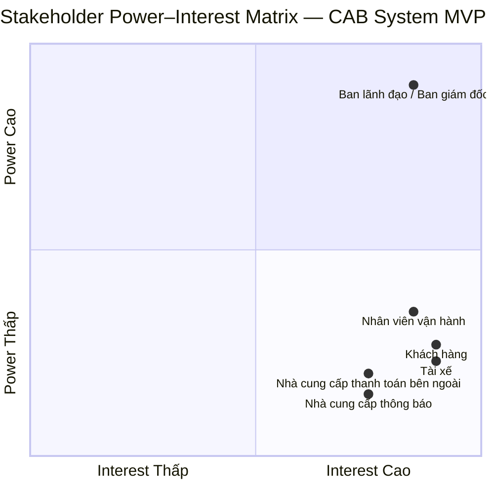
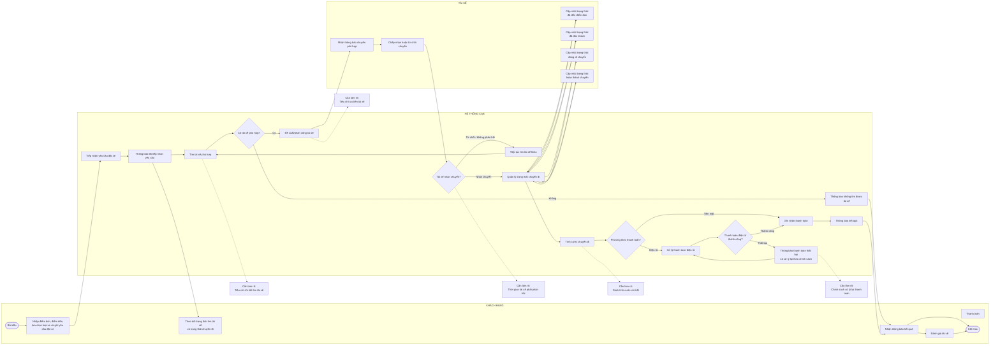

# 23641051_TranTrongDuythuc_cabsystem

## 1/ Stakeholder
### BẢNG PHÂN TÍCH VÀ XÁC ĐỊNH STAKEHOLDERS (CAB SYSTEM)
| STT | Stakeholder | Vai trò | Kỳ vọng chính đối với hệ thống CAB |
|---|---|---|---|
| 1 | Khách hàng | Người sử dụng dịch vụ đặt xe | Có thể đăng ký, đăng nhập, cập nhật thông tin cá nhân, đặt xe, theo dõi chuyến đi, xem lịch sử chuyến, số tiền phải trả và đánh giá tài xế. |
| 2 | Tài xế | Người thực hiện chuyến xe | Được tạo tài khoản, cập nhật hồ sơ và thông tin phương tiện, cập nhật trạng thái hoạt động, nhận thông báo chuyến, chấp nhận/từ chối chuyến và cập nhật trạng thái chuyến. |
| 3 | Nhân viên vận hành | Người quản lý và hỗ trợ hoạt động vận hành | Có giao diện quản trị để quản lý khách hàng, tài xế, phương tiện và chuyến đi; xem chuyến đang diễn ra, kiểm tra trạng thái tài xế, xử lý chuyến bị lỗi và tra cứu lịch sử giao dịch. |
| 4 | Ban lãnh đạo | Định hướng và theo dõi hoạt động của doanh nghiệp | Có báo cáo về số lượng chuyến, doanh thu, tỷ lệ chuyến hoàn thành, tỷ lệ hủy và hiệu quả hoạt động của tài xế; hệ thống có khả năng phục vụ số lượng lớn khách hàng, tài xế và phát triển lâu dài. |
| 5 | Nhà cung cấp thanh toán bên ngoài | Cung cấp dịch vụ thanh toán điện tử được tích hợp với CAB | Hỗ trợ xử lý thanh toán điện tử cho khách hàng thông qua hệ thống CAB. |
| 6 | Nhà cung cấp thông báo | Cung cấp dịch vụ/kênh thông báo được tích hợp với CAB | Hỗ trợ gửi thông báo cho khách hàng và tài xế; có khả năng mở rộng thêm các kênh thông báo trong tương lai. |

## 2/ Stakeholder Power–Interest Matrix
### 2.1/ Phân loại Stakeholder theo Power – Interest
| STT | Stakeholder | Power (High/Low) | Cơ sở xác định Power |
|---|---|---|---|
| 1 | Ban lãnh đạo / Ban giám đốc | High | Ban lãnh đạo mong muốn xây dựng nền tảng CAB mới; Ban giám đốc đưa ra kỳ vọng đối với hệ thống. Đề bài cũng nêu doanh nghiệp yêu cầu các đặc tính quan trọng về khả năng mở rộng, ổn định, bảo mật và triển khai hệ thống. Đây là nhóm có ảnh hưởng trực tiếp đến phạm vi và yêu cầu của hệ thống. |
| 2 | Nhân viên vận hành | Low | Được sử dụng giao diện quản trị để quản lý khách hàng, tài xế, phương tiện, chuyến đi và hỗ trợ xử lý chuyến lỗi. Tuy nhiên, đề bài không nêu nhân viên vận hành có quyền quyết định hoặc phê duyệt phạm vi dự án. Một số thao tác quản trị còn phải được phân quyền, cho thấy quyền hạn của nhân viên có giới hạn. |
| 3 | Khách hàng | Low | Sử dụng hệ thống để đăng ký, đặt xe, theo dõi chuyến, thanh toán và đánh giá tài xế. Đề bài không nêu khách hàng có quyền quyết định, phê duyệt hoặc kiểm soát nguồn lực của dự án. |
| 4 | Tài xế | Low | Sử dụng hệ thống để quản lý hồ sơ, phương tiện, trạng thái hoạt động, nhận/từ chối chuyến và cập nhật trạng thái chuyến. Đề bài không nêu tài xế có quyền quyết định, phê duyệt hoặc kiểm soát nguồn lực của dự án. |
| 5 | Nhà cung cấp thanh toán bên ngoài | Low | Được đề cập là bên cung cấp dịch vụ thanh toán điện tử để CAB tích hợp. Đề bài không nêu bên này có quyền quyết định, phê duyệt hoặc kiểm soát phạm vi và nguồn lực của dự án CAB. |
| 6 | Nhà cung cấp thông báo | Low | Có vai trò liên quan đến việc cung cấp các kênh thông báo cho hệ thống. Đề bài không nêu bên cung cấp thông báo có quyền quyết định, phê duyệt hoặc kiểm soát phạm vi và nguồn lực của dự án CAB. |

### 2.2/ Ma trận 2 chiều phân loại Stakeholder theo:
- **Trục X:** Mức độ quan tâm (Interest)
- **Trục Y:** Mức độ ảnh hưởng (Power)

## 3/ Business goals
### BẢNG XÁC ĐỊNH MỤC TIÊU KINH DOANH (BUSINESS GOALS)
| Mã | Business Goal | Mô tả | Kết quả cần đạt |
|---|---|---|---|
| BG-01 | Xây dựng nền tảng đặt xe phục vụ khách hàng và tài xế | Thay thế những hạn chế của hệ thống hiện tại bằng một nền tảng CAB mới phục vụ quy trình đặt và thực hiện chuyến đi. | Khách hàng và tài xế có thể phối hợp thực hiện chuyến đi trên cùng một nền tảng. |
| BG-02 | Nâng cao hiệu quả tìm và phân công tài xế | Giảm sự phụ thuộc vào việc phân công tài xế thủ công và hỗ trợ tìm tài xế phù hợp cho chuyến đi. | Việc tìm và phân công tài xế được thực hiện hiệu quả, có xử lý khi tài xế không phản hồi hoặc từ chối. |
| BG-03 | Quản lý tập trung hoạt động chuyến đi và thanh toán | Khắc phục tình trạng thông tin thanh toán chưa được quản lý tập trung và tăng khả năng theo dõi hoạt động. | Doanh nghiệp có thông tin tập trung về chuyến đi, cước phí và giao dịch thanh toán để theo dõi. |
| BG-04 | Hỗ trợ vận hành và theo dõi hoạt động kinh doanh | Cung cấp cho các bộ phận trong doanh nghiệp dữ liệu cần thiết để theo dõi và xử lý hoạt động đặt xe. | Nhân viên vận hành có thể theo dõi chuyến đi, tài xế, giao dịch và doanh nghiệp có dữ liệu báo cáo về hoạt động. |
| BG-05 | Đảm bảo hệ thống hoạt động ổn định khi nhu cầu tăng cao | Đáp ứng nhu cầu phục vụ số lượng lớn khách hàng và tài xế, đồng thời hạn chế ảnh hưởng khi một thành phần gặp lỗi. | Hệ thống duy trì hoạt động ổn định khi tải tăng và lỗi ở một thành phần không làm toàn bộ hệ thống đặt xe ngừng hoạt động. |
| BG-06 | Tạo nền tảng có khả năng phát triển lâu dài | Xây dựng nền tảng có thể tiếp tục mở rộng và bổ sung các tính năng, dịch vụ trong tương lai. | Các chức năng mới có thể được triển khai từng phần và hệ thống có khả năng mở rộng mà không phải xây dựng lại toàn bộ ứng dụng. |

## 4/ Scope
### BẢNG PHẠM VI CÔNG VIỆC THEO MODULE 
| STT | Module | Chức năng chính | Mô tả |
|---|---|---|---|
| 1 | Khách hàng | Đặt xe | Khách hàng nhập điểm đón, điểm đến, chọn loại xe và gửi yêu cầu đặt xe. |
| 2 | Khách hàng | Theo dõi chuyến đi | Khách hàng theo dõi tài xế và trạng thái chuyến đi. |
| 3 | Tài xế | Tiếp nhận chuyến | Tài xế nhận thông báo, chấp nhận hoặc từ chối chuyến. |
| 4 | Tài xế | Thực hiện chuyến | Tài xế cập nhật trạng thái trong quá trình thực hiện chuyến. |
| 5 | Đặt & quản lý chuyến đi | Quản lý chuyến | Quản lý chuyến từ khi khách hàng tạo yêu cầu đến khi hoàn thành. |
| 6 | Tìm/phân công tài xế | Tìm và phân công tài xế | Xác định tài xế phù hợp dựa trên vị trí, trạng thái sẵn sàng và các tiêu chí vận hành. |
| 7 | Tính cước & thanh toán | Tính cước | Xác định số tiền khách hàng phải trả dựa trên loại dịch vụ và thông tin chuyến đi. |
| 8 | Tính cước & thanh toán | Thanh toán | Hỗ trợ thanh toán tiền mặt hoặc phương thức thanh toán điện tử. |
| 9 | Thông báo | Thông báo trạng thái | Thông báo các sự kiện quan trọng cho khách hàng và tài xế trong quá trình đặt và thực hiện chuyến. |
| 10 | Quản trị & vận hành | Theo dõi và xử lý chuyến | Nhân viên vận hành theo dõi chuyến đang diễn ra, trạng thái tài xế và xử lý trường hợp chuyến bị lỗi. |
| 11 | Báo cáo | Báo cáo hoạt động | Cung cấp số lượng chuyến, doanh thu, tỷ lệ hoàn thành, tỷ lệ hủy và hiệu quả hoạt động của tài xế. |
| 12 | Xác thực & phân quyền | Kiểm soát truy cập | Xác thực người dùng và kiểm soát quyền đối với các thao tác quản trị. |

## 5/ Business Requirements
### **BẢNG YÊU CẦU NGHIỆP VỤ (BUSINESS REQUIREMENTS)**
| Mã | Business Requirement | Mô tả | 
| ----- | ----- | ----- | 
| **BR-01** | Hỗ trợ khách hàng sử dụng dịch vụ đặt xe | Đáp ứng nhu cầu đăng ký, sử dụng dịch vụ đặt xe và quản lý thông tin cá nhân của khách hàng. | 
| **BR-02** | Tiếp nhận và quản lý yêu cầu đặt xe | Đảm bảo yêu cầu đặt xe được tiếp nhận và quản lý từ khi khách hàng gửi yêu cầu. | 
| **BR-03** | Đảm bảo tìm và phân công tài xế phù hợp | Hỗ trợ doanh nghiệp tìm tài xế phù hợp dựa trên vị trí, trạng thái sẵn sàng và các tiêu chí vận hành. | 
| **BR-04** | Đảm bảo xử lý việc phân công khi tài xế không nhận chuyến | Cho phép quá trình tìm tài xế tiếp tục khi tài xế được đề xuất không phản hồi hoặc từ chối, không yêu cầu khách hàng tạo lại yêu cầu. | 
| **BR-05** | Quản lý và theo dõi chuyến đi | Đảm bảo chuyến đi được theo dõi từ khi tìm tài xế đến khi hoàn thành, với trạng thái chuyến rõ ràng. | 
| **BR-06** | Hỗ trợ tài xế thực hiện chuyến đi | Đảm bảo tài xế có thể tiếp nhận và cập nhật tình trạng chuyến trong quá trình phục vụ khách hàng. | 
| **BR-07** | Tính cước chuyến đi | Xác định số tiền khách hàng phải trả dựa trên loại dịch vụ và thông tin chuyến đi. | 
| **BR-08** | Hỗ trợ thanh toán chuyến đi | Đáp ứng thanh toán bằng tiền mặt hoặc phương thức thanh toán điện tử và xử lý kết quả thanh toán. | 
| **BR-09** | Đảm bảo thông tin thanh toán được quản lý an toàn | Thông tin nhạy cảm của thẻ hoặc tài khoản thanh toán không được lưu trực tiếp trong hệ thống CAB. | 
| **BR-10** | Đảm bảo thông báo trong quá trình cung cấp dịch vụ | Khách hàng và tài xế nhận được các thông báo cần thiết liên quan đến yêu cầu và chuyến đi. | 
| **BR-11** | Hỗ trợ vận hành và giám sát hoạt động đặt xe | Nhân viên vận hành có khả năng theo dõi chuyến đi, trạng thái tài xế, quản lý thông tin liên quan và xử lý các trường hợp chuyến bị lỗi. | 
| **BR-12** | Cung cấp dữ liệu phục vụ quản lý hoạt động kinh doanh | Cung cấp thông tin về số lượng chuyến, doanh thu, tỷ lệ hoàn thành, tỷ lệ hủy và hiệu quả hoạt động của tài xế. | 
| **BR-13** | Đảm bảo kiểm soát truy cập và bảo vệ dữ liệu | Đảm bảo người dùng được xác thực, thao tác quản trị được kiểm soát quyền truy cập và các dữ liệu quan trọng được bảo vệ. | 
| **BR-14** | Đảm bảo khả năng hoạt động ổn định khi nhu cầu tăng cao | Hệ thống phải duy trì hoạt động khi nhu cầu tăng cao và lỗi ở chức năng thanh toán hoặc thông báo không làm toàn bộ hệ thống đặt xe ngừng hoạt động. |

## 6/ Functional Requirements
### BẢNG PHÂN RÃ YÊU CẦU CHỨC NĂNG (FUNCTIONAL REQUIREMENTS)
| Mã FR | Functional Requirement | Mô tả |
| :--- | :--- | :--- |
| **FR-01** | Đăng ký tài khoản khách hàng | Hệ thống cho phép khách hàng đăng ký tài khoản. |
| **FR-02** | Đăng nhập và quản lý thông tin khách hàng | Hệ thống cho phép khách hàng đăng nhập và cập nhật thông tin cá nhân. |
| **FR-03** | Tạo yêu cầu đặt xe | Hệ thống cho phép khách hàng nhập điểm đón, điểm đến, lựa chọn loại xe và gửi yêu cầu đặt xe. |
| **FR-04** | Theo dõi yêu cầu và chuyến đi | Hệ thống cho phép khách hàng theo dõi trạng thái tìm tài xế, tài xế nhận chuyến, thời gian dự kiến tài xế đến và trạng thái chuyến đi. |
| **FR-05** | Tra cứu lịch sử và thông tin chuyến đi | Hệ thống cho phép khách hàng xem lịch sử chuyến đi và số tiền phải trả. |
| **FR-06** | Đánh giá tài xế | Hệ thống cho phép khách hàng đánh giá tài xế sau khi hoàn thành chuyến. |
| **FR-07** | Đăng ký và quản lý tài khoản tài xế | Hệ thống cho phép tài xế đăng ký hoặc nhân viên vận hành tạo tài khoản cho tài xế. |
| **FR-08** | Quản lý hồ sơ và phương tiện tài xế | Hệ thống cho phép tài xế cập nhật hồ sơ và thông tin phương tiện. |
| **FR-09** | Quản lý trạng thái tài xế | Hệ thống cho phép tài xế cập nhật trạng thái hoạt động và trạng thái sẵn sàng nhận chuyến. |
| **FR-10** | Tiếp nhận và phản hồi chuyến | Hệ thống thông báo cho tài xế về chuyến phù hợp và cho phép tài xế chấp nhận hoặc từ chối chuyến. |
| **FR-11** | Cập nhật trạng thái thực hiện chuyến | Hệ thống cho phép tài xế cập nhật trạng thái đã đến điểm đón, đã đón khách, đang di chuyển và hoàn thành chuyến. |
| **FR-12** | Cập nhật và lưu vị trí tài xế | Hệ thống lưu thông tin vị trí của tài xế để phục vụ tìm tài xế gần khách hàng và hỗ trợ dự kiến thời gian đến. |
| **FR-13** | Tìm tài xế phù hợp | Hệ thống xác định tài xế phù hợp dựa trên vị trí, trạng thái sẵn sàng.|
| **FR-14** | Phân công và tiếp tục tìm tài xế | Hệ thống ưu tiên tài xế phù hợp, gần khách hàng và tiếp tục tìm tài xế khác khi tài xế được đề xuất không phản hồi hoặc từ chối|
| **FR-15** | Xử lý trường hợp không tìm được tài xế | Hệ thống thông báo rõ ràng cho khách hàng khi không tìm được tài xế. |
| **FR-16** | Quản lý trạng thái chuyến đi | Hệ thống quản lý trạng thái chuyến từ khi tiếp nhận yêu cầu đến khi hoàn thành. |
| **FR-17** | Tính cước chuyến đi | Hệ thống xác định số tiền khách hàng phải trả dựa trên loại dịch vụ và thông tin chuyến đi.|
| **FR-18** | Thanh toán chuyến đi | Hệ thống hỗ trợ thanh toán bằng tiền mặt hoặc phương thức thanh toán điện tử. |
| **FR-19** | Xử lý thanh toán điện tử | Hệ thống tích hợp với nhà cung cấp thanh toán bên ngoài và xử lý trường hợp giao dịch điện tử thất bại. |
| **FR-20** | Thông báo cho khách hàng | Hệ thống thông báo cho khách hàng về việc tiếp nhận yêu cầu, tài xế nhận chuyến, tài xế đến điểm đón, hoàn thành chuyến và kết quả thanh toán. |
| **FR-21** | Thông báo cho tài xế | Hệ thống thông báo cho tài xế về chuyến mới hoặc những thay đổi liên quan đến chuyến đang thực hiện. |
| **FR-22** | Báo cáo hoạt động | Hệ thống cung cấp báo cáo về số lượng chuyến, doanh thu, tỷ lệ chuyến hoàn thành, tỷ lệ hủy và hiệu quả hoạt động của tài xế. |
| **FR-23** | Xác thực người dùng | Hệ thống xác thực khách hàng và tài xế trước khi sử dụng các chức năng yêu cầu tài khoản. |
| **FR-24** | Phân quyền quản trị | Hệ thống kiểm soát quyền truy cập đối với các thao tác quản trị, bảo đảm nhân viên thông thường không thực hiện được các thao tác nhạy cảm. |
| **FR-25** | Lưu vết thao tác quan trọng | Hệ thống lưu vết các thao tác quan trọng để phục vụ kiểm tra khi có sự cố. |

## 7/ Vẽ use case
## 7.1/ Xác định Actors
| STT | Actor | Vai trò |
| --- | ----- | ------- |
| 1 | **Khách hàng** | Sử dụng hệ thống để đặt xe, theo dõi chuyến, thanh toán và đánh giá tài xế. |
| 2 | **Tài xế** | Nhận chuyến, cập nhật trạng thái, thông tin phương tiện và vị trí. |
| 3 | **Nhân viên vận hành** | Quản lý và theo dõi hoạt động vận hành của hệ thống. |
| 4 | **Ban lãnh đạo / Ban giám đốc** | Theo dõi thông tin và báo cáo phục vụ quản lý. |
| 5 | **Nhà cung cấp thanh toán bên ngoài** | Cung cấp dịch vụ thanh toán điện tử tích hợp với CAB System. |
| 6 | **Nhà cung cấp thông báo** | Cung cấp kênh/dịch vụ thông báo cho hệ thống. |

## 7.2/ Sơ đồ use case

```mermaid
flowchart LR

    KH[Khách hàng]
    TX[Tài xế]
    NV[Nhân viên vận hành]
    LD[Ban lãnh đạo / Ban giám đốc]
    PAY[Nhà cung cấp thanh toán bên ngoài]

    subgraph CAB[CAB System - MVP]

        UC01((Đăng ký tài khoản khách hàng))
        UC02((Đăng nhập và quản lý thông tin khách hàng))
        UC03((Tạo yêu cầu đặt xe))
        UC04((Theo dõi yêu cầu và chuyến đi))
        UC05((Tra cứu lịch sử và thông tin chuyến đi))
        UC06((Đánh giá tài xế))

        UC07((Đăng ký và quản lý tài khoản tài xế))
        UC08((Quản lý hồ sơ và phương tiện))
        UC09((Quản lý trạng thái tài xế))
        UC10((Tiếp nhận và phản hồi chuyến))
        UC11((Cập nhật trạng thái thực hiện chuyến))
        UC12((Cập nhật và lưu vị trí tài xế))

        UC13((Tìm và phân công tài xế))
        UC14((Xử lý không tìm được tài xế))

        UC15((Tính cước chuyến đi))
        UC16((Thanh toán chuyến đi))

        UC17((Thông báo khách hàng))
        UC18((Thông báo tài xế))

        UC19((Quản lý hoạt động vận hành))
        UC20((Theo dõi và xử lý chuyến đi))
        UC21((Tra cứu lịch sử giao dịch))
        UC22((Báo cáo hoạt động))

        UC23((Xác thực người dùng))
        UC24((Phân quyền quản trị))
        UC25((Lưu vết thao tác quan trọng))
    end

    NOTI[Nhà cung cấp thông báo]

    KH --- UC01
    KH --- UC02
    KH --- UC03
    KH --- UC04
    KH --- UC05
    KH --- UC06
    KH --- UC16
    KH --- UC17
    KH --- UC23

    TX --- UC07
    TX --- UC08
    TX --- UC09
    TX --- UC10
    TX --- UC11
    TX --- UC12
    TX --- UC18
    TX --- UC23

    NV --- UC07
    NV --- UC13
    NV --- UC19
    NV --- UC20
    NV --- UC21
    NV --- UC22
    NV --- UC24
    NV --- UC25
    NV --- UC23

    PAY --- UC16
```

## 8/ Đặc tả use case
### 8.1/ Đặc tả use case Đăng ký tài khoản khách hàng
| Thành phần | Nội dung | |
| :--- | :--- | :--- |
| **Tên Use Case** | Đăng ký tài khoản khách hàng | |
| **Tiền điều kiện** | - Khách hàng chưa có tài khoản trên hệ thống. - Hệ thống đang hoạt động bình thường. | |
| **Hậu điều kiện** | - Tài khoản khách hàng được tạo thành công. - Thông tin tài khoản được lưu trên hệ thống. - Khách hàng có thể sử dụng tài khoản để đăng nhập. | |
| **Actor chính** | Khách hàng | |
| **Actor phụ** | Không | |
| **Basic flow** | **Actor (Khách hàng)** | **System (Hệ thống)** |
| | 1. Chọn chức năng “Đăng ký tài khoản”. | 2. Hiển thị biểu mẫu đăng ký gồm: họ tên, số điện thoại, email và mật khẩu. |
| | 3. Nhập họ tên, số điện thoại, email và mật khẩu. | 4. Tiếp nhận thông tin đăng ký. |
| | | 5. Kiểm tra các thông tin bắt buộc gồm họ tên, số điện thoại, email và mật khẩu đã được nhập đầy đủ. |
| | | 6. Kiểm tra định dạng họ tên, số điện thoại, email và mật khẩu theo quy định của hệ thống. |
| | | 7. Kiểm tra số điện thoại và email chưa được sử dụng cho tài khoản khác. |
| | 8. Chọn “Đăng ký”. | 9. Hiển thị thông tin đăng ký để khách hàng xác nhận. |
| | 10. Chọn “Xác nhận”. | 11. Tạo tài khoản khách hàng với thông tin đăng ký hợp lệ. |
| | | 12. Lưu thông tin tài khoản vào hệ thống. |
| | | 13. Hiển thị thông báo “Đăng ký tài khoản thành công”. |
| | | 14. Kết thúc Use Case |
| **Alternative flow** | **9.1 Khách hàng hủy xác nhận đăng ký:** Khách hàng chọn “Hủy” → Hệ thống không tạo tài khoản → Giữ lại thông tin đã nhập → Quay lại bước 8.  **2.1 Khách hàng hủy đăng ký:** Khách hàng chọn “Hủy đăng ký” → Hệ thống không tạo tài khoản → Quay về màn hình trước đó → Kết thúc Use Case. | |
| **Exception** | **5.1 Thiếu họ tên:** Hệ thống phát hiện chưa nhập họ tên → Thông báo lỗi → Khách hàng bổ sung họ tên → Quay lại bước 3.  **5.2 Thiếu số điện thoại:** Hệ thống phát hiện chưa nhập số điện thoại → Thông báo lỗi → Khách hàng bổ sung số điện thoại → Quay lại bước 3.  **5.3 Thiếu email:** Hệ thống phát hiện chưa nhập email → Thông báo lỗi → Khách hàng bổ sung email → Quay lại bước 3.  **5.4 Thiếu mật khẩu:** Hệ thống phát hiện chưa nhập mật khẩu → Thông báo lỗi → Khách hàng bổ sung mật khẩu → Quay lại bước 3.  **6.1 Họ tên không hợp lệ:** Hệ thống phát hiện họ tên không đúng định dạng → Thông báo lỗi → Khách hàng nhập lại họ tên → Quay lại bước 3.  **6.2 Số điện thoại không hợp lệ:** Hệ thống phát hiện số điện thoại không đúng định dạng → Thông báo lỗi → Khách hàng nhập lại số điện thoại → Quay lại bước 3.  **6.3 Email không hợp lệ:** Hệ thống phát hiện email không đúng định dạng → Thông báo lỗi → Khách hàng nhập lại email → Quay lại bước 3.  **6.4 Mật khẩu không hợp lệ:** Hệ thống phát hiện mật khẩu không đáp ứng định dạng → Thông báo lỗi → Khách hàng nhập lại mật khẩu → Quay lại bước 3.  **7.1 Số điện thoại đã được sử dụng:** Hệ thống phát hiện số điện thoại đã tồn tại → Thông báo lỗi → Khách hàng nhập số điện thoại khác → Quay lại bước 3.  **7.2 Email đã được sử dụng:** Hệ thống phát hiện email đã tồn tại → Thông báo lỗi → Khách hàng nhập email khác → Quay lại bước 3.  **12.1 Không thể lưu tài khoản:** Hệ thống không thể lưu thông tin tài khoản → Thông báo đăng ký không thành công → Không tạo tài khoản → Kết thúc Use Case. | |

### 8.2/ Đặc tả use case Đăng nhập và quản lý thông tin khách hàng
| Thành phần | Nội dung | |
| :--- | :--- | :--- |
| **Tên Use Case** | Đăng nhập và quản lý thông tin khách hàng | |
| **Tiền điều kiện** | - Khách hàng đã có tài khoản trên hệ thống. - Hệ thống đang hoạt động bình thường. | |
| **Hậu điều kiện** | - Khách hàng đăng nhập thành công. - Thông tin khách hàng được cập nhật và lưu thành công nếu có thay đổi. | |
| **Actor chính** | Khách hàng | |
| **Actor phụ** | Không có | |
| **Basic flow** | **Actor (Khách hàng)** | **System (Hệ thống)** |
| | **1.** Chọn chức năng **“Đăng nhập”**. | **2.** Hiển thị màn hình đăng nhập và yêu cầu khách hàng nhập thông tin đăng nhập. |
| | **3.** Nhập thông tin tài khoản và mật khẩu. | **4.** Tiếp nhận thông tin đăng nhập. |
| | | **5.** Kiểm tra thông tin đăng nhập đã được nhập đầy đủ. |
| | | **6.** Kiểm tra thông tin tài khoản và mật khẩu có hợp lệ hay không. |
| | | **7.** Xác nhận thông tin đăng nhập hợp lệ. |
| | | **8.** Cho phép khách hàng đăng nhập và hiển thị thông tin khách hàng. |
| | **9.** Chọn chức năng quản lý thông tin cá nhân. | **10.** Hiển thị thông tin khách hàng hiện tại. |
| | **11.** Chỉnh sửa thông tin cần thay đổi. | **12.** Tiếp nhận thông tin được chỉnh sửa. |
| | | **13.** Kiểm tra tính hợp lệ của thông tin được cập nhật. |
| | **14.** Xác nhận cập nhật thông tin. | **15.** Lưu thông tin khách hàng đã cập nhật. |
| | | **16.** Thông báo cập nhật thông tin thành công. |
| | | **17.** Use Case kết thúc. |
| **Alternative flow** | **2.1 Khách hàng hủy đăng nhập:** Khách hàng chọn “Hủy đăng nhập” → Hệ thống không thực hiện xác thực → Quay về màn hình trước đó → Kết thúc Use Case.  **10.1 Khách hàng không chỉnh sửa thông tin:** Khách hàng không thay đổi thông tin → Hệ thống giữ nguyên thông tin hiện tại → Kết thúc Use Case.  **12.1 Khách hàng hủy cập nhật thông tin:** Khách hàng chọn “Hủy” → Hệ thống không lưu thông tin đã chỉnh sửa → Giữ lại thông tin hiện tại → Kết thúc Use Case. | |
| **Exception** | **5.1 Thiếu thông tin đăng nhập:** Hệ thống phát hiện chưa nhập đầy đủ thông tin đăng nhập → Thông báo lỗi → Khách hàng bổ sung thông tin còn thiếu → Quay lại bước 3.  **6.1 Thông tin tài khoản không hợp lệ:** Hệ thống phát hiện thông tin tài khoản không hợp lệ → Thông báo lỗi → Khách hàng nhập lại thông tin tài khoản → Quay lại bước 3.  **6.2 Mật khẩu không hợp lệ:** Hệ thống phát hiện mật khẩu không hợp lệ → Thông báo lỗi → Khách hàng nhập lại mật khẩu → Quay lại bước 3.  **13.1 Thông tin cập nhật không hợp lệ:** Hệ thống phát hiện thông tin được cập nhật không hợp lệ → Thông báo lỗi → Khách hàng chỉnh sửa lại thông tin → Quay lại bước 11.  **15.1 Không thể lưu thông tin:** Hệ thống không thể lưu thông tin khách hàng đã cập nhật → Thông báo lỗi → Không thay đổi thông tin hiện tại → Kết thúc Use Case. | |

### 8.3/ Đặc tả use case Tạo yêu cầu đặt xe
| Thành phần | Nội dung | |
| :--- | :--- | :--- |
| **Tên Use Case** | Tạo yêu cầu đặt xe | |
| **Tiền điều kiện** | - Khách hàng đã đăng nhập vào hệ thống. - Hệ thống đang hoạt động bình thường. | |
| **Hậu điều kiện** | - Yêu cầu đặt xe của khách hàng được hệ thống tiếp nhận. - Yêu cầu đặt xe được chuyển sang quá trình tìm và phân công tài xế. | |
| **Actor chính** | Khách hàng | |
| **Actor phụ** | Không có | |
| **Basic flow** | **Actor (Khách hàng)** | **System (Hệ thống)** |
| | **1.** Chọn chức năng **“Đặt xe”**. | **2.** Hiển thị giao diện tạo yêu cầu đặt xe. |
| | **3.** Nhập **điểm đón, điểm đến và loại phương tiện**. | **4.** Tiếp nhận thông tin yêu cầu đặt xe. |
| | | **5.** Kiểm tra yêu cầu đã có đầy đủ **điểm đón, điểm đến và loại phương tiện**. |
| | | **6.** Xác nhận thông tin yêu cầu đặt xe hợp lệ. |
| | **7.** Xác nhận gửi yêu cầu đặt xe. | **8.** Tiếp nhận yêu cầu đặt xe. |
| | | **9.** Ghi nhận yêu cầu đặt xe và chuyển sang quá trình tìm và phân công tài xế. |
| | | **10.** Thông báo yêu cầu đặt xe đã được tiếp nhận. |
| | | **11.** Use Case kết thúc. |
| **Alternative flow** | **3.1 Khách hàng thay đổi thông tin đặt xe:** Khách hàng chỉnh sửa điểm đón, điểm đến hoặc loại phương tiện → Hệ thống tiếp nhận thông tin mới → Quay lại bước 5.  **7.1 Khách hàng hủy gửi yêu cầu:** Khách hàng chọn “Hủy” → Hệ thống không tạo yêu cầu đặt xe → Quay lại giao diện trước đó → Kết thúc Use Case. | |
| **Exception** | **5.1 Thiếu điểm đón:** Hệ thống phát hiện chưa nhập điểm đón → Thông báo lỗi → Khách hàng bổ sung điểm đón → Quay lại bước 3.  **5.2 Thiếu điểm đến:** Hệ thống phát hiện chưa nhập điểm đến → Thông báo lỗi → Khách hàng bổ sung điểm đến → Quay lại bước 3.  **5.3 Thiếu loại phương tiện:** Hệ thống phát hiện chưa chọn loại phương tiện → Thông báo lỗi → Khách hàng chọn loại phương tiện → Quay lại bước 3. | |

### 8.4/ Đặc tả use case Theo dõi yêu cầu và chuyến đi
| Thành phần | Nội dung | |
| :--- | :--- | :--- |
| **Tên Use Case** | Theo dõi yêu cầu và chuyến đi | |
| **Tiền điều kiện** | - Khách hàng đã đăng nhập vào hệ thống. - Khách hàng đã gửi yêu cầu đặt xe. | |
| **Hậu điều kiện** | - Khách hàng xem được trạng thái tìm tài xế, tài xế nhận chuyến, thời gian dự kiến tài xế đến và trạng thái chuyến đi. | |
| **Actor chính** | Khách hàng | |
| **Actor phụ** | Không có | |
| **Basic flow** | **Actor (Khách hàng)** | **System (Hệ thống)** |
| | **1.** Chọn chức năng **“Theo dõi yêu cầu và chuyến đi”**. | **2.** Hiển thị thông tin yêu cầu và trạng thái hiện tại của chuyến đi. |
| | | **3.** Hiển thị trạng thái **“đang tìm tài xế”** khi hệ thống đang thực hiện tìm tài xế. |
| | | **4.** Cập nhật và hiển thị thông tin tài xế khi có tài xế nhận chuyến. |
| | | **5.** Hiển thị **thời gian dự kiến tài xế đến**. |
| | | **6.** Cập nhật trạng thái chuyến đi trong quá trình thực hiện chuyến. |
| | **7.** Theo dõi thông tin và trạng thái chuyến đi trên hệ thống. | **8.** Tiếp tục cập nhật thông tin trạng thái chuyến đi. |
| | | **9.** Khi chuyến đi hoàn thành, hiển thị trạng thái **“hoàn thành chuyến”**. |
| | | **10.** Use Case kết thúc. |
| **Alternative flow** | **3.1 Chưa tìm được tài xế:** Hệ thống tiếp tục hiển thị trạng thái đang tìm tài xế → Khách hàng tiếp tục theo dõi trạng thái yêu cầu → Quay lại bước 3.  **6.1 Chuyến đi chuyển sang trạng thái khác:** Hệ thống nhận được trạng thái mới của chuyến đi → Cập nhật trạng thái hiển thị cho khách hàng → Tiếp tục theo dõi chuyến đi → Quay lại bước 6. | |
| **Exception** | **2.1 Không có thông tin yêu cầu đặt xe:** Hệ thống không tìm thấy yêu cầu đặt xe cần theo dõi → Thông báo không có yêu cầu đặt xe để theo dõi → Kết thúc Use Case.  **2.2 Không thể tải thông tin chuyến đi:** Hệ thống không thể lấy thông tin yêu cầu hoặc trạng thái chuyến đi → Thông báo lỗi → Kết thúc Use Case.  **8.1 Không thể cập nhật trạng thái chuyến đi:** Hệ thống không thể cập nhật trạng thái mới → Thông báo lỗi → Giữ trạng thái đang hiển thị → Kết thúc Use Case. | |

### 8.5/ Đặc tả use case Tra cứu lịch sử và thông tin chuyến đi
| Thành phần | Nội dung | |
| :--- | :--- | :--- |
| **Tên Use Case** | Tra cứu lịch sử và thông tin chuyến đi | |
| **Tiền điều kiện** | - Khách hàng đã đăng nhập vào hệ thống. - Khách hàng đã có thông tin chuyến đi trên hệ thống. | |
| **Hậu điều kiện** | - Khách hàng xem được lịch sử chuyến đi và thông tin của chuyến đi đã chọn. - Khách hàng xem được số tiền phải trả của chuyến đi. | |
| **Actor chính** | Khách hàng | |
| **Actor phụ** | Không có | |
| **Basic flow** | **Actor (Khách hàng)** | **System (Hệ thống)** |
| | **1.** Chọn chức năng **“Tra cứu lịch sử và thông tin chuyến đi”**. | **2.** Hiển thị danh sách lịch sử chuyến đi của khách hàng. |
| | **3.** Chọn một chuyến đi trong danh sách lịch sử. | **4.** Hiển thị thông tin của chuyến đi được chọn. |
| | | **5.** Hiển thị số tiền khách hàng phải trả của chuyến đi. |
| | **6.** Xem thông tin chuyến đi và số tiền phải trả. | **7.** Kết thúc quá trình tra cứu. |
| | | **8.** Use Case kết thúc. |
| **Alternative flow** | **2.1 Khách hàng không chọn chuyến đi:** Khách hàng xem danh sách lịch sử chuyến đi nhưng không chọn chuyến đi → Hệ thống giữ nguyên danh sách lịch sử → Kết thúc Use Case.  **4.1 Khách hàng chọn chuyến đi khác:** Khách hàng chọn một chuyến đi khác trong danh sách → Hệ thống hiển thị thông tin của chuyến đi được chọn → Quay lại bước 5. | |
| **Exception** | **2.1 Không có lịch sử chuyến đi:** Hệ thống không có thông tin chuyến đi của khách hàng → Thông báo không có lịch sử chuyến đi → Kết thúc Use Case.  **4.1 Không thể tải thông tin chuyến đi:** Hệ thống không thể lấy thông tin của chuyến đi được chọn → Thông báo lỗi → Kết thúc Use Case.  **5.1 Không thể hiển thị số tiền phải trả:** Hệ thống không thể lấy thông tin số tiền phải trả của chuyến đi → Thông báo lỗi → Kết thúc Use Case. | |

### 8.6/ Đặc tả use case Đánh giá tài xế
| Thành phần | Nội dung | |
| :--- | :--- | :--- |
| **Tên Use Case** | Tìm và phân công tài xế | |
| **Tiền điều kiện** | Có yêu cầu đặt xe hợp lệ và hệ thống có thông tin tài xế đang hoạt động. | |
| **Hậu điều kiện** | Nếu tìm được tài xế: yêu cầu được gửi đến tài xế phù hợp và chuyến được phân công khi tài xế chấp nhận. Nếu không tìm được: khách hàng được thông báo không có tài xế phù hợp. | |
| **Actor chính** | Hệ thống | |
| **Actor phụ** | Tài xế | |
| **Basic flow** | **Actor (Tài xế)** | **System (Hệ thống)** |
| | | 1. Tiếp nhận yêu cầu tìm tài xế |
| | | 2. Xác định các tài xế đang sẵn sàng nhận chuyến |
| | | 3. Lọc các tài xế phù hợp theo vị trí, trạng thái và loại xe |
| | | 4. Xác định tài xế phù hợp theo tiêu chí phân công |
| | | 5. Gửi yêu cầu nhận chuyến cho tài xế |
| | | 6. Hiển thị yêu cầu chuyến cho tài xế |
| | 7. Nhận yêu cầu và xem thông tin chuyến | 8. Chờ phản hồi của tài xế |
| | 9. Chọn “Nhận chuyến” | 10. Kiểm tra chuyến còn khả dụng |
| | | 11. Gán chuyến cho tài xế |
| | | 12. Cập nhật trạng thái tài xế thành “Đang có chuyến” |
| | | 13. Thông báo kết quả phân công cho khách hàng |
| | | 14. Kết thúc Use Case |
| **Alternative flow** | **9.1 Tài xế chọn “Từ chối”:** Hệ thống ghi nhận tài xế từ chối → Tìm tài xế phù hợp tiếp theo → Gửi yêu cầu cho tài xế tiếp theo → Quay lại bước 6. **8.1 Tài xế không phản hồi:** Hệ thống xác định tài xế hết thời gian phản hồi → Ghi nhận trạng thái “Không phản hồi” → Tìm tài xế tiếp theo → Quay lại bước 5. | |
| **Exception** | **3.1 Không có tài xế phù hợp:** Hệ thống xác định không có tài xế đáp ứng điều kiện → Cập nhật trạng thái yêu cầu → Thông báo cho khách hàng → Kết thúc Use Case. **10.1 Chuyến đã được tài xế khác nhận:** Hệ thống phát hiện chuyến không còn khả dụng → Thông báo cho tài xế → Kết thúc yêu cầu phân công đối với tài xế này. | |

### 8.7/ Đặc tả use case Đăng ký và quản lý tài khoản tài xế
| Thành phần | Nội dung | |
| :--- | :--- | :--- |
| **Tên Use Case** | Nhận hoặc từ chối chuyến | |
| **Tiền điều kiện** | Tài xế đã đăng nhập, đang ở trạng thái sẵn sàng nhận chuyến và có yêu cầu chuyến được gửi đến. | |
| **Hậu điều kiện** | Nếu nhận chuyến: chuyến được gán cho tài xế. Nếu từ chối: hệ thống ghi nhận từ chối và tiếp tục tìm tài xế khác. | |
| **Actor chính** | Tài xế | |
| **Actor phụ** | Không | |
| **Basic flow** | **Actor (Tài xế)** | **System (Hệ thống)** |
| | 1. Nhận thông báo có chuyến mới | 2. Hiển thị thông tin chuyến |
| | 3. Xem điểm đón, điểm đến và thông tin chuyến | 4. Hiển thị lựa chọn “Nhận chuyến” và “Từ chối” |
| | 5. Chọn “Nhận chuyến” | 6. Kiểm tra chuyến còn khả dụng |
| | | 7. Gán chuyến cho tài xế |
| | | 8. Cập nhật trạng thái tài xế thành “Đang có chuyến” |
| | | 9. Thông báo cho khách hàng |
| | | 10. Kết thúc Use Case |
| **Alternative flow** | **5.1 Tài xế chọn “Từ chối”:** Hệ thống ghi nhận tài xế từ chối → Cập nhật trạng thái yêu cầu → Thực hiện UC06 để tìm tài xế khác → Kết thúc Use Case. | |
| **Exception** | **6.1 Chuyến đã được tài xế khác nhận:** Hệ thống phát hiện chuyến không còn khả dụng → Thông báo cho tài xế → Cập nhật danh sách chuyến → Kết thúc Use Case. | |

### 8.8/ Đặc tả use case Quản lý hồ sơ và phương tiện
| Thành phần | Nội dung | |
| :--- | :--- | :--- |
| **Tên Use Case** | Theo dõi và cập nhật chuyến đi | |
| **Tiền điều kiện** | Chuyến đã được tạo, phân công tài xế và tài xế đã nhận chuyến. | |
| **Hậu điều kiện** | Trạng thái chuyến được cập nhật chính xác. Khách hàng có thể theo dõi tiến trình chuyến. Khi hoàn thành, chuyến chuyển sang trạng thái “Hoàn thành”. | |
| **Actor chính** | Tài xế | |
| **Actor phụ** | Khách hàng / Nhân viên vận hành | |
| **Basic flow** | **Actor (Tài xế)** | **System (Hệ thống)** |
| | 1. Nhận chuyến | 2. Cập nhật trạng thái “Đã nhận chuyến” |
| | 3. Di chuyển đến điểm đón | 4. Cập nhật thông tin vị trí và trạng thái chuyến |
| | 5. Chọn “Đã đến điểm đón” | 6. Cập nhật trạng thái “Đã đến điểm đón” |
| | 7. Đón khách | 8. Cập nhật trạng thái “Đã đón khách” |
| | 9. Chọn “Bắt đầu chuyến” | 10. Cập nhật trạng thái “Đang thực hiện chuyến” |
| | 11. Di chuyển đến điểm đến | 12. Cập nhật tiến trình chuyến cho khách hàng |
| | 13. Chọn “Hoàn thành chuyến” | 14. Kiểm tra điều kiện hoàn thành chuyến |
| | | 15. Cập nhật trạng thái “Hoàn thành” |
| | | 16. Thực hiện UC10 – Tính cước chuyến đi |
| | | 17. Gửi thông báo kết quả cho khách hàng |
| | | 18. Kết thúc Use Case |
| **Alternative flow** | **5.1 Tài xế chưa thể đến điểm đón:** Tài xế tiếp tục di chuyển → Hệ thống giữ nguyên trạng thái chuyến → Khi đến điểm đón, quay lại bước 5. **13.1 Tài xế chưa thể hoàn thành chuyến:** Tài xế tiếp tục thực hiện chuyến → Hệ thống giữ nguyên trạng thái “Đang thực hiện chuyến” → Khi đến điểm đến, quay lại bước 13. | |
| **Exception** | **14.1 Không đủ điều kiện hoàn thành chuyến:** Hệ thống phát hiện thông tin chuyến chưa đầy đủ → Hiển thị thông báo lỗi → Tài xế bổ sung thông tin → Quay lại bước 13. | |

### 8.9/ Đặc tả use case Quản lý trạng thái tài xế
| Thành phần | Nội dung | |
| :--- | :--- | :--- |
| **Tên Use Case** | Cập nhật vị trí tài xế | |
| **Tiền điều kiện** | Tài xế đã đăng nhập, cho phép hệ thống truy cập vị trí và đang hoạt động hoặc đang thực hiện chuyến. | |
| **Hậu điều kiện** | Vị trí mới nhất của tài xế được cập nhật. Khách hàng có thể theo dõi vị trí tài xế và hệ thống có dữ liệu để tính ETA. | |
| **Actor chính** | Tài xế | |
| **Actor phụ** | Không | |
| **Basic flow** | **Actor (Tài xế)** | **System (Hệ thống)** |
| | 1. Cho phép hệ thống truy cập vị trí | 2. Xác nhận quyền truy cập vị trí |
| | 3. Bắt đầu hoạt động hoặc thực hiện chuyến | 4. Nhận dữ liệu vị trí từ thiết bị |
| | | 5. Kiểm tra dữ liệu vị trí |
| | | 6. Cập nhật vị trí mới nhất của tài xế |
| | | 7. Tính toán ETA dự kiến |
| | | 8. Cập nhật vị trí và ETA cho khách hàng |
| | | 9. Tiếp tục nhận dữ liệu vị trí trong quá trình hoạt động |
| **Alternative flow** | **1.1 Tài xế chưa cho phép truy cập vị trí:** Hệ thống hiển thị yêu cầu cấp quyền → Tài xế cho phép truy cập → Hệ thống xác nhận quyền → Quay lại bước 3. | |
| **Exception** | **4.1 Không nhận được dữ liệu vị trí:** Hệ thống phát hiện dữ liệu vị trí bị gián đoạn → Ghi nhận trạng thái vị trí không khả dụng → Thông báo cho tài xế → Tiếp tục thử nhận dữ liệu vị trí. | |

### 8.10/ Đặc tả use case Tiếp nhận và phản hồi chuyến
| Thành phần | Nội dung | |
| :--- | :--- | :--- |
| **Tên Use Case** | Tính cước chuyến đi | |
| **Tiền điều kiện** | Chuyến có đầy đủ thông tin cần thiết và hệ thống có cấu hình giá áp dụng. | |
| **Hậu điều kiện** | Cước chuyến đi được tính thành công và tổng tiền được lưu vào thông tin chuyến. | |
| **Actor chính** | Hệ thống | |
| **Actor phụ** | Không | |
| **Basic flow** | **Actor** | **System (Hệ thống)** |
| | | 1. Tiếp nhận thông tin chuyến đi |
| | | 2. Xác định loại dịch vụ và bảng giá áp dụng |
| | | 3. Xác định quãng đường và thời gian chuyến đi |
| | | 4. Tính cước theo cấu hình giá hiện hành |
| | | 5. Kiểm tra kết quả tính cước |
| | | 6. Lưu tổng cước vào thông tin chuyến |
| | | 7. Hiển thị tổng cước cho khách hàng |
| | | 8. Kết thúc Use Case |
| **Alternative flow** | **4.1 Hệ thống áp dụng phụ phí:** Hệ thống xác định chuyến thuộc trường hợp áp dụng phụ phí → Tính thêm phụ phí theo cấu hình → Cập nhật lại tổng cước → Quay lại bước 5. | |
| **Exception** | **2.1 Không có bảng giá phù hợp:** Hệ thống không tìm thấy bảng giá → Thông báo không thể tính cước → Không lưu kết quả → Kết thúc Use Case. **5.1 Kết quả tính cước không hợp lệ:** Hệ thống phát hiện kết quả không hợp lệ → Ghi nhận lỗi → Thông báo không thể hoàn tất tính cước → Kết thúc Use Case. | |

### 8.11/ Đặc tả use case Cập nhật trạng thái thực hiện chuyến
| Thành phần | Nội dung | |
| :--- | :--- | :--- |
| **Tên Use Case** | Thanh toán chuyến đi | |
| **Tiền điều kiện** | Chuyến đã hoàn thành hoặc đủ điều kiện thanh toán và hệ thống đã xác định số tiền cần thanh toán. | |
| **Hậu điều kiện** | Nếu thanh toán thành công: giao dịch được ghi nhận và trạng thái thanh toán được cập nhật “Thành công”. Nếu thất bại: giao dịch được ghi nhận “Thất bại” và khách hàng được thông báo để thực hiện lại theo chính sách. | |
| **Actor chính** | Khách hàng | |
| **Actor phụ** | Nhà cung cấp thanh toán | |
| **Basic flow** | **Actor (Khách hàng)** | **System (Hệ thống)** |
| | 1. Chọn phương thức thanh toán điện tử | 2. Hiển thị số tiền cần thanh toán |
| | 3. Chọn “Thanh toán” | 4. Tạo yêu cầu thanh toán |
| | | 5. Gửi yêu cầu đến nhà cung cấp thanh toán |
| | | 6. Nhà cung cấp thanh toán xử lý giao dịch |
| | | 7. Nhận kết quả giao dịch |
| | | 8. Kiểm tra kết quả thanh toán |
| | | 9. Cập nhật trạng thái thanh toán “Thành công” |
| | | 10. Lưu thông tin giao dịch |
| | | 11. Hiển thị thông báo thanh toán thành công |
| | | 12. Kết thúc Use Case |
| **Alternative flow** | **1.1 Khách hàng chọn thanh toán tiền mặt:** Khách hàng chọn “Tiền mặt” → Hệ thống ghi nhận phương thức thanh toán → Cập nhật trạng thái thanh toán theo quy trình tiền mặt → Kết thúc Use Case. **3.1 Khách hàng hủy thanh toán:** Khách hàng chọn “Hủy” → Hệ thống không gửi yêu cầu thanh toán → Giữ nguyên trạng thái thanh toán → Kết thúc Use Case. | |
| **Exception** | **7.1 Thanh toán thất bại:** Hệ thống nhận kết quả thất bại → Cập nhật trạng thái “Thất bại” → Lưu giao dịch → Thông báo cho khách hàng → Cho phép thanh toán lại theo chính sách. **5.1 Nhà cung cấp thanh toán không phản hồi:** Hệ thống không nhận được kết quả → Ghi nhận giao dịch “Đang xử lý” → Thông báo cho khách hàng → Kết thúc Use Case. | |

### 8.12/ Đặc tả use case Cập nhật và lưu vị trí tài xế
| Thành phần | Nội dung | |
| :--- | :--- | :--- |
| **Tên Use Case** | Gửi và tiếp nhận thông báo | |
| **Tiền điều kiện** | Có sự kiện cần gửi thông báo, hệ thống có thông tin người nhận và dịch vụ thông báo đang hoạt động. | |
| **Hậu điều kiện** | Thông báo được gửi đến người nhận và kết quả gửi thông báo được ghi nhận vào hệ thống. | |
| **Actor chính** | Hệ thống | |
| **Actor phụ** | Nhà cung cấp thông báo | |
| **Basic flow** | **Actor (Nhà cung cấp thông báo)** | **System (Hệ thống)** |
| | | 1. Phát sinh sự kiện cần gửi thông báo |
| | | 2. Xác định nội dung và người nhận |
| | | 3. Tạo yêu cầu gửi thông báo |
| | | 4. Gửi yêu cầu đến nhà cung cấp thông báo |
| | 5. Tiếp nhận yêu cầu gửi thông báo | 6. Chờ kết quả gửi thông báo |
| | 7. Thực hiện gửi thông báo | 8. Nhận kết quả gửi thông báo |
| | | 9. Lưu kết quả gửi thông báo |
| | | 10. Cập nhật trạng thái thông báo |
| | | 11. Kết thúc Use Case |
| **Alternative flow** | **7.1 Hệ thống thực hiện gửi lại thông báo:** Hệ thống phát hiện thông báo chưa được gửi thành công → Tạo yêu cầu gửi lại → Nhà cung cấp tiếp nhận → Hệ thống cập nhật kết quả gửi. | |
| **Exception** | **8.1 Nhà cung cấp thông báo không phản hồi:** Hệ thống không nhận được kết quả gửi → Ghi nhận trạng thái “Không xác định” → Ghi log sự kiện → Kết thúc Use Case. | |

### 8.13/ Đặc tả use case Tìm và phân công tài xế
| Thành phần | Nội dung | |
| :--- | :--- | :--- |
| **Tên Use Case** | Xem lịch sử chuyến đi | |
| **Tiền điều kiện** | Khách hàng đã đăng nhập thành công. | |
| **Hậu điều kiện** | Danh sách lịch sử chuyến đi được hiển thị và khách hàng có thể xem chi tiết các chuyến đã thực hiện. | |
| **Actor chính** | Khách hàng | |
| **Actor phụ** | Không | |
| **Basic flow** | **Actor (Khách hàng)** | **System (Hệ thống)** |
| | 1. Chọn chức năng “Lịch sử chuyến đi” | 2. Truy xuất lịch sử chuyến đi |
| | | 3. Hiển thị danh sách các chuyến đi |
| | 4. Chọn điều kiện lọc nếu cần | 5. Lọc danh sách theo điều kiện |
| | 6. Chọn một chuyến muốn xem | 7. Hiển thị thông tin chi tiết chuyến đi |
| | | 8. Kết thúc Use Case |
| **Alternative flow** | **4.1 Khách hàng không sử dụng bộ lọc:** Hệ thống giữ nguyên danh sách lịch sử → Khách hàng chọn chuyến cần xem → Quay lại bước 6. | |
| **Exception** | **2.1 Không có lịch sử chuyến đi:** Hệ thống không tìm thấy chuyến đi → Hiển thị thông báo “Chưa có lịch sử chuyến đi” → Kết thúc Use Case. | |

### 8.14/ Đặc tả use case Xử lý không tìm được tài xế
| Thành phần | Nội dung | |
| :--- | :--- | :--- |
| **Tên Use Case** | Đánh giá tài xế | |
| **Tiền điều kiện** | Khách hàng đã đăng nhập, chuyến đi đã hoàn thành và chuyến chưa được đánh giá. | |
| **Hậu điều kiện** | Đánh giá được lưu thành công và liên kết với chuyến đi và tài xế. | |
| **Actor chính** | Khách hàng | |
| **Actor phụ** | Không | |
| **Basic flow** | **Actor (Khách hàng)** | **System (Hệ thống)** |
| | 1. Chọn chuyến đã hoàn thành | 2. Kiểm tra chuyến đủ điều kiện đánh giá |
| | 3. Chọn “Đánh giá tài xế” | 4. Hiển thị biểu mẫu đánh giá |
| | 5. Chọn mức đánh giá và nhập nhận xét nếu cần | 6. Kiểm tra thông tin đánh giá |
| | 7. Chọn “Gửi đánh giá” | 8. Hiển thị yêu cầu xác nhận |
| | 9. Chọn “Xác nhận” | 10. Lưu đánh giá |
| | | 11. Hiển thị thông báo “Đánh giá thành công” |
| | | 12. Kết thúc Use Case |
| **Alternative flow** | **9.1 Khách hàng hủy đánh giá:** Khách hàng chọn “Hủy” → Hệ thống không lưu đánh giá → Quay lại thông tin chuyến → Kết thúc Use Case. | |
| **Exception** | **6.1 Mức đánh giá không hợp lệ:** Hệ thống phát hiện chưa chọn mức đánh giá → Hiển thị thông báo lỗi → Khách hàng chọn lại mức đánh giá → Quay lại bước 5. **10.1 Không thể lưu đánh giá:** Hệ thống phát hiện lỗi khi lưu → Thông báo lỗi → Khách hàng thực hiện lại → Quay lại bước 7. | |

### 8.15/ Đặc tả use case Tính cước chuyến đi
| Thành phần | Nội dung | |
| :--- | :--- | :--- |
| **Tên Use Case** | Tra cứu và cập nhật thông tin đối tượng | |
| **Tiền điều kiện** | Nhân viên vận hành đã đăng nhập và có quyền thực hiện chức năng. | |
| **Hậu điều kiện** | Thông tin khách hàng, tài xế hoặc phương tiện được tra cứu/cập nhật thành công. Các thay đổi được lưu vào CSDL và ghi nhận lịch sử. | |
| **Actor chính** | Nhân viên vận hành | |
| **Actor phụ** | Không | |
| **Basic flow** | **Actor (Nhân viên vận hành)** | **System (Hệ thống)** |
| | 1. Chọn chức năng “Thông tin đối tượng” | 2. Hiển thị các loại đối tượng: khách hàng, tài xế, phương tiện |
| | 3. Chọn loại đối tượng cần tra cứu | 4. Hiển thị danh sách tương ứng |
| | 5. Nhập điều kiện tìm kiếm | 6. Tìm kiếm và hiển thị kết quả |
| | 7. Chọn đối tượng cần xem | 8. Hiển thị thông tin chi tiết |
| | 9. Chọn “Cập nhật” nếu cần | 10. Hiển thị biểu mẫu chỉnh sửa |
| | 11. Chỉnh sửa thông tin | 12. Kiểm tra tính hợp lệ của dữ liệu |
| | 13. Chọn “Lưu” | 14. Hiển thị yêu cầu xác nhận |
| | 15. Chọn “Xác nhận” | 16. Lưu thông tin mới |
| | | 17. Ghi nhận lịch sử thay đổi |
| | | 18. Hiển thị thông báo cập nhật thành công |
| | | 19. Kết thúc Use Case |
| **Alternative flow** | **5.1 Nhân viên không nhập điều kiện tìm kiếm:** Hệ thống hiển thị danh sách đối tượng theo mặc định → Nhân viên chọn đối tượng cần xem → Quay lại bước 7. **15.1 Nhân viên hủy cập nhật:** Nhân viên chọn “Hủy” → Hệ thống không lưu thông tin mới → Giữ nguyên dữ liệu hiện tại → Quay lại bước 8. | |
| **Exception** | **6.1 Không tìm thấy đối tượng:** Hệ thống không tìm thấy dữ liệu phù hợp → Hiển thị thông báo “Không tìm thấy dữ liệu” → Nhân viên nhập lại điều kiện → Quay lại bước 5. **12.1 Thông tin cập nhật không hợp lệ:** Hệ thống phát hiện thông tin không hợp lệ → Hiển thị thông báo lỗi → Nhân viên chỉnh sửa → Quay lại bước 11. | |

### 8.16/ Đặc tả use case Thanh toán chuyến đi
| Thành phần | Nội dung | |
| :--- | :--- | :--- |
| **Tên Use Case** | Hỗ trợ và xử lý chuyến | |
| **Tiền điều kiện** | Nhân viên vận hành đã đăng nhập và có chuyến đang hoạt động hoặc phát sinh vấn đề cần hỗ trợ. | |
| **Hậu điều kiện** | Vấn đề của chuyến được xử lý hoặc ghi nhận. Kết quả xử lý và lịch sử hỗ trợ được lưu vào hệ thống. | |
| **Actor chính** | Nhân viên vận hành | |
| **Actor phụ** | Khách hàng / Tài xế | |
| **Basic flow** | **Actor (Nhân viên vận hành)** | **System (Hệ thống)** |
| | 1. Chọn chức năng “Hỗ trợ và xử lý chuyến” | 2. Hiển thị danh sách chuyến đang hoạt động/cần hỗ trợ |
| | 3. Tìm kiếm chuyến cần xử lý | 4. Hiển thị thông tin chuyến |
| | 5. Kiểm tra tình trạng chuyến | 6. Hiển thị thông tin khách hàng, tài xế và trạng thái chuyến |
| | 7. Chọn phương án xử lý | 8. Kiểm tra quyền thực hiện thao tác |
| | 9. Xác nhận xử lý | 10. Cập nhật trạng thái chuyến |
| | | 11. Ghi nhận nội dung xử lý |
| | | 12. Gửi thông báo cho bên liên quan nếu cần |
| | | 13. Kết thúc Use Case |
| **Alternative flow** | **7.1 Nhân viên chỉ ghi nhận sự cố:** Nhân viên nhập nội dung sự cố → Hệ thống lưu thông tin sự cố → Giữ nguyên trạng thái chuyến → Kết thúc Use Case. **9.1 Nhân viên hủy xử lý:** Nhân viên chọn “Hủy” → Hệ thống không thay đổi trạng thái chuyến → Giữ nguyên thông tin hiện tại → Kết thúc Use Case. | |
| **Exception** | **8.1 Nhân viên không có quyền xử lý:** Hệ thống phát hiện không có quyền → Từ chối thao tác → Hiển thị thông báo lỗi → Ghi log → Kết thúc Use Case. **10.1 Không thể cập nhật trạng thái chuyến:** Hệ thống phát hiện lỗi → Không lưu thay đổi → Thông báo lỗi → Nhân viên thực hiện lại → Quay lại bước 7. | |

### 8.17/ Đặc tả use case Thông báo khách hàng
| Thành phần | Nội dung | |
| :--- | :--- | :--- |
| **Tên Use Case** | Tra cứu giao dịch | |
| **Tiền điều kiện** | Nhân viên vận hành đã đăng nhập và có quyền tra cứu giao dịch. | |
| **Hậu điều kiện** | Thông tin giao dịch phù hợp được hiển thị và nhân viên có thể xem chi tiết giao dịch. | |
| **Actor chính** | Nhân viên vận hành | |
| **Actor phụ** | Không | |
| **Basic flow** | **Actor (Nhân viên vận hành)** | **System (Hệ thống)** |
| | 1. Chọn chức năng “Tra cứu giao dịch” | 2. Hiển thị giao diện tìm kiếm giao dịch |
| | 3. Nhập mã giao dịch, mã chuyến hoặc khoảng thời gian | 4. Kiểm tra điều kiện tìm kiếm |
| | 5. Chọn “Tìm kiếm” | 6. Truy xuất dữ liệu giao dịch |
| | | 7. Hiển thị danh sách kết quả |
| | 8. Chọn giao dịch cần xem | 9. Hiển thị thông tin chi tiết giao dịch |
| | | 10. Kết thúc Use Case |
| **Alternative flow** | **5.1 Nhân viên thay đổi điều kiện tìm kiếm:** Nhân viên nhập lại điều kiện → Hệ thống thực hiện tìm kiếm theo điều kiện mới → Quay lại bước 7. | |
| **Exception** | **6.1 Không tìm thấy giao dịch:** Hệ thống không tìm thấy giao dịch phù hợp → Hiển thị thông báo “Không tìm thấy giao dịch” → Nhân viên nhập lại điều kiện → Quay lại bước 3. **6.2 Lỗi truy xuất dữ liệu:** Hệ thống phát hiện lỗi → Hiển thị thông báo lỗi → Ghi nhận lỗi vào log → Kết thúc Use Case. | |

### 8.18/ Đặc tả use case Thông báo tài xế
| Thành phần | Nội dung | |
| :--- | :--- | :--- |
| **Tên Use Case** | Xem báo cáo hoạt động | |
| **Tiền điều kiện** | Ban giám đốc hoặc nhân viên vận hành đã đăng nhập, có quyền xem báo cáo và hệ thống có dữ liệu hoạt động. | |
| **Hậu điều kiện** | Báo cáo được tổng hợp và hiển thị, bao gồm các chỉ số về chuyến đi, doanh thu, tỷ lệ hoàn thành, tỷ lệ hủy và hiệu quả tài xế. | |
| **Actor chính** | Ban giám đốc | |
| **Actor phụ** | Nhân viên vận hành | |
| **Basic flow** | **Actor (Ban giám đốc / Nhân viên vận hành)** | **System (Hệ thống)** |
| | 1. Chọn chức năng “Báo cáo hoạt động” | 2. Hiển thị các loại báo cáo |
| | 3. Chọn loại báo cáo cần xem | 4. Hiển thị bộ điều kiện lọc |
| | 5. Chọn khoảng thời gian và điều kiện cần thiết | 6. Tổng hợp dữ liệu theo điều kiện |
| | 7. Chọn “Xem báo cáo” | 8. Hiển thị báo cáo |
| | 9. Xem các chỉ số báo cáo | 10. Hiển thị dữ liệu tương ứng |
| | | 11. Kết thúc Use Case |
| **Alternative flow** | **5.1 Actor thay đổi điều kiện báo cáo:** Actor thay đổi khoảng thời gian hoặc điều kiện lọc → Hệ thống tổng hợp lại dữ liệu → Quay lại bước 7. | |
| **Exception** | **6.1 Không có dữ liệu phù hợp:** Hệ thống không tìm thấy dữ liệu → Hiển thị thông báo “Không có dữ liệu phù hợp” → Actor thay đổi điều kiện → Quay lại bước 5. **6.2 Lỗi tổng hợp dữ liệu:** Hệ thống phát hiện lỗi → Thông báo không thể tạo báo cáo → Ghi nhận lỗi → Kết thúc Use Case. | |

### 8.19/ Đặc tả use case Quản lý hoạt động vận hành
| Thành phần | Nội dung | |
| :--- | :--- | :--- |
| **Tên Use Case** | Phân quyền người dùng | |
| **Tiền điều kiện** | Nhân viên vận hành đã đăng nhập và có quyền thực hiện chức năng phân quyền. | |
| **Hậu điều kiện** | Quyền của người dùng được cập nhật thành công, hệ thống áp dụng quyền mới và ghi nhận lịch sử thay đổi quyền. | |
| **Actor chính** | Nhân viên vận hành | |
| **Actor phụ** | Không | |
| **Basic flow** | **Actor (Nhân viên vận hành)** | **System (Hệ thống)** |
| | 1. Chọn chức năng “Phân quyền người dùng” | 2. Hiển thị danh sách người dùng và vai trò |
| | 3. Chọn người dùng cần phân quyền | 4. Hiển thị quyền hiện tại |
| | 5. Chọn vai trò hoặc quyền cần cấp/thay đổi | 6. Kiểm tra quyền của nhân viên thực hiện |
| | 7. Chọn “Lưu” | 8. Hiển thị yêu cầu xác nhận thay đổi quyền |
| | 9. Chọn “Xác nhận” | 10. Cập nhật quyền người dùng |
| | | 11. Ghi nhận lịch sử thay đổi quyền |
| | | 12. Hiển thị thông báo “Phân quyền thành công” |
| | | 13. Kết thúc Use Case |
| **Alternative flow** | **9.1 Nhân viên hủy thay đổi quyền:** Nhân viên chọn “Hủy” → Hệ thống không cập nhật quyền → Giữ nguyên quyền hiện tại → Kết thúc Use Case. | |
| **Exception** | **6.1 Nhân viên không có quyền phân quyền:** Hệ thống phát hiện nhân viên không có quyền → Từ chối thao tác → Hiển thị thông báo lỗi → Ghi nhận sự kiện vào log → Kết thúc Use Case. **10.1 Không thể cập nhật quyền:** Hệ thống phát hiện lỗi khi lưu → Không cập nhật quyền mới → Hiển thị thông báo lỗi → Nhân viên thực hiện lại → Quay lại bước 5. | |

### 8.20/ Đặc tả use case Theo dõi và xử lý chuyến đi
| Thành phần | Nội dung | |
| :--- | :--- | :--- |
| **Tên Use Case** | Thiết lập cấu hình hệ thống | |
| **Tiền điều kiện** | Nhân viên vận hành đã đăng nhập và có quyền cấu hình hệ thống. | |
| **Hậu điều kiện** | Cấu hình mới được lưu thành công, hệ thống áp dụng cấu hình mới và ghi nhận lịch sử thay đổi cấu hình. | |
| **Actor chính** | Nhân viên vận hành | |
| **Actor phụ** | Không | |
| **Basic flow** | **Actor (Nhân viên vận hành)** | **System (Hệ thống)** |
| | 1. Chọn chức năng “Thiết lập cấu hình hệ thống” | 2. Hiển thị các nhóm cấu hình |
| | 3. Chọn nhóm cấu hình cần thay đổi | 4. Hiển thị các giá trị cấu hình hiện tại |
| | 5. Nhập giá trị cấu hình mới | 6. Kiểm tra tính hợp lệ của giá trị |
| | 7. Chọn “Lưu” | 8. Hiển thị yêu cầu xác nhận thay đổi |
| | 9. Chọn “Xác nhận” | 10. Lưu cấu hình mới |
| | | 11. Áp dụng cấu hình mới theo quy định |
| | | 12. Ghi nhận lịch sử thay đổi cấu hình |
| | | 13. Hiển thị thông báo “Cập nhật cấu hình thành công” |
| | | 14. Kết thúc Use Case |
| **Alternative flow** | **9.1 Nhân viên hủy thay đổi cấu hình:** Nhân viên chọn “Hủy” → Hệ thống không lưu cấu hình mới → Giữ nguyên cấu hình hiện tại → Kết thúc Use Case. | |
| **Exception** | **6.1 Giá trị cấu hình không hợp lệ:** Hệ thống phát hiện giá trị không nằm trong phạm vi cho phép → Hiển thị thông báo lỗi → Nhân viên nhập lại giá trị → Quay lại bước 5. **10.1 Không thể lưu cấu hình:** Hệ thống phát hiện lỗi khi lưu → Không áp dụng cấu hình mới → Hiển thị thông báo lỗi → Nhân viên thực hiện lại → Quay lại bước 7. | |

### 8.21/ Đặc tả use case Tra cứu lịch sử giao dịch

### 8.22/ Đặc tả use case Báo cáo hoạt động

### 8.23/ Đặc tả use case Xác thực người dùng

### 8.24/ Đặc tả use case Phân quyền quản trị

### 8.25/ Đặc tả use case Lưu vết thao tác quan trọng

## 9/ Phân tích quy trình nghiệp vụ (Business Project)

## 10/ Phân tích quy tắc nghiệp vụ (Business Rules)
| Mã BR | Business Rule | Điều kiện/Quy định | Mô tả |
| ----- | ----- | ----- | ----- |
| **BR-01** | Xác thực tài khoản | Khách hàng và tài xế phải được xác thực trước khi sử dụng các chức năng yêu cầu tài khoản. | Chỉ người dùng đã được xác thực mới được sử dụng các chức năng yêu cầu tài khoản. |
| **BR-02** | Thông tin đặt xe phải có điểm đón, điểm đến và loại xe | Khi khách hàng tạo yêu cầu đặt xe, phải nhập điểm đón, điểm đến và lựa chọn loại xe. | Đây là các thông tin được xác định trong nghiệp vụ tạo yêu cầu đặt xe. |
| **BR-03** | Tài xế phải ở trạng thái sẵn sàng để được xem xét tìm chuyến | Khi hệ thống tìm tài xế, tài xế phù hợp được xác định dựa trên vị trí, trạng thái sẵn sàng và các tiêu chí vận hành. | Trạng thái sẵn sàng là một điều kiện để xác định tài xế phù hợp. Tiêu chí vận hành chi tiết cần làm rõ. |
| **BR-04** | Tài xế phải được thông báo về chuyến phù hợp | Khi có yêu cầu chuyến phù hợp với tài xế, tài xế nhận được thông báo và có thể chấp nhận hoặc từ chối chuyến. | Quy tắc xác định quyền phản hồi của tài xế đối với chuyến được đề xuất. |
| **BR-05** | Tiếp tục tìm tài xế khi tài xế không nhận chuyến | Nếu tài xế được đề xuất từ chối hoặc không phản hồi, hệ thống tiếp tục tìm tài xế khác. | Khách hàng không phải tạo lại yêu cầu đặt xe khi tài xế đầu tiên không nhận chuyến. |
| **BR-06** | Tiêu chí ưu tiên tài xế chưa được chốt | Hệ thống có yêu cầu ưu tiên tài xế phù hợp và gần khách hàng, nhưng tiêu chí ưu tiên cụ thể chưa được xác định. | Không tự đặt công thức hoặc thứ tự ưu tiên. Cần làm rõ. |
| **BR-07** | Phải thông báo khi không tìm được tài xế | Khi không tìm được tài xế, khách hàng phải được thông báo rõ ràng. | Đây là quy định bắt buộc đối với trường hợp không có tài xế phù hợp. |
| **BR-08** | Thời gian phản hồi của tài xế chưa được xác định | Việc tài xế được xem là “không phản hồi” phụ thuộc vào thời gian phản hồi chưa được doanh nghiệp chốt. | Cần làm rõ thời gian tài xế phải phản hồi trước khi hệ thống tiếp tục tìm tài xế khác. |
| **BR-09** | Chuyến đi phải được quản lý trạng thái xuyên suốt | Trạng thái chuyến được quản lý từ khi tiếp nhận yêu cầu đến khi hoàn thành. | Hệ thống phải duy trì việc quản lý trạng thái trong toàn bộ vòng đời chuyến theo nghiệp vụ đã xác định. |
| **BR-10** | Tài xế phải cập nhật các trạng thái thực hiện chuyến | Trong quá trình thực hiện chuyến, tài xế cập nhật: đã đến điểm đón, đã đón khách, đang di chuyển và hoàn thành chuyến. | Các trạng thái này được đề bài/FR xác định trực tiếp. |
| **BR-11** | Chỉ tính cước sau khi chuyến hoàn thành | Sau khi chuyến đi hoàn thành, hệ thống xác định số tiền khách hàng phải trả. | Thời điểm tính cước được đề bài xác định là sau khi chuyến hoàn thành. |
| **BR-12** | Tiền cước phụ thuộc vào loại dịch vụ và thông tin chuyến đi | Số tiền phải trả được xác định dựa trên loại dịch vụ và thông tin chuyến đi. | Công thức và các thành phần tính cước chi tiết cần làm rõ. |
| **BR-13** | Hỗ trợ hai nhóm phương thức thanh toán | Khách hàng có thể thanh toán bằng tiền mặt hoặc phương thức thanh toán điện tử. | Đây là các phương thức thanh toán được xác định trong MVP. |
| **BR-14** | Thanh toán điện tử được thực hiện thông qua nhà cung cấp bên ngoài | Khi khách hàng chọn thanh toán điện tử, hệ thống tích hợp với nhà cung cấp thanh toán bên ngoài. | Thông tin nhạy cảm của thẻ hoặc tài khoản thanh toán không được lưu trực tiếp trong hệ thống CAB. |
| **BR-15** | Thanh toán điện tử thất bại phải được thông báo và xử lý lại | Nếu giao dịch thanh toán điện tử thất bại, khách hàng phải được thông báo và giao dịch được phép xử lý lại theo chính sách doanh nghiệp. | Cách thức và điều kiện xử lý lại cụ thể cần làm rõ. |
| **BR-16** | Thông báo các sự kiện quan trọng cho khách hàng | Khách hàng phải nhận thông báo khi yêu cầu được tiếp nhận, tài xế nhận chuyến, tài xế đến điểm đón, chuyến hoàn thành và thanh toán có kết quả. | Quy định các sự kiện nghiệp vụ bắt buộc phải thông báo cho khách hàng. |
| **BR-17** | Thông báo cho tài xế về chuyến và thay đổi liên quan | Tài xế phải được thông báo về chuyến mới hoặc những thay đổi liên quan đến chuyến đang thực hiện. | Quy định phạm vi các sự kiện cần thông báo cho tài xế. |
| **BR-18** | Kiểm soát quyền truy cập quản trị | Các thao tác quản trị phải được kiểm soát quyền truy cập; nhân viên thông thường không được thực hiện các thao tác nhạy cảm. | Quyền thực hiện thao tác quản trị phụ thuộc vào quyền truy cập được cấp. |
| **BR-19** | Bảo vệ dữ liệu | Thông tin cá nhân, thông tin phương tiện, dữ liệu vị trí và dữ liệu giao dịch phải được bảo vệ. | Đây là yêu cầu bắt buộc đối với các nhóm dữ liệu được đề bài xác định. |
| **BR-20** | Không lưu trực tiếp thông tin thanh toán nhạy cảm trong CAB | Thông tin nhạy cảm của thẻ hoặc tài khoản thanh toán không được lưu trực tiếp trong hệ thống CAB. | Đây là ràng buộc nghiệp vụ liên quan đến xử lý thanh toán điện tử. |
| **BR-21** | Lưu vết các thao tác quan trọng | Các thao tác quan trọng phải được lưu vết để phục vụ kiểm tra khi có sự cố. | Việc lưu vết được yêu cầu ở mức nghiệp vụ; thời gian lưu trữ dữ liệu cần làm rõ. |
