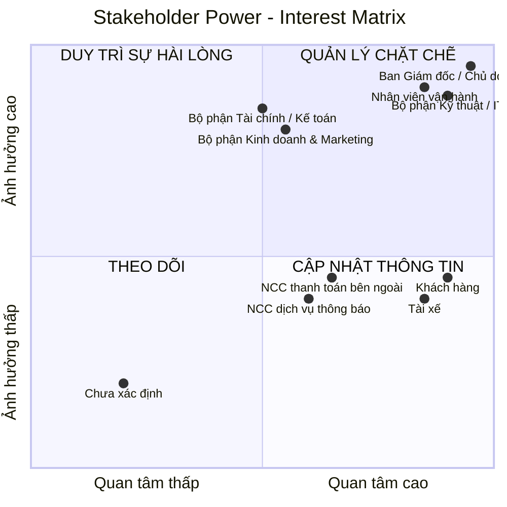
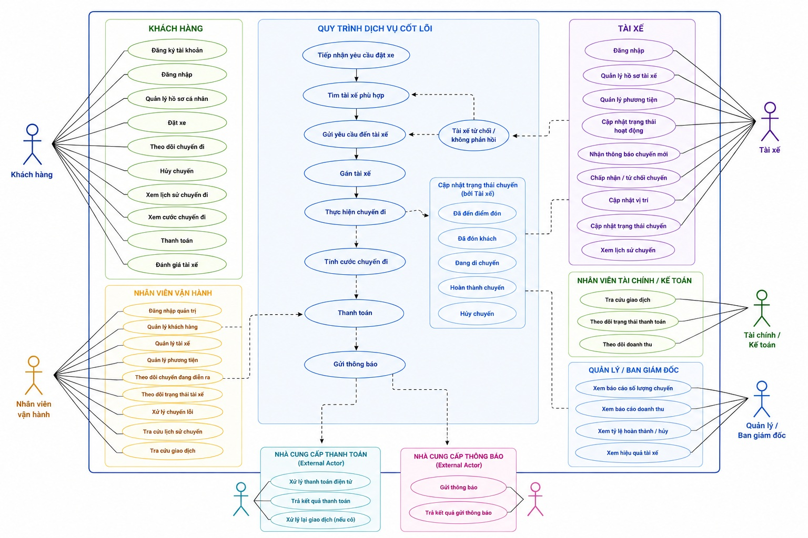
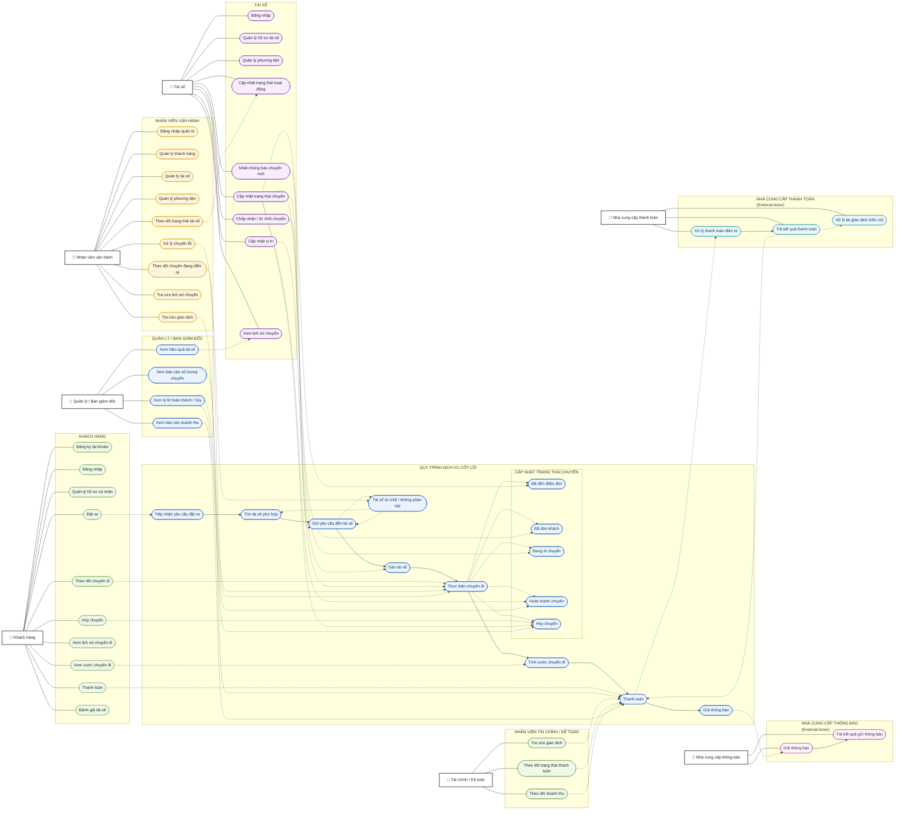
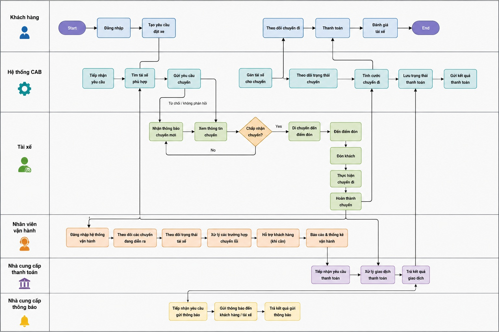

# 23641051_TranTrongDuythuc_cabsystem

## 1/ Stakeholder
### BẢNG PHÂN TÍCH VÀ XÁC ĐỊNH STAKEHOLDERS (CAB SYSTEM)
| STT | Nhóm Stakeholder | Vai trò chi tiết | Vai trò & Kỳ vọng chính đối với hệ thống CAB |
|---:|---|---|---|
| 1 | **Ban giám đốc / Chủ doanh nghiệp** | Định hướng hoạt động kinh doanh, quyết định mục tiêu và phạm vi hệ thống | Muốn hệ thống vận hành ổn định, phục vụ số lượng lớn khách hàng và tài xế, kiểm soát doanh thu, hiệu quả hoạt động và có khả năng mở rộng |
| 2 | **Khách hàng** | Người sử dụng dịch vụ để đặt và sử dụng chuyến xe | Đăng ký/đăng nhập, đặt xe nhanh, theo dõi trạng thái chuyến, biết thông tin tài xế, thanh toán, xem lịch sử và đánh giá tài xế |
| 3 | **Tài xế** | Người nhận và trực tiếp thực hiện chuyến xe | Quản lý hồ sơ và phương tiện, cập nhật trạng thái sẵn sàng, nhận thông báo chuyến, chấp nhận/từ chối chuyến, cập nhật trạng thái và hoàn thành chuyến |
| 4 | **Nhân viên vận hành** | Theo dõi và điều phối hoạt động đặt xe hằng ngày | Theo dõi chuyến đang diễn ra, trạng thái tài xế, hỗ trợ xử lý chuyến lỗi, quản lý thông tin khách hàng, tài xế, phương tiện và tra cứu lịch sử |
| 5 | **Bộ phận Tài chính / Kế toán** | Theo dõi các khoản thanh toán, giao dịch và doanh thu từ chuyến xe | Tra cứu giao dịch, theo dõi số tiền phải thu, trạng thái thanh toán và doanh thu; đảm bảo dữ liệu tài chính chính xác |
| 6 | **Nhà cung cấp thanh toán bên ngoài** | Cung cấp dịch vụ xử lý thanh toán điện tử | Tiếp nhận yêu cầu thanh toán, xử lý giao dịch và trả kết quả cho CAB; không yêu cầu CAB lưu thông tin nhạy cảm của thẻ/tài khoản |
| 7 | **Nhà cung cấp dịch vụ thông báo** | Cung cấp các kênh gửi thông báo đến khách hàng và tài xế | Gửi thông báo về đặt xe, tài xế, chuyến đi và thanh toán; hỗ trợ khả năng bổ sung hoặc thay đổi kênh thông báo trong tương lai |
| 8 | **Bộ phận Kinh doanh & Marketing** | Phụ trách hoạt động kinh doanh, thu hút khách hàng và phát triển dịch vụ | Cần dữ liệu về số lượng chuyến, khách hàng và doanh thu để đánh giá hoạt động kinh doanh; kỳ vọng hệ thống hỗ trợ mở rộng dịch vụ và phát triển khách hàng |
| 9 | **Bộ phận Kỹ thuật / IT** | Quản lý hạ tầng kỹ thuật, vận hành và hỗ trợ hệ thống | Hệ thống ổn định, bảo mật, dễ bảo trì; các thành phần có thể mở rộng độc lập và có thể triển khai tính năng mới từng phần mà hạn chế ảnh hưởng hệ thống đang hoạt động |

## 2/ Stakeholder Power–Interest Matrix
### 2.1/ Phân loại Stakeholder theo Power – Interest
| Nhóm | Tên nhóm | Stakeholder | Power | Interest | Chiến lược quản lý |
|---|---|---|---|---|---|
| **1** | **Quản lý chặt chẽ** | **Ban giám đốc / Chủ doanh nghiệp** | Cao | Cao | Tham gia thường xuyên, xác nhận phạm vi, yêu cầu và các quyết định quan trọng |
| | | **Nhân viên vận hành** | Cao | Cao | Làm việc trực tiếp, thu thập yêu cầu và lấy phản hồi thường xuyên |
| | | **Bộ phận Kỹ thuật / IT** | Cao | Cao | Phối hợp chặt chẽ về kỹ thuật, bảo mật, hiệu năng và khả năng mở rộng |
| **2** | **Duy trì sự hài lòng** | **Bộ phận Tài chính / Kế toán** | Cao | Trung bình | Đảm bảo các yêu cầu về thanh toán, giao dịch và doanh thu |
| | | **Bộ phận Kinh doanh & Marketing** | Cao | Trung bình | Đảm bảo có dữ liệu cần thiết để theo dõi hoạt động kinh doanh |
| **3** | **Cập nhật thông tin** | **Khách hàng** | Thấp – Trung bình | Cao | Thu thập nhu cầu, phản hồi và ưu tiên trải nghiệm người dùng |
| | | **Tài xế** | Thấp – Trung bình | Cao | Khảo sát quy trình thực tế và thu thập phản hồi |
| | | **Nhà cung cấp thanh toán bên ngoài** | Trung bình | Trung bình – Cao | Trao đổi yêu cầu tích hợp, trạng thái giao dịch và xử lý lỗi |
| | | **Nhà cung cấp dịch vụ thông báo** | Trung bình | Trung bình – Cao | Đảm bảo yêu cầu tích hợp và khả năng mở rộng kênh thông báo |
| **4** | **Theo dõi** | **Chưa xác định** | Thấp | Thấp | Chỉ cần theo dõi, không cần tham gia thường xuyên |

### 2.2/ Ma trận 2 chiều phân loại Stakeholder theo:
- **Trục X:** Mức độ quan tâm (Interest)
- **Trục Y:** Mức độ ảnh hưởng (Power)

## 3/ Business goals
### BẢNG XÁC ĐỊNH MỤC TIÊU KINH DOANH (BUSINESS GOALS)
| STT | Business Goal | Mô tả | Kỳ vọng / Kết quả cần đạt |
|---:|---|---|---|
| 1 | **Nâng cao hiệu quả đặt xe** | Thay thế quy trình đặt xe và phân công tài xế thủ công bằng hệ thống CAB | Khách hàng có thể đặt xe nhanh, hệ thống tự động tiếp nhận và xử lý yêu cầu |
| 2 | **Tự động hóa việc tìm và phân công tài xế** | Tự động tìm tài xế phù hợp dựa trên vị trí, trạng thái sẵn sàng và tiêu chí vận hành | Giảm thời gian điều phối, hạn chế phụ thuộc vào nhân viên vận hành |
| 3 | **Cải thiện trải nghiệm khách hàng** | Cung cấp thông tin rõ ràng trong toàn bộ quá trình sử dụng dịch vụ | Khách hàng biết trạng thái chuyến, tài xế, thời gian dự kiến đến, chi phí và kết quả thanh toán |
| 4 | **Nâng cao hiệu quả hoạt động của tài xế** | Hỗ trợ tài xế nhận và xử lý chuyến thông qua hệ thống | Tài xế dễ dàng nhận chuyến, cập nhật trạng thái và hoàn thành chuyến |
| 5 | **Quản lý tập trung dữ liệu vận hành** | Tập trung thông tin khách hàng, tài xế, phương tiện, chuyến đi và giao dịch | Nhân viên có thể tra cứu và quản lý dữ liệu từ một hệ thống thống nhất |
| 6 | **Quản lý thanh toán và doanh thu hiệu quả** | Tích hợp thanh toán điện tử và quản lý kết quả thanh toán | Theo dõi được số tiền phải trả, trạng thái giao dịch và doanh thu; không lưu thông tin thanh toán nhạy cảm |
| 7 | **Giảm tỷ lệ chuyến không được phân công** | Xây dựng cơ chế tiếp tục tìm tài xế khi tài xế được đề xuất không phản hồi hoặc từ chối | Tăng khả năng tìm được tài xế mà khách hàng không phải tạo lại yêu cầu |
| 8 | **Tăng khả năng kiểm soát hoạt động vận hành** | Cung cấp giao diện để nhân viên theo dõi chuyến và trạng thái tài xế | Nhân viên có thể phát hiện và xử lý nhanh các trường hợp bất thường |
| 9 | **Cung cấp dữ liệu phục vụ quản lý và ra quyết định** | Tổng hợp các chỉ số hoạt động chính | Ban lãnh đạo có thể theo dõi số chuyến, doanh thu, tỷ lệ hoàn thành, tỷ lệ hủy và hiệu quả tài xế |
| 10 | **Đảm bảo an toàn và bảo mật dữ liệu** | Bảo vệ thông tin cá nhân, phương tiện, vị trí và giao dịch | Chỉ người có quyền mới được truy cập dữ liệu/chức năng phù hợp; các thao tác quan trọng được lưu vết |
| 11 | **Đảm bảo hệ thống hoạt động ổn định khi nhu cầu tăng cao** | Thiết kế hệ thống có khả năng mở rộng khi số lượng khách hàng và tài xế tăng | Hạn chế tình trạng hệ thống bị gián đoạn hoặc giảm hiệu năng trong giờ cao điểm |
| 12 | **Tạo nền tảng có khả năng mở rộng trong tương lai** | Xây dựng CAB không chỉ phục vụ MVP mà còn hỗ trợ phát triển thêm dịch vụ và tích hợp | Có thể bổ sung loại dịch vụ, phương thức thanh toán, kênh thông báo và thay đổi thành phần kỹ thuật mà không phải xây dựng lại toàn bộ hệ thống |

## 4/ Scope
### BẢNG PHẠM VI CÔNG VIỆC THEO MODULE 
| STT | Module | Phạm vi công việc chính |
|---:|---|---|
| 1 | **Quản lý tài khoản & hồ sơ** | Đăng ký, đăng nhập, đăng xuất; cập nhật thông tin khách hàng và tài xế; quản lý trạng thái tài xế |
| 2 | **Đặt xe (Booking)** | Nhập điểm đón, điểm đến; lựa chọn loại xe; tạo và xác nhận yêu cầu đặt xe |
| 3 | **Tìm & phân công tài xế (Dispatch)** | Xác định tài xế phù hợp dựa trên vị trí và trạng thái sẵn sàng; gửi yêu cầu chuyến; tài xế chấp nhận hoặc từ chối; tiếp tục tìm tài xế khác khi không có phản hồi hoặc bị từ chối |
| 4 | **Quản lý & theo dõi chuyến đi** | Quản lý trạng thái chuyến từ khi tạo yêu cầu đến khi hoàn thành hoặc hủy; theo dõi thông tin tài xế, vị trí và thời gian dự kiến đến |
| 5 | **Quản lý tài xế & phương tiện** | Quản lý hồ sơ tài xế; thông tin phương tiện; trạng thái hoạt động; thông tin vị trí tài xế |
| 6 | **Tính cước & thanh toán** | Xác định số tiền phải trả; hỗ trợ thanh toán tiền mặt và điện tử; tích hợp nhà cung cấp thanh toán; xử lý và lưu trạng thái giao dịch |
| 7 | **Thông báo** | Gửi thông báo cho khách hàng và tài xế về đặt xe, nhận chuyến, tài xế đến, trạng thái chuyến và kết quả thanh toán |
| 8 | **Quản trị & vận hành** | Quản lý khách hàng, tài xế, phương tiện và chuyến đi; theo dõi chuyến đang diễn ra; xử lý chuyến lỗi; tra cứu giao dịch; phân quyền |
| 9 | **Báo cáo & giám sát** | Cung cấp báo cáo về số lượng chuyến, doanh thu, tỷ lệ hoàn thành, tỷ lệ hủy và hiệu quả hoạt động của tài xế |

## 5/ Business Requirements
### **BẢNG YÊU CẦU NGHIỆP VỤ (BUSINESS REQUIREMENTS)**
| ID | Business Requirement | Mô tả |
|---|---|---|
| **BR-01** | Quản lý dịch vụ đặt xe | Hệ thống phải hỗ trợ doanh nghiệp cung cấp dịch vụ đặt xe trực tuyến từ khi khách hàng tạo yêu cầu đến khi chuyến đi hoàn thành. |
| **BR-02** | Quản lý khách hàng | Hệ thống phải cho phép doanh nghiệp quản lý thông tin tài khoản và hồ sơ của khách hàng sử dụng dịch vụ. |
| **BR-03** | Quản lý tài xế | Hệ thống phải hỗ trợ doanh nghiệp quản lý tài khoản, hồ sơ, trạng thái hoạt động và thông tin liên quan của tài xế. |
| **BR-04** | Quản lý phương tiện | Hệ thống phải cho phép quản lý thông tin phương tiện được sử dụng để cung cấp dịch vụ vận chuyển. |
| **BR-05** | Tự động tìm và phân công tài xế | Hệ thống phải hỗ trợ tự động tìm tài xế phù hợp dựa trên vị trí, trạng thái sẵn sàng và các tiêu chí vận hành được doanh nghiệp xác định. |
| **BR-06** | Xử lý trường hợp tài xế không nhận chuyến | Hệ thống phải tiếp tục tìm tài xế khác khi tài xế được đề xuất không phản hồi hoặc từ chối chuyến, không yêu cầu khách hàng tạo lại yêu cầu. |
| **BR-07** | Quản lý quá trình thực hiện chuyến | Hệ thống phải hỗ trợ doanh nghiệp và các bên liên quan theo dõi chuyến đi từ lúc đặt xe đến khi hoàn thành hoặc bị hủy. |
| **BR-08** | Theo dõi vị trí và thời gian dự kiến | Hệ thống phải sử dụng thông tin vị trí của tài xế để hỗ trợ tìm tài xế gần khách hàng và cung cấp thời gian dự kiến tài xế đến. |
| **BR-09** | Tính cước chuyến đi | Hệ thống phải xác định số tiền khách hàng phải trả dựa trên loại dịch vụ và thông tin của chuyến đi. |
| **BR-10** | Hỗ trợ thanh toán | Hệ thống phải hỗ trợ thanh toán bằng tiền mặt và thanh toán điện tử thông qua nhà cung cấp thanh toán bên ngoài. |
| **BR-11** | Quản lý kết quả thanh toán | Hệ thống phải ghi nhận trạng thái giao dịch và thông báo cho khách hàng khi thanh toán thành công hoặc thất bại; cho phép xử lý lại giao dịch thất bại theo chính sách doanh nghiệp. |
| **BR-12** | Quản lý thông báo | Hệ thống phải cung cấp thông báo kịp thời cho khách hàng và tài xế về các sự kiện quan trọng trong quá trình đặt và thực hiện chuyến. |
| **BR-13** | Hỗ trợ vận hành | Hệ thống phải cung cấp giao diện để nhân viên vận hành theo dõi chuyến, trạng thái tài xế và xử lý các trường hợp chuyến bị lỗi. |
| **BR-14** | Quản lý và tra cứu dữ liệu | Hệ thống phải tập trung dữ liệu khách hàng, tài xế, phương tiện, chuyến đi và giao dịch để hỗ trợ quản lý và tra cứu. |
| **BR-15** | Báo cáo hoạt động kinh doanh | Hệ thống phải cung cấp các báo cáo cơ bản về số lượng chuyến, doanh thu, tỷ lệ hoàn thành, tỷ lệ hủy và hiệu quả hoạt động của tài xế. |
| **BR-16** | Đánh giá chất lượng dịch vụ | Hệ thống phải cho phép khách hàng đánh giá tài xế sau khi chuyến đi hoàn thành để doanh nghiệp theo dõi chất lượng dịch vụ. |
| **BR-17** | Kiểm soát quyền truy cập | Hệ thống phải đảm bảo các chức năng và dữ liệu quản trị chỉ được truy cập bởi nhân viên có quyền phù hợp. |
| **BR-18** | Bảo vệ dữ liệu | Hệ thống phải bảo vệ thông tin cá nhân, thông tin phương tiện, dữ liệu vị trí và dữ liệu giao dịch của người dùng. |
| **BR-19** | Lưu vết hoạt động | Hệ thống phải lưu lại các thao tác quan trọng để phục vụ kiểm tra và xử lý sự cố khi cần thiết. |
| **BR-20** | Đảm bảo tính ổn định của dịch vụ | Hệ thống phải hạn chế việc một thành phần gặp lỗi, như thanh toán hoặc thông báo, làm gián đoạn toàn bộ hoạt động đặt xe. |
| **BR-21** | Hỗ trợ mở rộng hệ thống | Hệ thống phải có khả năng mở rộng để phục vụ số lượng lớn khách hàng, tài xế và chuyến đi khi hoạt động kinh doanh phát triển. |

## 6/ Functional Requirements
### BẢNG PHÂN RÃ YÊU CẦU CHỨC NĂNG (FUNCTIONAL REQUIREMENTS)
| ID | Business Requirement | Functional Requirement |
|---|---|---|
| **FR-01.01** | **BR-01 Quản lý dịch vụ đặt xe** | Hệ thống cho phép khách hàng tạo yêu cầu đặt xe. |
| **FR-01.02** | | Hệ thống tiếp nhận và ghi nhận yêu cầu đặt xe. |
| **FR-01.03** | | Hệ thống cập nhật trạng thái xử lý của yêu cầu đặt xe. |
| **FR-01.04** | | Hệ thống cho phép hủy yêu cầu/chuyến đi theo chính sách được xác định. |
| **FR-02.01** | **BR-02 Quản lý khách hàng** | Hệ thống cho phép khách hàng đăng ký tài khoản. |
| **FR-02.02** | | Hệ thống cho phép khách hàng đăng nhập và đăng xuất. |
| **FR-02.03** | | Hệ thống cho phép khách hàng cập nhật thông tin cá nhân. |
| **FR-02.04** | | Hệ thống lưu trữ và quản lý thông tin tài khoản khách hàng. |
| **FR-03.01** | **BR-03 Quản lý tài xế** | Hệ thống cho phép tạo tài khoản tài xế. |
| **FR-03.02** | | Hệ thống cho phép tài xế cập nhật thông tin hồ sơ. |
| **FR-03.03** | | Hệ thống cho phép tài xế chuyển đổi trạng thái sẵn sàng/không sẵn sàng nhận chuyến. |
| **FR-03.04** | | Hệ thống ghi nhận trạng thái hoạt động hiện tại của tài xế. |
| **FR-04.01** | **BR-04 Quản lý phương tiện** | Hệ thống cho phép nhân viên vận hành tạo thông tin phương tiện. |
| **FR-04.02** | | Hệ thống cho phép cập nhật thông tin phương tiện. |
| **FR-04.03** | | Hệ thống cho phép liên kết phương tiện với tài xế. |
| **FR-04.04** | | Hệ thống lưu trữ thông tin phương tiện để phục vụ quản lý chuyến đi. |
| **FR-05.01** | **BR-05 Tìm & phân công tài xế** | Hệ thống xác định các tài xế đang sẵn sàng nhận chuyến. |
| **FR-05.02** | | Hệ thống xác định vị trí hiện tại của các tài xế phù hợp. |
| **FR-05.03** | | Hệ thống lọc tài xế theo các tiêu chí vận hành được cấu hình. |
| **FR-05.04** | | Hệ thống ưu tiên tài xế phù hợp và gần điểm đón. |
| **FR-05.05** | | Hệ thống gửi yêu cầu nhận chuyến đến tài xế được lựa chọn. |
| **FR-05.06** | | Hệ thống ghi nhận tài xế đã nhận chuyến. |
| **FR-06.01** | **BR-06 Xử lý tài xế không nhận chuyến** | Hệ thống ghi nhận trường hợp tài xế từ chối chuyến. |
| **FR-06.02** | | Hệ thống xác định trường hợp tài xế không phản hồi trong thời gian quy định. |
| **FR-06.03** | | Hệ thống tự động chuyển yêu cầu sang tài xế phù hợp tiếp theo. |
| **FR-06.04** | | Hệ thống tiếp tục tìm tài xế khác cho đến khi tìm được tài xế hoặc hết tài xế phù hợp. |
| **FR-06.05** | | Hệ thống thông báo cho khách hàng khi không tìm được tài xế. |
| **FR-07.01** | **BR-07 Quản lý chuyến đi** | Hệ thống tạo chuyến đi sau khi tài xế nhận yêu cầu. |
| **FR-07.02** | | Hệ thống cho phép tài xế cập nhật trạng thái **đã đến điểm đón**. |
| **FR-07.03** | | Hệ thống cho phép tài xế cập nhật trạng thái **đã đón khách**. |
| **FR-07.04** | | Hệ thống cho phép tài xế cập nhật trạng thái **đang di chuyển**. |
| **FR-07.05** | | Hệ thống cho phép tài xế cập nhật trạng thái **hoàn thành chuyến**. |
| **FR-07.06** | | Hệ thống cho phép xử lý trạng thái **hủy chuyến**. |
| **FR-07.07** | | Hệ thống lưu lại lịch sử và trạng thái của chuyến đi. |
| **FR-08.01** | **BR-08 Theo dõi vị trí & ETA** | Hệ thống ghi nhận vị trí hiện tại của tài xế. |
| **FR-08.02** | | Hệ thống cập nhật vị trí tài xế trong quá trình thực hiện chuyến. |
| **FR-08.03** | | Hệ thống sử dụng vị trí tài xế để hỗ trợ tìm tài xế phù hợp. |
| **FR-08.04** | | Hệ thống cung cấp thời gian dự kiến tài xế đến cho khách hàng. |
| **FR-08.05** | | Hệ thống hiển thị thông tin vị trí/trạng thái chuyến cho khách hàng. |
| **FR-09.01** | **BR-09 Tính cước** | Hệ thống xác định loại dịch vụ của chuyến đi. |
| **FR-09.02** | | Hệ thống thu thập thông tin cần thiết để tính cước. |
| **FR-09.03** | | Hệ thống tính số tiền khách hàng phải trả theo quy tắc tính cước. |
| **FR-09.04** | | Hệ thống lưu số tiền phải trả của chuyến đi. |
| **FR-10.01** | **BR-10 Thanh toán** | Hệ thống cho phép khách hàng lựa chọn thanh toán bằng tiền mặt. |
| **FR-10.02** | | Hệ thống cho phép khách hàng lựa chọn thanh toán điện tử. |
| **FR-10.03** | | Hệ thống gửi yêu cầu thanh toán điện tử đến nhà cung cấp thanh toán. |
| **FR-10.04** | | Hệ thống nhận kết quả giao dịch từ nhà cung cấp thanh toán. |
| **FR-10.05** | | Hệ thống không lưu trực tiếp thông tin nhạy cảm của thẻ/tài khoản thanh toán. |
| **FR-11.01** | **BR-11 Quản lý kết quả thanh toán** | Hệ thống ghi nhận trạng thái giao dịch thanh toán. |
| **FR-11.02** | | Hệ thống thông báo cho khách hàng khi thanh toán thành công. |
| **FR-11.03** | | Hệ thống thông báo cho khách hàng khi thanh toán thất bại. |
| **FR-11.04** | | Hệ thống cho phép thực hiện lại thanh toán khi giao dịch thất bại theo chính sách doanh nghiệp. |
| **FR-12.01** | **BR-12 Thông báo** | Hệ thống thông báo cho khách hàng khi yêu cầu đặt xe được tiếp nhận. |
| **FR-12.02** | | Hệ thống thông báo cho khách hàng khi tài xế nhận chuyến. |
| **FR-12.03** | | Hệ thống thông báo khi tài xế đến điểm đón. |
| **FR-12.04** | | Hệ thống thông báo khi chuyến đi hoàn thành. |
| **FR-12.05** | | Hệ thống thông báo kết quả thanh toán. |
| **FR-12.06** | | Hệ thống thông báo cho tài xế khi có chuyến mới. |
| **FR-12.07** | | Hệ thống thông báo cho tài xế khi có thay đổi liên quan đến chuyến đang thực hiện. |
| **FR-13.01** | **BR-13 Hỗ trợ vận hành** | Hệ thống cung cấp giao diện quản trị cho nhân viên vận hành. |
| **FR-13.02** | | Nhân viên vận hành có thể xem danh sách chuyến đang diễn ra. |
| **FR-13.03** | | Nhân viên vận hành có thể kiểm tra trạng thái tài xế. |
| **FR-13.04** | | Nhân viên vận hành có thể tra cứu thông tin khách hàng, tài xế và phương tiện. |
| **FR-13.05** | | Nhân viên vận hành có thể tra cứu lịch sử chuyến đi. |
| **FR-13.06** | | Nhân viên vận hành có thể tra cứu lịch sử giao dịch. |
| **FR-13.07** | | Nhân viên vận hành có thể hỗ trợ xử lý các trường hợp chuyến bị lỗi. |
| **FR-14.01** | **BR-14 Quản lý & tra cứu dữ liệu** | Hệ thống lưu trữ tập trung thông tin khách hàng. |
| **FR-14.02** | | Hệ thống lưu trữ tập trung thông tin tài xế và phương tiện. |
| **FR-14.03** | | Hệ thống lưu trữ thông tin chuyến đi. |
| **FR-14.04** | | Hệ thống lưu trữ thông tin giao dịch. |
| **FR-14.05** | | Người dùng có quyền có thể tìm kiếm và tra cứu dữ liệu. |
| **FR-15.01** | **BR-15 Báo cáo** | Hệ thống cung cấp báo cáo số lượng chuyến. |
| **FR-15.02** | | Hệ thống cung cấp báo cáo doanh thu. |
| **FR-15.03** | | Hệ thống cung cấp tỷ lệ chuyến hoàn thành. |
| **FR-15.04** | | Hệ thống cung cấp tỷ lệ chuyến hủy. |
| **FR-15.05** | | Hệ thống cung cấp thông tin hiệu quả hoạt động của tài xế. |
| **FR-16.01** | **BR-16 Đánh giá tài xế** | Hệ thống cho phép khách hàng đánh giá tài xế sau khi hoàn thành chuyến. |
| **FR-16.02** | | Hệ thống lưu kết quả đánh giá của khách hàng. |
| **FR-16.03** | | Hệ thống cho phép doanh nghiệp tra cứu kết quả đánh giá. |
| **FR-17.01** | **BR-17 Kiểm soát quyền truy cập** | Hệ thống xác thực khách hàng và tài xế trước khi sử dụng chức năng yêu cầu tài khoản. |
| **FR-17.02** | | Hệ thống xác thực nhân viên trước khi truy cập giao diện quản trị. |
| **FR-17.03** | | Hệ thống phân quyền chức năng theo vai trò người dùng. |
| **FR-17.04** | | Hệ thống ngăn người dùng thực hiện chức năng ngoài quyền được cấp. |
| **FR-18.01** | **BR-18 Bảo vệ dữ liệu** | Hệ thống kiểm soát quyền truy cập thông tin cá nhân. |
| **FR-18.02** | | Hệ thống bảo vệ thông tin phương tiện và dữ liệu vị trí. |
| **FR-18.03** | | Hệ thống bảo vệ dữ liệu giao dịch và thanh toán. |
| **FR-19.01** | **BR-19 Lưu vết hoạt động** | Hệ thống ghi nhận các thao tác quản trị quan trọng. |
| **FR-19.02** | | Hệ thống ghi nhận người thực hiện, thời gian và thao tác đã thực hiện. |
| **FR-19.03** | | Người có quyền có thể tra cứu log phục vụ kiểm tra và xử lý sự cố. |
| **FR-20.01** | **BR-20 Ổn định dịch vụ** | Hệ thống phải xử lý lỗi của dịch vụ thanh toán mà không làm dừng chức năng đặt xe. |
| **FR-20.02** | | Hệ thống phải xử lý lỗi của dịch vụ thông báo mà không làm dừng chức năng đặt xe. |
| **FR-20.03** | | Hệ thống phải ghi nhận các lỗi xảy ra trong quá trình xử lý để phục vụ kiểm tra. |
| **FR-21.01** | **BR-21 Mở rộng hệ thống** | Hệ thống cho phép mở rộng khả năng phục vụ khi số lượng khách hàng và tài xế tăng. |
| **FR-21.02** | | Các thành phần xử lý chính có thể được mở rộng độc lập khi cần thiết. |
| **FR-21.03** | | Hệ thống hỗ trợ triển khai thêm chức năng mà hạn chế ảnh hưởng đến chức năng đang hoạt động. |

## 7/ Vẽ use case
## 7.1/ Xác định Actors
| STT | Actor | Vai trò |
|---:|---|---|
| 1 | **Khách hàng** | Người đặt và sử dụng dịch vụ xe |
| 2 | **Tài xế** | Người nhận và thực hiện chuyến xe |
| 3 | **Nhân viên vận hành** | Theo dõi, quản lý và xử lý các hoạt động vận hành |
| 4 | **Nhân viên tài chính / kế toán** | Theo dõi và tra cứu giao dịch, doanh thu |
| 5 | **Quản lý / Ban giám đốc** | Theo dõi báo cáo và hiệu quả hoạt động |
| 6 | **Nhà cung cấp thanh toán** | Xử lý các giao dịch thanh toán điện tử |
| 7 | **Nhà cung cấp thông báo** | Gửi thông báo đến khách hàng và tài xế |

## 7.2/ Sơ đồ use case

## 8/ Đặc tả use case
### 8.1/ Đặc tả use case đặt xe
| Thành phần | Nội dung | |
| :--- | :--- | :--- |
| **Tên Use Case** | Đặt xe | |
| **Tiền điều kiện** | Khách hàng đã đăng nhập thành công. | |
| **Hậu điều kiện** | Nếu đặt xe thành công, thông tin yêu cầu đặt xe được lưu vào CSDL và trạng thái yêu cầu là “đang tìm tài xế”. | |
| **Actor chính** | Khách hàng | |
| **Actor phụ** | Không | |
| **Basic flow** | **Actor (Khách hàng)** | **System (Hệ thống)** |
| | 1. Chọn chức năng Đặt xe | 2. Hiển thị trang đặt xe |
| | 3. Nhập điểm đón | 4. Kiểm tra thông tin điểm đón |
| | 5. Nhập điểm đến | 6. Kiểm tra thông tin điểm đến |
| | 7. Chọn loại xe | 8. Hiển thị thông tin loại xe được chọn |
| | 9. Xác nhận yêu cầu đặt xe | 10. Kiểm tra toàn bộ thông tin đặt xe |
| | | 11. Tạo yêu cầu đặt xe |
| | | 12. Lưu thông tin yêu cầu vào CSDL |
| | | 13. Đặt trạng thái yêu cầu là “đang tìm tài xế” |
| | | 14. Thông báo yêu cầu đặt xe đã được tiếp nhận |
| **Alternative flow** | **3.1 Điểm đón không hợp lệ:** Hệ thống thông báo lỗi và yêu cầu nhập lại điểm đón → quay lại bước 3. **5.1 Điểm đến không hợp lệ:** Hệ thống thông báo lỗi và yêu cầu nhập lại điểm đến → quay lại bước 5. **7.1 Loại xe không khả dụng:** Hệ thống thông báo loại xe không khả dụng và yêu cầu chọn loại xe khác → quay lại bước 7. | |
| **Exception** | **9.1 Khách hàng không muốn tiếp tục:** Khách hàng chọn kết thúc → hệ thống hiển thị thông báo xác nhận → khách hàng xác nhận → kết thúc Use Case. **10.1 Lỗi khi lưu yêu cầu:** Hệ thống thông báo không thể tạo yêu cầu đặt xe → kết thúc Use Case. | |

### 8.2/ Đặc tả use case theo dõi chuyến đi
| Thành phần | Nội dung | |
| :--- | :--- | :--- |
| **Tên Use Case** | Theo dõi chuyến đi | |
| **Tiền điều kiện** | Khách hàng đã đăng nhập và có yêu cầu/chuyến đi đang được xử lý. | |
| **Hậu điều kiện** | Thông tin trạng thái chuyến, tài xế và thời gian dự kiến đến được hiển thị cho khách hàng. | |
| **Actor chính** | Khách hàng | |
| **Actor phụ** | Không | |
| **Basic flow** | **Actor (Khách hàng)** | **System (Hệ thống)** |
| | 1. Chọn chức năng Theo dõi chuyến đi | 2. Hiển thị chuyến đi hiện tại |
| | 3. Xem trạng thái chuyến | 4. Hiển thị trạng thái hiện tại của chuyến |
| | 5. Xem thông tin tài xế | 6. Hiển thị thông tin tài xế đã nhận chuyến |
| | 7. Xem vị trí tài xế | 8. Hiển thị vị trí tài xế và thời gian dự kiến đến |
| | 9. Theo dõi chuyến trong quá trình thực hiện | 10. Cập nhật thông tin và trạng thái chuyến |
| | | 11. Hiển thị trạng thái mới nhất cho khách hàng |
| **Alternative flow** | **3.1 Hệ thống đang tìm tài xế:** Hiển thị trạng thái “đang tìm tài xế” → tiếp tục chờ kết quả tìm tài xế. **5.1 Chưa có tài xế nhận chuyến:** Hệ thống thông báo chưa tìm được tài xế → tiếp tục tìm tài xế. **7.1 Không nhận được vị trí tài xế:** Hệ thống thông báo vị trí hiện tại chưa khả dụng → tiếp tục hiển thị trạng thái chuyến. | |
| **Exception** | **9.1 Chuyến bị hủy:** Hệ thống cập nhật trạng thái chuyến là “đã hủy” và thông báo cho khách hàng → kết thúc theo dõi. **9.2 Lỗi kết nối:** Hệ thống không thể cập nhật dữ liệu mới → thông báo dữ liệu chưa được cập nhật và cho phép khách hàng thử lại. | |

### 8.3/ Đặc tả use case Chấp nhận / từ chối chuyến
| Thành phần | Nội dung | |
| :--- | :--- | :--- |
| **Tên Use Case** | Chấp nhận / từ chối chuyến | |
| **Tiền điều kiện** | Tài xế đã đăng nhập và đang ở trạng thái sẵn sàng nhận chuyến. Hệ thống đã gửi yêu cầu chuyến đến tài xế. | |
| **Hậu điều kiện** | Nếu chấp nhận, chuyến được gán cho tài xế. Nếu từ chối, hệ thống tiếp tục tìm tài xế khác. | |
| **Actor chính** | Tài xế | |
| **Actor phụ** | Không | |
| **Basic flow** | **Actor (Tài xế)** | **System (Hệ thống)** |
| | | 1. Nhận thông báo có chuyến mới |
| | | 2. Hiển thị thông tin yêu cầu chuyến |
| | 3. Xem thông tin điểm đón, điểm đến và loại xe | 4. Hiển thị thông tin chuyến |
| | 5. Chọn Chấp nhận chuyến | 6. Kiểm tra chuyến còn khả dụng |
| | | 7. Gán chuyến cho tài xế |
| | | 8. Cập nhật trạng thái chuyến |
| | | 9. Thông báo cho khách hàng tài xế đã nhận chuyến |
| **Alternative flow** | **5.1 Tài xế chọn Từ chối:** Hệ thống ghi nhận tài xế từ chối → chuyển yêu cầu sang quá trình tìm tài xế khác. **5.2 Tài xế không phản hồi:** Khi hết thời gian phản hồi theo quy định, hệ thống ghi nhận không phản hồi → tiếp tục tìm tài xế khác. | |
| **Exception** | **6.1 Chuyến đã được tài xế khác nhận:** Hệ thống thông báo chuyến không còn khả dụng → kết thúc Use Case. **6.2 Lỗi kết nối:** Hệ thống không ghi nhận được phản hồi → thông báo lỗi và xử lý theo trạng thái thực tế của chuyến. | |

### 8.4/ Đặc tả use case Cập nhật trạng thái chuyến
| Thành phần | Nội dung | |
| :--- | :--- | :--- |
| **Tên Use Case** | Cập nhật trạng thái chuyến | |
| **Tiền điều kiện** | Tài xế đã đăng nhập và đã được gán vào chuyến. | |
| **Hậu điều kiện** | Trạng thái mới của chuyến được lưu vào CSDL và thông tin được cập nhật cho các bên liên quan. | |
| **Actor chính** | Tài xế | |
| **Actor phụ** | Không | |
| **Basic flow** | **Actor (Tài xế)** | **System (Hệ thống)** |
| | 1. Mở chuyến đang thực hiện | 2. Hiển thị thông tin chuyến |
| | 3. Chọn trạng thái Đã đến điểm đón | 4. Kiểm tra trạng thái hiện tại |
| | 5. Xác nhận cập nhật | 6. Lưu trạng thái “đã đến điểm đón” |
| | 7. Chọn trạng thái Đã đón khách | 8. Cập nhật trạng thái chuyến |
| | 9. Chọn trạng thái Đang di chuyển | 10. Cập nhật trạng thái chuyến |
| | 11. Chọn trạng thái Hoàn thành chuyến | 12. Cập nhật trạng thái “hoàn thành” |
| | | 13. Lưu lịch sử thay đổi trạng thái |
| | | 14. Thông báo trạng thái mới cho khách hàng |
| **Alternative flow** | **7.1 Tài xế chưa đến điểm đón:** Hệ thống không cho phép chuyển sang trạng thái đã đón khách → thông báo và giữ trạng thái hiện tại. **9.1 Chưa xác nhận đã đón khách:** Hệ thống không cho phép chuyển sang đang di chuyển → yêu cầu cập nhật trạng thái trước đó. | |
| **Exception** | **11.1 Không thể cập nhật trạng thái:** Hệ thống thông báo lỗi → giữ trạng thái hiện tại và cho phép tài xế thử lại. | |

### 8.5/ Đặc tả use case Thanh toán
| Thành phần | Nội dung | |
| :--- | :--- | :--- |
| **Tên Use Case** | Thanh toán | |
| **Tiền điều kiện** | Chuyến đi đã hoàn thành và hệ thống đã xác định số tiền khách hàng phải trả. | |
| **Hậu điều kiện** | Nếu thanh toán thành công, giao dịch được lưu với trạng thái “thành công”. Nếu thất bại, giao dịch được lưu với trạng thái “thất bại” và khách hàng được thông báo. | |
| **Actor chính** | Khách hàng | |
| **Actor phụ** | Nhà cung cấp thanh toán | |
| **Basic flow** | **Actor (Khách hàng)** | **System (Hệ thống)** |
| | 1. Chọn phương thức thanh toán | 2. Hiển thị các phương thức thanh toán |
| | 3. Chọn thanh toán điện tử | 4. Gửi yêu cầu thanh toán đến nhà cung cấp |
| | | 5. Nhà cung cấp xử lý giao dịch |
| | | 6. Hệ thống nhận kết quả giao dịch |
| | | 7. Cập nhật trạng thái thanh toán |
| | | 8. Thông báo kết quả thanh toán cho khách hàng |
| **Alternative flow** | **3.1 Khách hàng chọn tiền mặt:** Hệ thống ghi nhận phương thức thanh toán là tiền mặt → cập nhật trạng thái giao dịch theo quy trình của doanh nghiệp → kết thúc. **6.1 Thanh toán thất bại:** Hệ thống ghi nhận giao dịch thất bại → thông báo cho khách hàng → cho phép xử lý lại theo chính sách doanh nghiệp. | |
| **Exception** | **4.1 Nhà cung cấp thanh toán không phản hồi:** Hệ thống ghi nhận giao dịch chưa có kết quả → thông báo cho khách hàng → xử lý lại theo chính sách. **4.2 Lỗi tích hợp:** Hệ thống ghi nhận lỗi giao dịch và không làm dừng chức năng đặt xe/chuyến đi. | |

### 8.6/ Đặc tả use case Xem cước chuyến đi
| Thành phần | Nội dung | |
| :--- | :--- | :--- |
| **Tên Use Case** | Xem cước chuyến đi | |
| **Tiền điều kiện** | Khách hàng đã đăng nhập và chuyến đi đã hoàn thành hoặc đã có thông tin cước cần hiển thị. | |
| **Hậu điều kiện** | Khách hàng xem được số tiền phải thanh toán và thông tin cước của chuyến. | |
| **Actor chính** | Khách hàng | |
| **Actor phụ** | Không | |
| **Basic flow** | **Actor (Khách hàng)** | **System (Hệ thống)** |
| | 1. Chọn chuyến đi cần xem cước | 2. Kiểm tra thông tin chuyến |
| | 3. Chọn Xem cước | 4. Xác định thông tin cước của chuyến |
| | | 5. Hiển thị loại dịch vụ và số tiền phải trả |
| | 6. Xem thông tin cước | 7. Hiển thị chi tiết cước theo quy tắc tính cước hiện hành |
| **Alternative flow** | **3.1 Chuyến chưa hoàn thành:** Hệ thống thông báo chưa thể xác định cước cuối cùng → hiển thị thông tin phù hợp nếu có. | |
| **Exception** | **4.1 Không tìm thấy thông tin cước:** Hệ thống thông báo chưa có dữ liệu cước → kết thúc Use Case. | |

### 8.7/ Đặc tả use case Nhận thông báo chuyến mới
| Thành phần | Nội dung | |
| :--- | :--- | :--- |
| **Tên Use Case** | Nhận thông báo chuyến mới | |
| **Tiền điều kiện** | Tài xế đã đăng nhập, đang ở trạng thái sẵn sàng và có chuyến phù hợp được hệ thống phân phối. | |
| **Hậu điều kiện** | Tài xế nhận được thông báo và có thể xem thông tin chuyến để quyết định chấp nhận hoặc từ chối. | |
| **Actor chính** | Tài xế | |
| **Actor phụ** | Nhà cung cấp dịch vụ thông báo | |
| **Basic flow** | **Actor (Tài xế)** | **System (Hệ thống)** |
| | 1. Tài xế chuyển sang trạng thái sẵn sàng | 2. Hệ thống ghi nhận trạng thái |
| | | 3. Hệ thống xác định có yêu cầu chuyến phù hợp |
| | | 4. Hệ thống gửi thông tin chuyến đến dịch vụ thông báo |
| | | 5. Nhà cung cấp thông báo gửi thông báo cho tài xế |
| | 6. Tài xế nhận thông báo | 7. Hệ thống hiển thị thông tin chuyến |
| **Alternative flow** | **3.1 Không có chuyến phù hợp:** Hệ thống không gửi thông báo → tiếp tục chờ yêu cầu mới. **5.1 Không gửi được thông báo:** Hệ thống ghi nhận trạng thái gửi thất bại và xử lý theo cơ chế thông báo của hệ thống. | |
| **Exception** | **4.1 Nhà cung cấp thông báo không phản hồi:** Hệ thống ghi nhận lỗi tích hợp → không làm ảnh hưởng đến việc xử lý yêu cầu đặt xe. | |

### 8.8/ Đặc tả use case Cập nhật vị trí
| Thành phần | Nội dung | |
| :--- | :--- | :--- |
| **Tên Use Case** | Cập nhật vị trí | |
| **Tiền điều kiện** | Tài xế đã đăng nhập và cho phép hệ thống sử dụng thông tin vị trí trong quá trình hoạt động. | |
| **Hậu điều kiện** | Vị trí mới nhất của tài xế được lưu/cập nhật để phục vụ tìm tài xế và theo dõi chuyến. | |
| **Actor chính** | Tài xế | |
| **Actor phụ** | Không | |
| **Basic flow** | **Actor (Tài xế)** | **System (Hệ thống)** |
| | 1. Tài xế bắt đầu hoạt động | 2. Hệ thống xác định vị trí hiện tại |
| | 3. Cho phép gửi vị trí | 4. Tiếp nhận thông tin vị trí |
| | | 5. Kiểm tra dữ liệu vị trí |
| | | 6. Lưu/cập nhật vị trí tài xế |
| | | 7. Sử dụng vị trí cho quá trình tìm tài xế và theo dõi chuyến |
| | 8. Tiếp tục di chuyển | 9. Hệ thống tiếp tục cập nhật vị trí mới |
| **Alternative flow** | **3.1 Tài xế không cho phép truy cập vị trí:** Hệ thống thông báo không thể cập nhật vị trí → xử lý theo chính sách vận hành. | |
| **Exception** | **4.1 Không nhận được vị trí:** Hệ thống ghi nhận vị trí không khả dụng → tiếp tục xử lý theo trạng thái vị trí hiện tại. **4.2 Mất kết nối:** Hệ thống không nhận được vị trí mới → giữ dữ liệu vị trí gần nhất và cập nhật lại khi có kết nối. | |

### 8.9/ Đặc tả use case Theo dõi chuyến đang diễn ra
| Thành phần | Nội dung | |
| :--- | :--- | :--- |
| **Tên Use Case** | Theo dõi chuyến đang diễn ra | |
| **Tiền điều kiện** | Nhân viên vận hành đã đăng nhập và có quyền truy cập chức năng vận hành. | |
| **Hậu điều kiện** | Nhân viên vận hành xem được danh sách và trạng thái các chuyến đang diễn ra. | |
| **Actor chính** | Nhân viên vận hành | |
| **Actor phụ** | Không | |
| **Basic flow** | **Actor (Nhân viên vận hành)** | **System (Hệ thống)** |
| | 1. Chọn chức năng Theo dõi chuyến đang diễn ra | 2. Hiển thị danh sách các chuyến đang hoạt động |
| | 3. Chọn một chuyến | 4. Hiển thị thông tin chuyến |
| | 5. Xem trạng thái chuyến | 6. Hiển thị trạng thái hiện tại |
| | 7. Xem thông tin tài xế | 8. Hiển thị thông tin tài xế và phương tiện |
| | 9. Xem vị trí chuyến/tài xế | 10. Hiển thị thông tin vị trí mới nhất nếu có |
| | | 11. Cập nhật dữ liệu chuyến khi trạng thái thay đổi |
| **Alternative flow** | **3.1 Không có chuyến đang diễn ra:** Hệ thống thông báo không có chuyến đang hoạt động → kết thúc Use Case. **9.1 Không có dữ liệu vị trí:** Hệ thống thông báo vị trí hiện tại chưa khả dụng → vẫn hiển thị thông tin chuyến. | |
| **Exception** | **11.1 Không thể cập nhật dữ liệu:** Hệ thống thông báo lỗi và hiển thị dữ liệu gần nhất → nhân viên có thể thử tải lại. | |

### 8.10/ Đặc tả use case Hủy chuyến
| Thành phần | Nội dung | |
| :--- | :--- | :--- |
| **Tên Use Case** | Hủy chuyến | |
| **Tiền điều kiện** | Khách hàng đã đăng nhập và đang có yêu cầu/chuyến đi có thể hủy theo chính sách của doanh nghiệp. | |
| **Hậu điều kiện** | Nếu hủy thành công, trạng thái yêu cầu/chuyến đi được cập nhật thành “đã hủy” và các bên liên quan được thông báo. | |
| **Actor chính** | Khách hàng | |
| **Actor phụ** | Không | |
| **Basic flow** | **Actor (Khách hàng)** | **System (Hệ thống)** |
| | 1. Chọn chuyến cần hủy | 2. Hiển thị thông tin chuyến |
| | 3. Chọn chức năng Hủy chuyến | 4. Kiểm tra chuyến có được phép hủy hay không |
| | 5. Chọn lý do hủy nếu được yêu cầu | 6. Hiển thị thông tin xác nhận hủy |
| | 7. Xác nhận hủy chuyến | 8. Cập nhật trạng thái chuyến thành “đã hủy” |
| | | 9. Lưu thông tin hủy chuyến |
| | | 10. Thông báo việc hủy đến các bên liên quan |
| **Alternative flow** | **4.1 Không được phép hủy:** Hệ thống thông báo chuyến không thể hủy theo chính sách → giữ nguyên trạng thái chuyến. **5.1 Khách hàng không muốn hủy:** Khách hàng chọn quay lại → hệ thống giữ nguyên chuyến → kết thúc Use Case. | |
| **Exception** | **7.1 Lỗi khi cập nhật trạng thái:** Hệ thống thông báo không thể hủy chuyến → giữ nguyên trạng thái hiện tại và cho phép thử lại. | |

### 8.11/ Đặc tả use case Đăng ký tài khoản
| Thành phần | Nội dung | |
| :--- | :--- | :--- |
| **Tên Use Case** | Đăng ký tài khoản | |
| **Tiền điều kiện** | Khách hàng chưa có tài khoản trên hệ thống. | |
| **Hậu điều kiện** | Nếu đăng ký thành công, thông tin tài khoản khách hàng được lưu vào CSDL và tài khoản có thể được sử dụng để đăng nhập. | |
| **Actor chính** | Khách hàng | |
| **Actor phụ** | Không | |
| **Basic flow** | **Actor (Khách hàng)** | **System (Hệ thống)** |
| | 1. Chọn chức năng Đăng ký | 2. Hiển thị trang đăng ký tài khoản |
| | 3. Nhập họ tên, số điện thoại/email và mật khẩu | 4. Kiểm tra dữ liệu nhập |
| | 5. Xác nhận đăng ký | 6. Kiểm tra thông tin tài khoản |
| | | 7. Kiểm tra số điện thoại/email đã tồn tại hay chưa |
| | | 8. Tạo tài khoản khách hàng |
| | | 9. Lưu thông tin tài khoản vào CSDL |
| | | 10. Thông báo đăng ký thành công |
| **Alternative flow** | **4.1 Dữ liệu không hợp lệ:** Hệ thống thông báo lỗi và yêu cầu nhập lại → quay lại bước 3. **7.1 Số điện thoại/email đã tồn tại:** Hệ thống thông báo tài khoản đã tồn tại → yêu cầu khách hàng sử dụng thông tin khác hoặc đăng nhập → quay lại bước 3. | |
| **Exception** | **9.1 Lỗi lưu tài khoản:** Hệ thống thông báo không thể tạo tài khoản → kết thúc Use Case. | || Thành phần | Nội dung | |
| :--- | :--- | :--- |
| **Tên Use Case** | Đăng ký tài khoản | |
| **Tiền điều kiện** | Khách hàng chưa có tài khoản trên hệ thống. | |
| **Hậu điều kiện** | Nếu đăng ký thành công, thông tin tài khoản khách hàng được lưu vào CSDL và tài khoản có thể được sử dụng để đăng nhập. | |
| **Actor chính** | Khách hàng | |
| **Actor phụ** | Không | |
| **Basic flow** | **Actor (Khách hàng)** | **System (Hệ thống)** |
| | 1. Chọn chức năng Đăng ký | 2. Hiển thị trang đăng ký tài khoản |
| | 3. Nhập họ tên, số điện thoại/email và mật khẩu | 4. Kiểm tra dữ liệu nhập |
| | 5. Xác nhận đăng ký | 6. Kiểm tra thông tin tài khoản |
| | | 7. Kiểm tra số điện thoại/email đã tồn tại hay chưa |
| | | 8. Tạo tài khoản khách hàng |
| | | 9. Lưu thông tin tài khoản vào CSDL |
| | | 10. Thông báo đăng ký thành công |
| **Alternative flow** | **4.1 Dữ liệu không hợp lệ:** Hệ thống thông báo lỗi và yêu cầu nhập lại → quay lại bước 3. **7.1 Số điện thoại/email đã tồn tại:** Hệ thống thông báo tài khoản đã tồn tại → yêu cầu khách hàng sử dụng thông tin khác hoặc đăng nhập → quay lại bước 3. | |
| **Exception** | **9.1 Lỗi lưu tài khoản:** Hệ thống thông báo không thể tạo tài khoản → kết thúc Use Case. | |

### 8.12/ Đặc tả use case Đăng nhập
| Thành phần | Nội dung | |
| :--- | :--- | :--- |
| **Tên Use Case** | Đăng nhập | |
| **Tiền điều kiện** | Khách hàng đã có tài khoản trên hệ thống. | |
| **Hậu điều kiện** | Nếu đăng nhập thành công, khách hàng được xác thực và có thể sử dụng các chức năng yêu cầu tài khoản. | |
| **Actor chính** | Khách hàng | |
| **Actor phụ** | Không | |
| **Basic flow** | **Actor (Khách hàng)** | **System (Hệ thống)** |
| | 1. Chọn chức năng Đăng nhập | 2. Hiển thị trang đăng nhập |
| | 3. Nhập số điện thoại/email và mật khẩu | 4. Kiểm tra dữ liệu nhập |
| | 5. Chọn Đăng nhập | 6. Xác thực thông tin tài khoản |
| | | 7. Tạo phiên đăng nhập |
| | | 8. Hiển thị giao diện chính |
| **Alternative flow** | **6.1 Thông tin đăng nhập không chính xác:** Hệ thống thông báo thông tin đăng nhập không đúng → yêu cầu nhập lại → quay lại bước 3. | |
| **Exception** | **6.2 Tài khoản không thể sử dụng:** Hệ thống thông báo tài khoản không thể đăng nhập → kết thúc Use Case. **7.1 Lỗi hệ thống:** Hệ thống thông báo đăng nhập không thành công → cho phép thử lại. | |

### 8.13/ Đặc tả use case Quản lý hồ sơ khách hàng
| Thành phần | Nội dung | |
| :--- | :--- | :--- |
| **Tên Use Case** | Quản lý hồ sơ khách hàng | |
| **Tiền điều kiện** | Khách hàng đã đăng nhập thành công. | |
| **Hậu điều kiện** | Thông tin hồ sơ khách hàng được cập nhật vào CSDL nếu khách hàng thực hiện thay đổi. | |
| **Actor chính** | Khách hàng | |
| **Actor phụ** | Không | |
| **Basic flow** | **Actor (Khách hàng)** | **System (Hệ thống)** |
| | 1. Chọn chức năng Hồ sơ cá nhân | 2. Hiển thị thông tin hồ sơ hiện tại |
| | 3. Chọn Cập nhật thông tin | 4. Hiển thị biểu mẫu cập nhật |
| | 5. Nhập thông tin cần thay đổi | 6. Kiểm tra dữ liệu nhập |
| | 7. Xác nhận cập nhật | 8. Lưu thông tin mới vào CSDL |
| | | 9. Hiển thị thông báo cập nhật thành công |
| **Alternative flow** | **5.1 Khách hàng không thay đổi thông tin:** Hệ thống giữ nguyên dữ liệu → kết thúc Use Case. **6.1 Dữ liệu không hợp lệ:** Hệ thống thông báo lỗi → yêu cầu khách hàng nhập lại → quay lại bước 5. | |
| **Exception** | **8.1 Không thể lưu thông tin:** Hệ thống thông báo lỗi → giữ thông tin cũ và cho phép thử lại. | |

### 8.14/ Đặc tả use case Xem lịch sử chuyến đi
| Thành phần | Nội dung | |
| :--- | :--- | :--- |
| **Tên Use Case** | Xem lịch sử chuyến đi | |
| **Tiền điều kiện** | Khách hàng đã đăng nhập thành công. | |
| **Hậu điều kiện** | Khách hàng xem được danh sách các chuyến đã thực hiện hoặc đã hủy. | |
| **Actor chính** | Khách hàng | |
| **Actor phụ** | Không | |
| **Basic flow** | **Actor (Khách hàng)** | **System (Hệ thống)** |
| | 1. Chọn chức năng Lịch sử chuyến đi | 2. Truy vấn dữ liệu lịch sử của khách hàng |
| | | 3. Hiển thị danh sách các chuyến |
| | 4. Chọn một chuyến | 5. Hiển thị thông tin chi tiết chuyến |
| | 6. Xem thông tin chuyến, cước và trạng thái thanh toán | 7. Hiển thị thông tin tương ứng |
| **Alternative flow** | **3.1 Không có lịch sử chuyến:** Hệ thống thông báo khách hàng chưa có chuyến đi → kết thúc Use Case. | |
| **Exception** | **2.1 Không thể truy vấn dữ liệu:** Hệ thống thông báo không thể tải lịch sử chuyến → cho phép khách hàng thử lại. | |

### 8.15/ Đặc tả use case Đánh giá tài xế
| Thành phần | Nội dung | |
| :--- | :--- | :--- |
| **Tên Use Case** | Đánh giá tài xế | |
| **Tiền điều kiện** | Khách hàng đã đăng nhập và chuyến đi đã hoàn thành. | |
| **Hậu điều kiện** | Đánh giá của khách hàng được lưu vào CSDL và gắn với chuyến đi/tài xế tương ứng. | |
| **Actor chính** | Khách hàng | |
| **Actor phụ** | Không | |
| **Basic flow** | **Actor (Khách hàng)** | **System (Hệ thống)** |
| | 1. Chọn chuyến đã hoàn thành | 2. Kiểm tra trạng thái chuyến |
| | 3. Chọn chức năng Đánh giá tài xế | 4. Hiển thị biểu mẫu đánh giá |
| | 5. Chọn mức đánh giá | 6. Kiểm tra dữ liệu đánh giá |
| | 7. Nhập nhận xét nếu có | 8. Lưu đánh giá vào CSDL |
| | | 9. Thông báo đánh giá thành công |
| **Alternative flow** | **2.1 Chuyến chưa hoàn thành:** Hệ thống không cho phép đánh giá → thông báo và kết thúc Use Case. **6.1 Chưa chọn mức đánh giá:** Hệ thống yêu cầu khách hàng chọn mức đánh giá → quay lại bước 5. | |
| **Exception** | **8.1 Không thể lưu đánh giá:** Hệ thống thông báo lỗi → cho phép khách hàng thực hiện lại. | |

### 8.16/ Đặc tả use case Quản lý hồ sơ tài xế
| Thành phần | Nội dung | |
| :--- | :--- | :--- |
| **Tên Use Case** | Quản lý hồ sơ tài xế | |
| **Tiền điều kiện** | Tài xế đã đăng nhập hoặc nhân viên vận hành đã đăng nhập và có quyền quản lý tài xế. | |
| **Hậu điều kiện** | Thông tin hồ sơ tài xế được tạo hoặc cập nhật trong CSDL. | |
| **Actor chính** | Tài xế | |
| **Actor phụ** | Nhân viên vận hành | |
| **Basic flow** | **Actor (Tài xế / Nhân viên vận hành)** | **System (Hệ thống)** |
| | 1. Chọn chức năng Quản lý hồ sơ | 2. Hiển thị thông tin hồ sơ tài xế |
| | 3. Nhập hoặc cập nhật thông tin | 4. Kiểm tra dữ liệu |
| | 5. Xác nhận lưu | 6. Lưu thông tin hồ sơ vào CSDL |
| | | 7. Thông báo cập nhật thành công |
| **Alternative flow** | **3.1 Nhân viên vận hành tạo hồ sơ mới:** Hệ thống hiển thị biểu mẫu tạo tài khoản/hồ sơ tài xế → nhân viên nhập thông tin → quay lại bước 5. **4.1 Thông tin không hợp lệ:** Hệ thống thông báo lỗi → yêu cầu nhập lại → quay lại bước 3. | |
| **Exception** | **6.1 Không thể lưu hồ sơ:** Hệ thống thông báo lỗi → giữ dữ liệu cũ và cho phép thử lại. | |

### 8.17/ Đặc tả use case Quản lý phương tiện
| Thành phần | Nội dung | |
| :--- | :--- | :--- |
| **Tên Use Case** | Quản lý phương tiện | |
| **Tiền điều kiện** | Tài xế hoặc nhân viên vận hành đã đăng nhập và có quyền quản lý phương tiện. | |
| **Hậu điều kiện** | Thông tin phương tiện được tạo, cập nhật hoặc thay đổi trạng thái trong CSDL. | |
| **Actor chính** | Tài xế | |
| **Actor phụ** | Nhân viên vận hành | |
| **Basic flow** | **Actor (Tài xế / Nhân viên vận hành)** | **System (Hệ thống)** |
| | 1. Chọn chức năng Quản lý phương tiện | 2. Hiển thị danh sách/thông tin phương tiện |
| | 3. Chọn thêm hoặc cập nhật phương tiện | 4. Hiển thị biểu mẫu phương tiện |
| | 5. Nhập thông tin phương tiện | 6. Kiểm tra dữ liệu |
| | 7. Xác nhận lưu | 8. Lưu thông tin phương tiện vào CSDL |
| | | 9. Cập nhật trạng thái phương tiện |
| | | 10. Thông báo thao tác thành công |
| **Alternative flow** | **6.1 Thông tin phương tiện không hợp lệ:** Hệ thống thông báo lỗi → yêu cầu nhập lại → quay lại bước 5. **6.2 Phương tiện đã tồn tại:** Hệ thống thông báo phương tiện đã được đăng ký → yêu cầu kiểm tra lại thông tin. | |
| **Exception** | **8.1 Không thể lưu dữ liệu:** Hệ thống thông báo lỗi → không thay đổi dữ liệu hiện tại. | |

### 8.18/ Đặc tả use case Quản lý trạng thái tài xế
| Thành phần | Nội dung | |
| :--- | :--- | :--- |
| **Tên Use Case** | Quản lý trạng thái tài xế | |
| **Tiền điều kiện** | Tài xế đã đăng nhập và có tài khoản hợp lệ. | |
| **Hậu điều kiện** | Trạng thái hoạt động mới của tài xế được lưu vào hệ thống. | |
| **Actor chính** | Tài xế | |
| **Actor phụ** | Nhân viên vận hành | |
| **Basic flow** | **Actor (Tài xế / Nhân viên vận hành)** | **System (Hệ thống)** |
| | 1. Chọn chức năng Trạng thái hoạt động | 2. Hiển thị trạng thái hiện tại |
| | 3. Chọn trạng thái cần thay đổi | 4. Kiểm tra điều kiện thay đổi trạng thái |
| | 5. Xác nhận thay đổi | 6. Cập nhật trạng thái tài xế |
| | | 7. Lưu lịch sử thay đổi nếu cần |
| | | 8. Thông báo thay đổi thành công |
| **Alternative flow** | **4.1 Tài xế đang thực hiện chuyến:** Hệ thống không cho phép chuyển sang trạng thái không phù hợp → thông báo lý do. **4.2 Tài xế chưa đáp ứng điều kiện hoạt động:** Hệ thống không cho phép chuyển sang “Sẵn sàng nhận chuyến” → thông báo yêu cầu cần đáp ứng. | |
| **Exception** | **6.1 Không thể cập nhật trạng thái:** Hệ thống thông báo lỗi → giữ trạng thái hiện tại và cho phép thử lại. | |

### 8.19/ Đặc tả use case Quản lý khách hàng
| Thành phần | Nội dung | |
| :--- | :--- | :--- |
| **Tên Use Case** | Quản lý khách hàng | |
| **Tiền điều kiện** | Nhân viên vận hành đã đăng nhập và có quyền quản lý khách hàng. | |
| **Hậu điều kiện** | Thông tin khách hàng được xem, cập nhật hoặc xử lý theo quyền của nhân viên. | |
| **Actor chính** | Nhân viên vận hành | |
| **Actor phụ** | Không | |
| **Basic flow** | **Actor (Nhân viên vận hành)** | **System (Hệ thống)** |
| | 1. Chọn chức năng Quản lý khách hàng | 2. Hiển thị danh sách khách hàng |
| | 3. Tìm kiếm khách hàng | 4. Thực hiện tìm kiếm theo thông tin nhập |
| | 5. Chọn khách hàng | 6. Hiển thị thông tin chi tiết |
| | 7. Chọn cập nhật thông tin nếu cần | 8. Hiển thị biểu mẫu cập nhật |
| | 9. Nhập thông tin mới | 10. Kiểm tra dữ liệu |
| | 11. Xác nhận cập nhật | 12. Lưu thông tin vào CSDL |
| | | 13. Thông báo cập nhật thành công |
| **Alternative flow** | **4.1 Không tìm thấy khách hàng:** Hệ thống thông báo không tìm thấy dữ liệu phù hợp → cho phép nhập lại điều kiện tìm kiếm. **10.1 Dữ liệu không hợp lệ:** Hệ thống thông báo lỗi → quay lại bước 9. | |
| **Exception** | **12.1 Không thể cập nhật dữ liệu:** Hệ thống thông báo lỗi → giữ dữ liệu hiện tại. | |

### 8.20/ Đặc tả use case Quản lý cấu hình hệ thống
| Thành phần | Nội dung | |
| :--- | :--- | :--- |
| **Tên Use Case** | Quản lý cấu hình hệ thống | |
| **Tiền điều kiện** | Nhân viên quản trị/nhân viên vận hành có quyền phù hợp đã đăng nhập. | |
| **Hậu điều kiện** | Cấu hình được cập nhật và hệ thống sử dụng cấu hình mới theo quyền và chính sách của doanh nghiệp. | |
| **Actor chính** | Nhân viên vận hành | |
| **Actor phụ** | Quản lý / Ban giám đốc | |
| **Basic flow** | **Actor (Nhân viên vận hành)** | **System (Hệ thống)** |
| | 1. Chọn chức năng Quản lý cấu hình | 2. Kiểm tra quyền truy cập |
| | | 3. Hiển thị các cấu hình được phép quản lý |
| | 4. Chọn loại cấu hình cần thay đổi | 5. Hiển thị thông tin cấu hình hiện tại |
| | 6. Nhập giá trị cấu hình mới | 7. Kiểm tra giá trị nhập |
| | 8. Xác nhận thay đổi | 9. Lưu cấu hình mới |
| | | 10. Lưu vết thao tác thay đổi cấu hình |
| | | 11. Thông báo cập nhật thành công |
| **Alternative flow** | **2.1 Không có quyền:** Hệ thống từ chối truy cập → thông báo không đủ quyền → kết thúc Use Case. **7.1 Giá trị cấu hình không hợp lệ:** Hệ thống thông báo lỗi → yêu cầu nhập lại → quay lại bước 6. | |
| **Exception** | **9.1 Không thể lưu cấu hình:** Hệ thống thông báo lỗi → giữ cấu hình cũ. **10.1 Không thể lưu nhật ký:** Hệ thống ghi nhận lỗi và xử lý theo cơ chế kiểm soát của hệ thống. | |

### 8.21/ Đặc tả use case Quản lý tài xế

### 8.22/ Đặc tả use case Nhận chuyến

### 8.23/ Đặc tả use case Cập nhật trạng thái chuyến

### 8.24/ Đặc tả use case Theo dõi chuyến đi

### 8.25/ Đặc tả use case Hủy chuyến

### 8.26/ Đặc tả use case Tính cước chuyến đi

### 8.27/ Đặc tả use case Thanh toán chuyến đi

### 8.28/ Đặc tả use case Quản lý thông báo

### 8.29/ Đặc tả use case Theo dõi và hỗ trợ chuyến đi

### 8.30/ Đặc tả use case Tra cứu giao dịch

### 8.31/ Đặc tả use case Quản lý phương tiện

### 8.32/ Đặc tả use case Cập nhật vị trí tài xế

### 8.33/ Đặc tả use case Tìm và phân công tài xế

### 8.34/ Đặc tả use case Quản lý yêu cầu đặt xe

### 8.35/ Đặc tả use case Quản lý quyền truy cập

### 8.36/ Đặc tả use case Quản lý dữ liệu hệ thống

### 8.37/ Đặc tả use case Xem báo cáo hoạt động

### 8.38/ Đặc tả use case Xem nhật ký hoạt động

### 8.39/ Đặc tả use case Quản lý cấu hình dịch vụ

### 8.40/ Đặc tả use case Quản lý trạng thái tài xế

## 9/ Phân tích quy trình nghiệp vụ (Business Project)

## 10/ Phân tích quy tắc nghiệp vụ (Business Rules)
| ID | Business Rule | Mô tả |
|---|---|---|
| **BUS-R01** | Khách hàng phải đăng nhập trước khi đặt xe | Chỉ khách hàng đã xác thực tài khoản mới được phép tạo yêu cầu đặt xe. |
| **BUS-R02** | Thông tin đặt xe bắt buộc | Một yêu cầu đặt xe phải có tối thiểu điểm đón, điểm đến và loại xe/dịch vụ. |
| **BUS-R03** | Yêu cầu đặt xe có trạng thái | Mỗi yêu cầu/chuyến đi phải có trạng thái để phản ánh quá trình xử lý, ví dụ: Đang tìm tài xế, Đã nhận tài xế, Đang thực hiện, Hoàn thành, Đã hủy. |
| **BUS-R04** | Tài xế phải ở trạng thái phù hợp mới được nhận chuyến | Chỉ tài xế có trạng thái **sẵn sàng nhận chuyến** mới được hệ thống đưa vào danh sách tìm tài xế. |
| **BUS-R05** | Tài xế phải có phương tiện hợp lệ | Tài xế phải được gắn với phương tiện phù hợp với loại dịch vụ/chuyến xe trước khi được phân công. |
| **BUS-R06** | Tìm tài xế dựa trên vị trí | Hệ thống ưu tiên xem xét các tài xế có vị trí phù hợp/gần điểm đón của khách hàng. |
| **BUS-R07** | Tài xế được ưu tiên theo tiêu chí vận hành | Hệ thống phải áp dụng các tiêu chí ưu tiên tài xế do doanh nghiệp quy định. **Cần xác nhận tiêu chí cụ thể.** |
| **BUS-R08** | Tài xế phải phản hồi yêu cầu chuyến | Tài xế phải chấp nhận hoặc từ chối yêu cầu trong khoảng thời gian được doanh nghiệp quy định. **Thời gian phản hồi cần xác nhận.** |
| **BUS-R09** | Tài xế từ chối thì tiếp tục tìm tài xế | Khi tài xế từ chối chuyến, hệ thống phải chuyển sang tìm tài xế phù hợp khác mà không yêu cầu khách hàng tạo lại yêu cầu. |
| **BUS-R10** | Tài xế không phản hồi thì tiếp tục tìm tài xế | Nếu tài xế không phản hồi trong thời gian quy định, hệ thống phải xem yêu cầu đó là không được chấp nhận và tiếp tục tìm tài xế khác. |
| **BUS-R11** | Không tìm được tài xế phải thông báo khách hàng | Khi hệ thống đã thực hiện cơ chế tìm tài xế nhưng không tìm được tài xế phù hợp, khách hàng phải nhận được thông báo rõ ràng. |
| **BUS-R12** | Một chuyến chỉ được gán cho một tài xế | Tại một thời điểm, một chuyến chỉ có một tài xế được hệ thống xác nhận nhận chuyến. |
| **BUS-R13** | Trạng thái chuyến phải tuân theo trình tự nghiệp vụ | Chuyến đi phải được cập nhật theo trình tự hợp lệ, ví dụ: Đã nhận → Đã đến điểm đón → Đã đón khách → Đang di chuyển → Hoàn thành. |
| **BUS-R14** | Chỉ tài xế được phân công mới được cập nhật chuyến | Tài xế không được phân công cho chuyến không được phép thay đổi trạng thái của chuyến đó. |
| **BUS-R15** | Vị trí tài xế được sử dụng trong quá trình vận hành | Hệ thống sử dụng vị trí tài xế để hỗ trợ tìm tài xế và cung cấp thông tin vị trí/thời gian dự kiến đến cho khách hàng. |
| **BUS-R16** | Chỉ sử dụng vị trí mới nhất khả dụng | Khi cung cấp thông tin vị trí, hệ thống ưu tiên sử dụng dữ liệu vị trí mới nhất mà hệ thống nhận được. |
| **BUS-R17** | Chuyến hoàn thành mới được xác định cước cuối cùng | Hệ thống thực hiện xác định số tiền phải trả dựa trên thông tin chuyến sau khi chuyến hoàn thành. |
| **BUS-R18** | Cước phụ thuộc loại dịch vụ và thông tin chuyến | Số tiền phải trả được xác định dựa trên loại dịch vụ và các thông tin liên quan của chuyến theo chính sách tính cước. **Công thức cụ thể cần xác nhận.** |
| **BUS-R19** | Chỉ hỗ trợ phương thức thanh toán được cấu hình | Khách hàng chỉ có thể sử dụng các phương thức thanh toán mà doanh nghiệp đã cấu hình và cho phép trên hệ thống. |
| **BUS-R20** | Không lưu thông tin nhạy cảm của phương thức thanh toán | Thông tin nhạy cảm của thẻ/tài khoản thanh toán không được lưu trực tiếp trong hệ thống CAB; giao dịch điện tử được xử lý thông qua nhà cung cấp thanh toán bên ngoài. |
| **BUS-R21** | Thanh toán phải có trạng thái | Mỗi giao dịch thanh toán phải có trạng thái để xác định kết quả xử lý, ví dụ: Chờ xử lý, Thành công, Thất bại. |
| **BUS-R22** | Thanh toán thất bại phải thông báo khách hàng | Khi giao dịch điện tử thất bại, hệ thống phải thông báo kết quả cho khách hàng. |
| **BUS-R23** | Thanh toán thất bại được xử lý lại theo chính sách | Khách hàng có thể thực hiện lại giao dịch thanh toán thất bại theo chính sách của doanh nghiệp. **Số lần/thời gian retry cần xác nhận.** |
| **BUS-R24** | Gửi thông báo khi có sự kiện quan trọng | Hệ thống phải gửi thông báo khi yêu cầu được tiếp nhận, tài xế nhận chuyến, tài xế đến điểm đón, chuyến hoàn thành và thanh toán có kết quả. |
| **BUS-R25** | Thông báo không được làm gián đoạn nghiệp vụ đặt xe | Nếu dịch vụ thông báo gặp lỗi, hệ thống đặt xe và xử lý chuyến vẫn phải tiếp tục hoạt động. |
| **BUS-R26** | Nhân viên vận hành chỉ truy cập chức năng được cấp quyền | Nhân viên vận hành chỉ được sử dụng các chức năng và dữ liệu phù hợp với quyền được cấp. |
| **BUS-R27** | Thao tác quản trị nhạy cảm phải được phân quyền | Các thao tác có tính nhạy cảm phải yêu cầu quyền phù hợp và không được cho phép nhân viên thông thường thực hiện nếu không có quyền. |
| **BUS-R28** | Dữ liệu quan trọng phải được bảo vệ | Thông tin cá nhân, thông tin phương tiện, dữ liệu vị trí và dữ liệu giao dịch phải được bảo vệ khỏi truy cập trái phép. |
| **BUS-R29** | Thao tác quan trọng phải được lưu vết | Các thao tác quan trọng của người dùng và nhân viên quản trị phải được ghi nhận để phục vụ kiểm tra và xử lý sự cố. |
| **BUS-R30** | Chuyến đã hoàn thành cho phép khách hàng đánh giá | Khách hàng chỉ được đánh giá tài xế sau khi chuyến đi đã hoàn thành. |
| **BUS-R31** | Mỗi chuyến chỉ có một kết quả đánh giá của khách hàng | Một khách hàng không được tạo nhiều đánh giá cho cùng một chuyến, trừ khi doanh nghiệp có chính sách cho phép chỉnh sửa/đánh giá lại. |
| **BUS-R32** | Dữ liệu báo cáo phải dựa trên dữ liệu nghiệp vụ | Các báo cáo về số chuyến, doanh thu, tỷ lệ hoàn thành, tỷ lệ hủy và hiệu quả tài xế phải được tổng hợp từ dữ liệu chuyến và giao dịch thực tế. |
| **BUS-R33** | Chuyến bị hủy phải được ghi nhận | Khi chuyến bị hủy, hệ thống phải lưu trạng thái và thông tin liên quan đến việc hủy để phục vụ tra cứu và báo cáo. |
| **BUS-R34** | Dữ liệu nghiệp vụ phải được tập trung | Thông tin khách hàng, tài xế, phương tiện, chuyến đi và giao dịch phải được quản lý tập trung để hỗ trợ tra cứu và vận hành. |
| **BUS-R35** | Lỗi một thành phần không làm dừng toàn hệ thống | Khi một thành phần như thanh toán hoặc thông báo gặp lỗi, các chức năng cốt lõi khác của hệ thống vẫn phải tiếp tục hoạt động trong phạm vi cho phép. |
| **BUS-R36** | Hệ thống phải hỗ trợ mở rộng độc lập | Các thành phần có tải tăng cao phải có khả năng mở rộng mà hạn chế ảnh hưởng đến các thành phần khác. |
| **BUS-R37** | Chức năng mới không được ảnh hưởng nghiêm trọng đến chức năng đang hoạt động | Khi triển khai chức năng mới, hệ thống phải hạn chế ảnh hưởng đến các chức năng hiện có. |
| **BUS-R38** | Dịch vụ mới phải sử dụng cơ chế nghiệp vụ mở rộng | Khi bổ sung loại dịch vụ mới, hệ thống phải cho phép cấu hình/bổ sung dịch vụ mà không phải xây dựng lại toàn bộ hệ thống. |
| **BUS-R39** | Phương thức thanh toán mới có thể được bổ sung | Hệ thống phải cho phép tích hợp thêm phương thức hoặc nhà cung cấp thanh toán trong tương lai mà hạn chế thay đổi các chức năng cốt lõi. |
| **BUS-R40** | Nhà cung cấp thông báo có thể thay đổi | Hệ thống phải cho phép bổ sung hoặc thay đổi nhà cung cấp/kênh thông báo mà không phải thay đổi toàn bộ hệ thống. |
