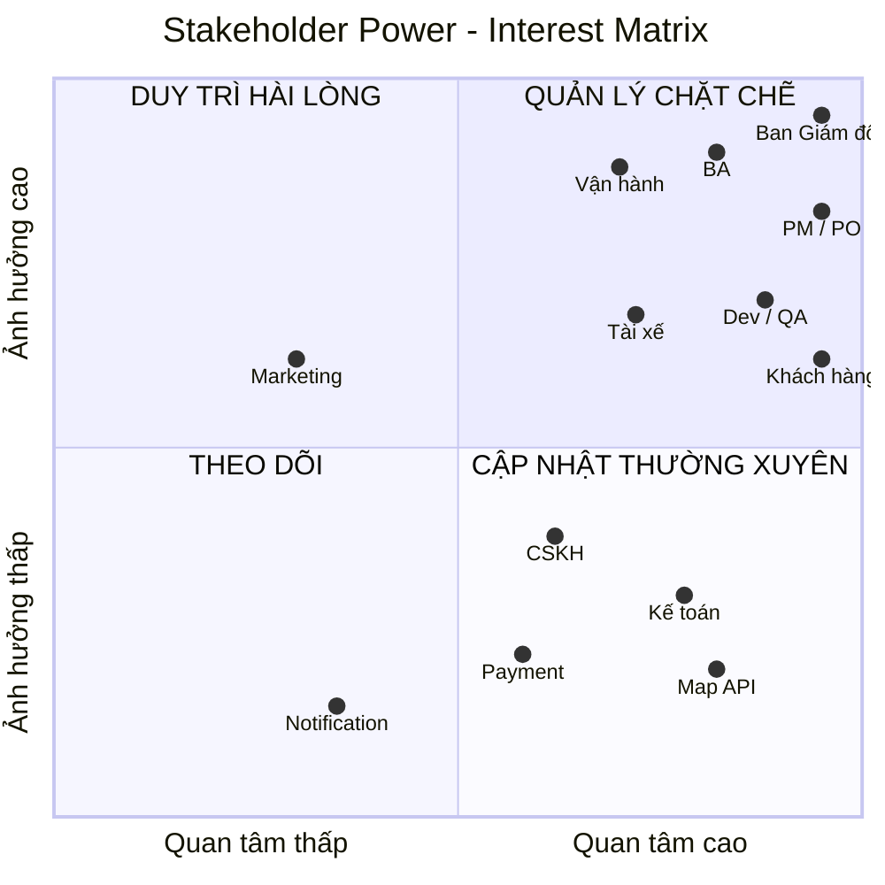

# 23641051_TranTrongDuythuc_cabsystem

## 1/ Stakeholder
### BẢNG PHÂN TÍCH VÀ XÁC ĐỊNH STAKEHOLDERS (CAB SYSTEM)

| STT | Nhóm Stakeholder | Tên / Vai trò chi tiết | Loại (Internal/External) | Quyền hạn / Ảnh hưởng | Vai trò & Kỳ vọng chính đối với hệ thống CAB |
| :--- | :--- | :--- | :--- | :--- | :--- |
| **1** | **Ban lãnh đạo** | Ban Giám đốc / Board of Directors | Internal | **Rất cao** (Quyết định ngân sách, định hướng chiến lược) | - Phục vụ số lượng lớn tài xế & khách hàng. - Mở rộng kinh doanh linh hoạt trong tương lai. - Xem báo cáo tổng quan (doanh thu, hiệu quả tài xế, tỷ lệ chuyến). |
| **2** | **Bộ phận Vận hành** | Quản lý / Nhân viên Vận hành (Operations Team) | Internal | **Cao** (Trực tiếp sử dụng Admin Dashboard) | - Dễ dàng quản lý tài khoản khách hàng, tài xế, phương tiện. - Theo dõi chuyến đi real-time và hỗ trợ xử lý chuyến đi bị lỗi. - Phân quyền chặt chẽ để bảo mật các thao tác nhạy cảm. |
| **3** | **Bộ phận Kinh doanh & Marketing** | Đội ngũ Marketing / Chăm sóc khách hàng (CS) | Internal | **Trung bình** (Đóng góp yêu cầu về CSKH, ưu đãi, báo cáo) | - Tra cứu lịch sử chuyến đi & giao dịch để giải quyết khiếu nại. - Dễ dàng triển khai chính sách giá, ưu đãi hoặc dịch vụ mới trong tương lai. |
| **4** | **Bộ phận Kỹ thuật / CNTT** | IT Lead, Developers, Testers, DevOps | Internal | **Cao** (Trực tiếp xây dựng & duy trì hệ thống) | - Kiến trúc hệ thống mở rộng độc lập (Microservices/Modular). - Giảm thiểu rủi ro khi 1 module (thanh toán/thông báo) bị lỗi. - Dễ bảo trì, dễ triển khai từng phần (rolling update). |
| **5** | **Khách hàng** | Người đặt xe (Passenger / End-User) | External | **Cao** (Quyết định sự thành bại của sản phẩm) | - Dễ dàng đăng ký, nhập điểm đón/đến, chọn loại xe. - Theo dõi rõ ràng trạng thái chuyến đi & vị trí tài xế real-time. - Thanh toán tiện lợi (tiền mặt/điện tử), minh bạch giá cước và đánh giá tài xế. |
| **6** | **Tài xế** | Tài xế đối tác (Driver) | External | **Cao** (Lực lượng cung cấp dịch vụ trực tiếp) | - Dễ thao tác bật/tắt trạng thái sẵn sàng nhận chuyến. - Nhận thông báo chuyến mới nhanh chóng. - Dễ dàng cập nhật trạng thái chuyến (Đã đến điểm đón, Đón khách, Hoàn thành). |
| **7** | **Đối tác Thanh toán** | Cổng thanh toán bên thứ ba (VNPay, Momo, ZaloPay, Stripe, v.v.) | External | **Trung bình** (Cung cấp hạ tầng thanh toán) | - Tích hợp API/SDK thanh toán an toàn. - Bảo đảm tiêu chuẩn PCI-DSS (không lưu trực tiếp thông tin thẻ nhạy cảm trong hệ thống CAB). |
| **8** | **Đối tác Thông báo** | Nhà cung cấp Push/SMS/Email (Firebase, AWS SNS, Twilio, Zalo ZNS, v.v.) | External | **Trung bình** (Cung cấp hạ tầng gửi tin) | - Đảm bảo tỷ lệ chuyển tin thông báo (delivery rate) cao và tốc độ gửi nhanh. - Dễ kết nối và mở rộng kênh thông báo mới trong tương lai. |

## 2/ Stakeholder Power–Interest Matrix

### Ma trận 2 chiều phân loại stakeholder theo: ###

- **Trục X:** Mức độ quan tâm (Interest)
- **Trục Y:** Mức độ ảnh hưởng (Power)

## 3/ Business goals
### BẢNG XÁC ĐỊNH MỤC TIÊU KINH DOANH (BUSINESS GOALS)

| STT | Nhóm mục tiêu | Mục tiêu kinh doanh (Business Goal) | Chỉ số đo lường (KPI / Metric) | Mức độ ưu tiên | Thời hạn / Giai đoạn |
| :--- | :--- | :--- | :--- | :--- | :--- |
| **1** | **Tự động hóa & Tối ưu vận hành** | **Tự động hóa 100% quy trình ghép nối xe và tài xế**, loại bỏ hoàn toàn việc phân công thủ công của tổng đài viên. | - Tỷ lệ tự động ghép chuyến thành công đạt **> 95%**. - Thời gian tìm tài xế trung bình **< 30 giây/chuyến**. | **Rất cao** (Must-Have) | Ngay khi ra mắt (Tuần 7) |
| **2** | **Nâng cao trải nghiệm khách hàng** | **Tăng tính minh bạch và độ hài lòng của khách hàng** thông qua việc theo dõi chuyến đi real-time và đa dạng phương thức thanh toán. | - Điểm đánh giá chuyến đi trung bình đạt **≥ 4.5/5 sao**. - Tỷ lệ chuyến bị hủy do không tìm thấy tài xế hoặc chờ lâu **< 8%**. | **Rất cao** (Must-Have) | Ngay khi ra mắt (Tuần 7) |
| **3** | **Đảm bảo khả năng mở rộng hệ thống** | **Xây dựng hạ tầng chịu tải cao**, sẵn sàng phục vụ lượng khách hàng và tài xế tăng trưởng đột biến vào giờ cao điểm. | - Hệ thống duy trì thời gian hoạt động (Uptime) đạt **99.9%**. - Đáp ứng đồng thời **X,000+ chuyến đi/giờ** vào khung giờ cao điểm mà không trễ/treo. | **Cao** (Must-Have) | Tuần 7 & Mở rộng lâu dài |
| **4** | **Tối ưu hóa doanh thu & Quản lý tài chính** | **Đa dạng hóa cổng thanh toán và quản lý tập trung**, giảm tỷ lệ thất thoát và sự cố giao dịch. | - Tỷ lệ giao dịch thanh toán điện tử thành công ngay từ lần đầu đạt **> 98%**. - **0%** rủi ro rò rỉ dữ liệu thẻ nhạy cảm (Tuân thủ bảo mật/Tokenization). | **Cao** (Must-Have) | Ngay khi ra mắt (Tuần 7) |
| **5** | **Tăng cường năng lực quản trị dữ liệu** | **Cung cấp công cụ Dashboard & Báo cáo thời gian thực** giúp Ban quản trị ra quyết định kinh doanh chính xác. | - Báo cáo số lượng chuyến, doanh thu, tỷ lệ hủy, hiệu suất tài xế được cập nhật **real-time / theo ngày**. - Giảm **50%** thời gian hỗ trợ xử lý khiếu nại/chuyến đi lỗi từ bộ phận Vận hành. | **Trung bình** (Should-Have) | Ngay khi ra mắt (Tuần 7) |
| **6** | **Tính linh hoạt & Mở rộng tương lai** | **Kiến trúc hệ thống linh hoạt**, cho phép dễ dàng bổ sung loại dịch vụ, kênh thông báo và phương thức thanh toán mới. | - Thời gian tích hợp một kênh thông báo hoặc phương thức thanh toán mới **< 2 tuần phát triển** mà không ảnh hưởng luồng đang chạy. | **Trung bình** (Should-Have) | Định hướng sau Tuần 7 |

## 4/ scope
### BẢNG PHẠM VI CÔNG VIỆC THEO MODULE (BÁM SÁT ĐỀ BÀI)

| STT | Module | Phạm vi chức năng chi tiết trong đề bài |
| :--- | :--- | :--- |
| **1** | **Quản lý Tài khoản & Phân quyền (IAM)** | - **Khách hàng:** Đăng ký tài khoản, đăng nhập, cập nhật thông tin cá nhân. - **Tài xế:** Đăng ký tài khoản (hoặc được nhân viên vận hành tạo tài khoản), cập nhật hồ sơ cá nhân, thông tin phương tiện, cập nhật trạng thái hoạt động. - **Xác thực & Bảo mật:** Xác thực khách hàng và tài xế trước khi dùng tính năng cần tài khoản; kiểm soát quyền truy cập/phân quyền thao tác cho nhân viên vận hành. |
| **2** | **Đặt xe & Tìm tài xế** | - **Đặt xe:** Khách hàng nhập điểm đón, điểm đến, chọn loại xe và gửi yêu cầu đặt xe. - **Lưu vị trí:** Lưu thông tin vị trí của tài xế để hỗ trợ tìm tài xế gần khách và dự kiến thời gian đến (ETA). - **Tìm & Phân công tài xế:** Xác định tài xế phù hợp dựa trên vị trí, trạng thái sẵn sàng và tiêu chí vận hành; ưu tiên tài xế phù hợp và gần khách hàng. - **Chuyển tiếp tự động:** Khi tài xế được đề xuất từ chối hoặc không phản hồi, hệ thống tiếp tục tìm tài xế khác mà không bắt khách tạo lại yêu cầu. - **Thông báo kết quả:** Thông báo rõ ràng cho khách hàng nếu không tìm được tài xế. |
| **3** | **Quản lý & Theo dõi Chuyến đi** | - **Khách hàng theo dõi:** Xem trạng thái tìm tài xế, tài xế nhận chuyến, thời gian dự kiến đến, trạng thái hiện tại của chuyến đi và lịch sử chuyến đi. - **Tài xế cập nhật trạng thái:** Chuyển sang sẵn sàng nhận chuyến; cập nhật các mốc (*đã đến điểm đón, đã đón khách, đang di chuyển, hoàn thành chuyến*). |
| **4** | **Tính cước & Thanh toán** | - **Tính cước:** Tự động xác định số tiền khách phải trả sau khi hoàn thành chuyến dựa trên loại dịch vụ và thông tin chuyến đi. - **Thanh toán:** Hỗ trợ thanh toán bằng tiền mặt hoặc thanh toán điện tử. - **Tích hợp cổng thanh toán:** Tích hợp nhà cung cấp thanh toán bên ngoài (không lưu trực tiếp thông tin nhạy cảm của thẻ/tài khoản trong hệ thống CAB). - **Xử lý lỗi:** Thông báo cho khách hàng khi giao dịch điện tử thất bại và cho phép xử lý lại. |
| **5** | **Thông báo (Notification)** | - **Thông báo cho Khách hàng:** Khi yêu cầu được tiếp nhận, khi có tài xế nhận chuyến, khi tài xế đến điểm đón, khi chuyến hoàn thành, khi thanh toán có kết quả. - **Thông báo cho Tài xế:** Nhận thông báo chuyến mới (có thể chấp nhận hoặc từ chối), thông báo các thay đổi liên quan đến chuyến đang thực hiện. - **Kiến trúc:** Khả năng mở rộng thêm các kênh thông báo trong tương lai mà không thay đổi toàn bộ hệ thống. |
| **6** | **Giao diện Quản trị & Báo cáo (Admin Dashboard)** | - **Quản lý dữ liệu:** Quản lý khách hàng, tài xế, phương tiện, chuyến đi. - **Giám sát & Hỗ trợ:** Xem các chuyến đang diễn ra, kiểm tra trạng thái tài xế, tra cứu lịch sử giao dịch, hỗ trợ xử lý chuyến bị lỗi. - **Phân quyền:** Phân quyền thao tác để nhân viên thông thường không thực hiện các thao tác nhạy cảm. - **Báo cáo:** Xuất báo cáo về số lượng chuyến, doanh thu, tỷ lệ chuyến hoàn thành, tỷ lệ hủy, hiệu quả hoạt động của tài xế. |
| **7** | **Hạ tầng, Bảo mật & Kiểm toán** | - **Khả năng chịu tải & Độc lập:** Các thành phần mở rộng độc lập; lỗi ở thanh toán hoặc thông báo không làm dừng toàn bộ hệ thống đặt xe; triển khai chức năng mới từng phần. - **Bảo mật dữ liệu:** Bảo vệ thông tin cá nhân, thông tin phương tiện, dữ liệu vị trí, dữ liệu giao dịch. - **Kiểm toán (Audit Log):** Lưu vết các thao tác quan trọng để phục vụ kiểm tra khi có sự cố. - **Mở rộng tương lai:** Kiến trúc linh hoạt để bổ sung dịch vụ mới, phương thức thanh toán mới, nhà cung cấp thông báo mới hoặc thay đổi thành phần kỹ thuật. |

## 5/ Business Requirements
### **BẢNG YÊU CẦU NGHIỆP VỤ (BUSINESS REQUIREMENTS)**

| **ID** | **Business Requirement** | **Mô tả** |
|---|---|---|
| **BR-01** | **Đăng ký, xác thực và quản lý tài khoản người dùng** | Hệ thống phải cho phép Khách hàng đăng ký/đăng nhập tài khoản; Tài xế đăng ký hoặc được Nhân viên vận hành tạo tài khoản và cập nhật hồ sơ phương tiện. Đảm bảo xác thực người dùng trước khi sử dụng các chức năng cốt lõi. |
| **BR-02** | **Tự động tìm kiếm và phân công tài xế** | Khi Khách hàng gửi yêu cầu đặt xe (điểm đón, điểm đến, loại xe), hệ thống phải tự động xác định và gửi thông báo mời nhận chuyến cho tài xế phù hợp gần nhất dựa trên vị trí GPS và trạng thái sẵn sàng. |
| **BR-03** | **Tự động chuyển tiếp yêu cầu khi tài xế từ chối** | Nếu tài xế được đề xuất từ chối hoặc không phản hồi, hệ thống phải tự động chuyển tiếp tìm tài xế khác mà không bắt Khách hàng thao tác lại. Trường hợp không tìm thấy tài xế sau danh sách đề xuất, phải thông báo rõ ràng cho Khách hàng. |
| **BR-04** | **Cập nhật và theo dõi tiến trình chuyến đi real-time** | Hệ thống phải hỗ trợ Tài xế cập nhật các mốc trạng thái chuyến đi (*Đã đến điểm đón, Đã đón khách, Đang di chuyển, Hoàn thành*). Khách hàng có thể theo dõi trạng thái chuyến đi, thông tin tài xế, thời gian dự kiến đến (ETA) và xem lịch sử chuyến đi. |
| **BR-05** | **Tính cước tự động và thanh toán linh hoạt** | Sau khi hoàn thành chuyến đi, hệ thống tự động tính số tiền phải trả. Hỗ trợ 2 hình thức: Tiền mặt và Thanh toán điện tử thông qua tích hợp với 01 Cổng thanh toán bên thứ ba (sử dụng Tokenization, không lưu thông tin thẻ nhạy cảm). Hỗ trợ xử lý lại khi giao dịch điện tử thất bại. |
| **BR-06** | **Gửi thông báo sự kiện chuyến đi (Notification)** | Tự động gửi thông báo thời gian thực cho Khách hàng (tiếp nhận yêu cầu, tài xế nhận chuyến, tài xế đến, hoàn thành, kết quả thanh toán) và cho Tài xế (chuyến mới, thay đổi chuyến). |
| **BR-07** | **Đánh giá chất lượng dịch vụ** | Cho phép Khách hàng đánh giá sao và gửi phản hồi về tài xế sau khi chuyến đi hoàn thành. |
| **BR-08** | **Cung cấp công cụ Quản trị và Báo cáo vận hành** | Cung cấp giao diện Web Admin phân quyền cho Nhân viên vận hành để: quản lý dữ liệu người dùng/phương tiện, giám sát các chuyến đi đang diễn ra, kiểm tra trạng thái tài xế, hỗ trợ xử lý chuyến bị lỗi, tra cứu giao dịch và xem báo cáo (số chuyến, doanh thu, tỷ lệ hoàn thành/hủy, hiệu quả tài xế). |
| **BR-09** | **Bảo mật, lưu vết kiểm toán và cô lập lỗi hệ thống** | Bảo vệ thông tin cá nhân, phương tiện, vị trí và giao dịch; ghi log (Audit Log) các thao tác quan trọng để xử lý sự cố. Thiết kế kiến trúc độc lập để lỗi ở module thanh toán/thông báo không làm ngưng trệ toàn bộ hệ thống đặt xe. |

## 6/ Functional Requirements
### BẢNG PHÂN RÃ YÊU CẦU CHỨC NĂNG (FUNCTIONAL REQUIREMENTS)

| Module | ID FR | Tên chức năng | Phân rã chi tiết các Yêu cầu Chức năng (Sub-requirements) |
| :--- | :--- | :--- | :--- |
| **1. Quản lý Tài khoản & Phân quyền (IAM)** | **FR-01** | Đăng ký & Đăng nhập Khách hàng | - **FR-01.1:** Khách hàng có thể đăng ký tài khoản mới bằng Số điện thoại / Email. - **FR-01.2:** Khách hàng đăng nhập vào hệ thống bằng thông tin đã đăng ký. - **FR-01.3:** Khách hàng có thể cập nhật thông tin cá nhân (Họ tên, Email, Ảnh đại diện). |
| | **FR-02** | Quản lý Tài khoản & Hồ sơ Tài xế | - **FR-02.1:** Tài xế có thể tự đăng ký tài khoản hoặc được Nhân viên vận hành tạo tài khoản trên Admin Dashboard. - **FR-02.2:** Tài xế có thể cập nhật hồ sơ cá nhân và thông tin phương tiện (Biển số xe, Loại xe, Màu xe, Thương hiệu). - **FR-02.3:** Tài xế có thể bật/tắt công tắc chuyển đổi sang trạng thái "Sẵn sàng nhận chuyến" hoặc "Ngưng nhận chuyến". |
| | **FR-03** | Xác thực & Phân quyền Quản trị | - **FR-03.1:** Hệ thống bắt buộc xác thực (Authentication) Khách hàng và Tài xế trước khi truy cập các chức năng yêu cầu tài khoản. - **FR-03.2:** Hệ thống kiểm soát quyền truy cập (RBAC) cho Nhân viên vận hành, phân chia thao tác thông thường và thao tác nhạy cảm. |
| **2. Đặt xe & Tìm tài xế (Matching Engine)** | **FR-04** | Tạo & Gửi yêu cầu đặt xe | - **FR-04.1:** Khách hàng nhập/chọn Điểm đón và Điểm đến trên giao diện. - **FR-04.2:** Khách hàng lựa chọn Loại xe / Loại dịch vụ mong muốn. - **FR-04.3:** Khách hàng gửi yêu cầu đặt xe lên hệ thống. |
| | **FR-05** | Tìm kiếm & Phân công Tài xế | - **FR-05.1:** Hệ thống lưu trữ và cập nhật liên tục thông tin vị trí GPS của Tài xế. - **FR-05.2:** Hệ thống xác định danh sách các Tài xế phù hợp đang ở trạng thái "Sẵn sàng nhận chuyến" và gần điểm đón của Khách hàng. - **FR-05.3:** Hệ thống gửi thông báo yêu cầu nhận chuyến đến Tài xế phù hợp nhất đầu tiên trong danh sách đề xuất. |
| | **FR-06** | Xử lý Từ chối & Chuyển tiếp Yêu cầu | - **FR-06.1:** Tài xế có thể bấm Chấp nhận hoặc Từ chối yêu cầu đặt xe. - **FR-06.2:** Nếu Tài xế từ chối hoặc không phản hồi sau một khoảng thời gian quy định (Timeout), hệ thống tự động chuyển tiếp yêu cầu đến Tài xế phù hợp tiếp theo mà không bắt Khách hàng tạo lại chuyến. - **FR-06.3:** Nếu đã duyệt hết danh sách tài xế phù hợp mà không ai nhận, hệ thống gửi thông báo rõ ràng cho Khách hàng biết "Hiện không tìm thấy tài xế". |
| **3. Quản lý & Theo dõi Chuyến đi** | **FR-07** | Theo dõi Tiến trình Chuyến đi (Khách hàng) | - **FR-07.1:** Khách hàng có thể theo dõi màn hình trạng thái "Đang tìm tài xế". - **FR-07.2:** Khi có tài xế nhận chuyến, Khách hàng xem được thông tin tài xế (Họ tên, Số điện thoại, Biển số xe, Loại xe, Đánh giá sao). - **FR-07.3:** Khách hàng có thể xem thời gian dự kiến Tài xế đến điểm đón (ETA) và vị trí thời gian thực của Tài xế. - **FR-07.4:** Khách hàng có thể tra cứu danh sách và chi tiết Lịch sử các chuyến đi đã thực hiện. |
| | **FR-08** | Cập nhật Trạng thái Chuyến đi (Tài xế) | - **FR-08.1:** Tài xế cập nhật trạng thái "Đã đến điểm đón" khi tới vị trí khách. - **FR-08.2:** Tài xế cập nhật trạng thái "Đã đón khách" khi khách lên xe. - **FR-08.3:** Tài xế cập nhật trạng thái "Đang di chuyển" trong quá trình di chuyển. - **FR-08.4:** Tài xế cập nhật trạng thái "Hoàn thành chuyến" khi trả khách tại điểm đến. |
| **4. Tính cước & Thanh toán** | **FR-09** | Tính cước Chuyến đi | - **FR-09.1:** Hệ thống tự động xác định và hiển thị cước phí chuyến đi sau khi hoàn thành dựa trên thông tin chuyến đi và loại dịch vụ. |
| | **FR-10** | Thanh toán & Xử lý Giao dịch | - **FR-10.1:** Cho phép Khách hàng chọn phương thức thanh toán bằng Tiền mặt hoặc Thanh toán điện tử. - **FR-10.2:** Tích hợp Cổng thanh toán bên ngoài để xử lý giao dịch điện tử qua cơ chế Tokenization (không lưu trữ số thẻ/tài khoản nhạy cảm trên hệ thống CAB). - **FR-10.3:** Nếu giao dịch thanh toán điện tử thất bại, hệ thống gửi thông báo lỗi và cho phép Khách hàng thực hiện chọn/thao tác lại phương thức thanh toán. |
| **5. Thông báo (Notification)** | **FR-11** | Thông báo cho Khách hàng | - **FR-11.1:** Tự động gửi thông báo khi hệ thống tiếp nhận yêu cầu đặt xe. - **FR-11.2:** Tự động gửi thông báo khi có Tài xế nhận chuyến đi. - **FR-11.3:** Tự động gửi thông báo khi Tài xế đã đến điểm đón. - **FR-11.4:** Tự động gửi thông báo khi chuyến đi hoàn thành. - **FR-11.5:** Tự động gửi thông báo về kết quả thanh toán (Thành công / Thất bại). |
| | **FR-12** | Thông báo cho Tài xế | - **FR-12.1:** Tự động gửi thông báo nhận chuyến mới khi có yêu cầu đặt xe phù hợp. - **FR-12.2:** Tự động gửi thông báo cho Tài xế khi có các thay đổi liên quan đến chuyến đi đang thực hiện (ví dụ: Khách hủy chuyến). |
| **6. Đánh giá & Phản hồi** | **FR-13** | Đánh giá Sau Chuyến đi | - **FR-13.1:** Cho phép Khách hàng chọn số sao đánh giá (từ 1 đến 5 sao) cho Tài xế sau khi hoàn thành chuyến đi. - **FR-13.2:** Cho phép Khách hàng nhập nội dung phản hồi/nhận xét về Tài xế. |
| **7. Giao diện Quản trị & Báo cáo (Admin Dashboard)** | **FR-14** | Quản lý Dữ liệu Vận hành | - **FR-14.1:** Nhân viên vận hành có thể xem, tìm kiếm, cập nhật thông tin Khách hàng, Tài xế và Phương tiện. - **FR-14.2:** Nhân viên vận hành có thể tra cứu lịch sử danh sách các Chuyến đi và lịch sử Giao dịch thanh toán. |
| | **FR-15** | Giám sát & Hỗ trợ Chuyến đi | - **FR-15.1:** Nhân viên vận hành có thể xem danh sách và trạng thái các chuyến đi đang diễn ra theo thời gian thực. - **FR-15.2:** Nhân viên vận hành có thể kiểm tra vị trí và trạng thái hoạt động của các Tài xế. - **FR-15.3:** Cung cấp chức năng cho Nhân viên vận hành can thiệp xử lý đối với các trường hợp chuyến đi bị lỗi/gặp sự cố. |
| | **FR-16** | Báo cáo Thống kê | - **FR-16.1:** Báo cáo tổng số lượng chuyến đi (hoàn thành, hủy). - **FR-16.2:** Báo cáo tổng doanh thu theo khoảng thời gian. - **FR-16.3:** Báo cáo tỷ lệ chuyến hoàn thành và tỷ lệ hủy chuyến. - **FR-16.4:** Báo cáo hiệu quả hoạt động và năng suất của từng Tài xế. |
| **8. Bảo mật, Log & Hạ tầng** | **FR-17** | Bảo vệ Dữ liệu & Lưu vết (Audit Log) | - **FR-17.1:** Mã hóa và bảo vệ thông tin cá nhân, dữ liệu phương tiện, vị trí GPS và thông tin giao dịch. - **FR-17.2:** Hệ thống tự động ghi nhật ký lưu vết (Audit Log) đối với tất cả các thao tác quản trị quan trọng của Nhân viên vận hành để phục vụ kiểm tra khi có sự cố. |

## 7/ Vẽ use case
## 8/ Đặt tả use case
## 9/ Phân tích quy trình nghiệp vụ (Business Project)
## 10/ Phân tích quy tắc nghiệp vụ (Business Rules)
